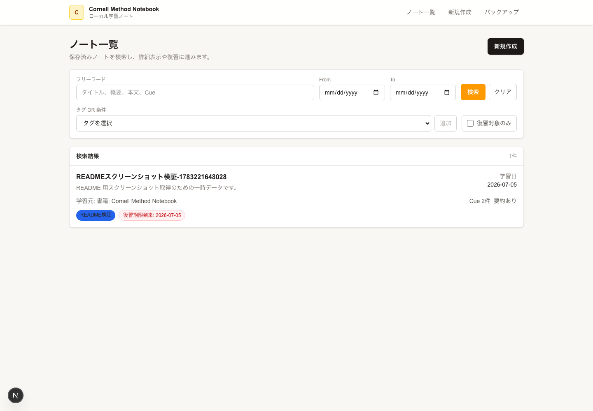
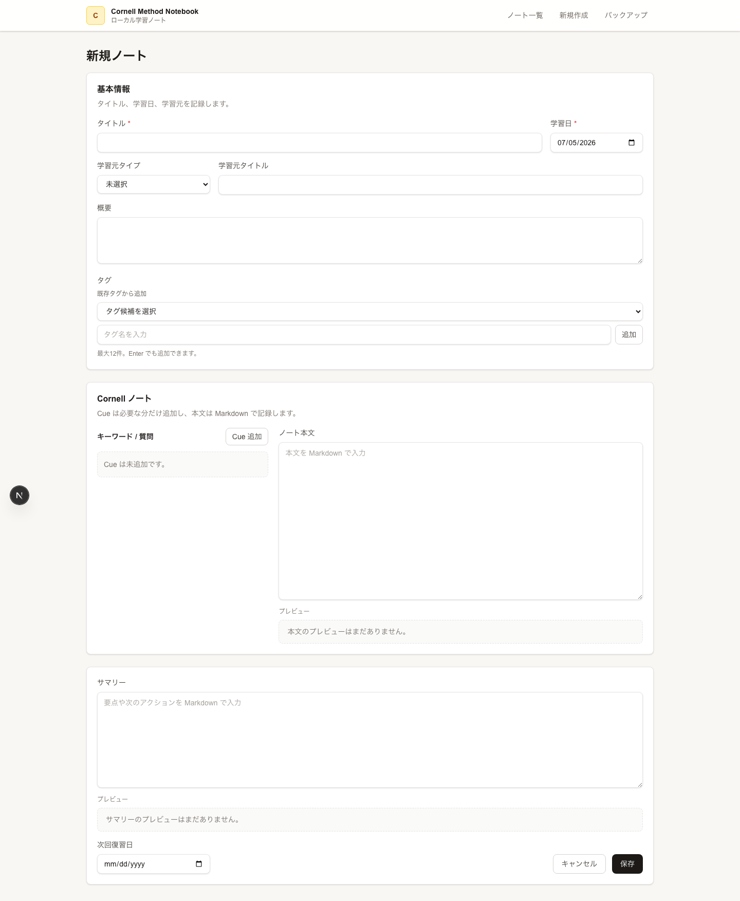
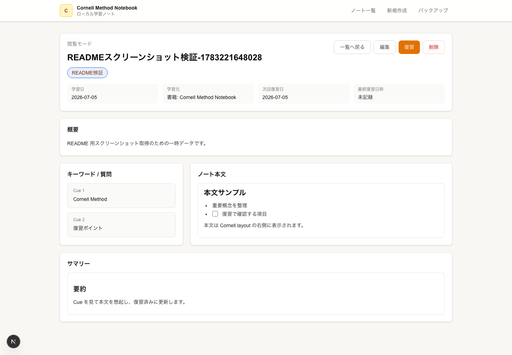
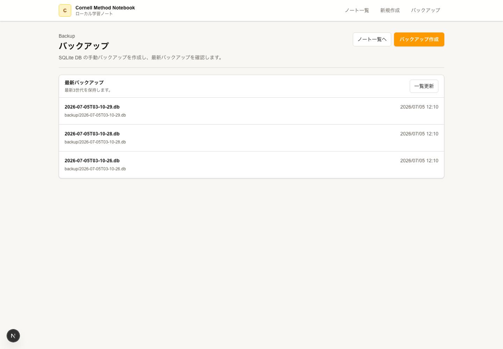

# Cornell Method Notebook MVP

ローカル個人利用向けの Cornell Method Notebook アプリです。Next.js App Router、React、Prisma、SQLite を使い、学習ノートの作成、検索、閲覧、編集、復習、バックアップまでの MVP フローをローカル環境で動かせるようにしています。

MVP の主な機能:

- ノート作成
- 一覧検索
- 詳細閲覧 / 編集 / 復習モード
- Markdown preview
- タグ登録とタグ検索
- SQLite DB バックアップ

認証、ユーザー管理、外部 API 連携はありません。

## セットアップ

前提:

- Node.js
- npm

依存関係をインストールします。

```bash
npm install
```

Prisma Client を生成し、SQLite DB を作成します。

```bash
npm run prisma:generate
npm run prisma:migrate
```

MVP では seed は不要です。`package.json` に seed script はなく、初期データは `/notes/new` の UI または `POST /api/notes` から作成します。

`DATABASE_URL` は未指定の場合、`prisma.config.ts` の設定により `file:./dev.db` を使います。明示したい場合は、プロジェクトルートに `.env` を作り、次のように指定してください。

```env
DATABASE_URL="file:./dev.db"
```

開発サーバーを起動します。

```bash
npm run dev
```

ブラウザで次を開きます。

```text
http://localhost:3000/notes
```

## 主な npm Scripts

| コマンド | 用途 |
| --- | --- |
| `npm run dev` | Next.js 開発サーバーを起動 |
| `npm run build` | 本番ビルドを webpack で実行 |
| `npm run lint` | ESLint を実行 |
| `npm run prisma:generate` | Prisma Client を生成 |
| `npm run prisma:migrate` | Prisma migration を適用し SQLite DB を作成 / 更新 |
| `npm run backup:copy` | SQLite DB ファイルを `backup/` 配下へコピー |
| `npm run diagrams:build` | Mermaid 図を `.mmd` に抽出し、SVG を生成 |

## 主要画面

| パス | 画面 |
| --- | --- |
| `/notes` | ノート一覧。フリーワード、日付、タグ、復習対象で検索 |
| `/notes/new` | ノート作成 |
| `/notes/[id]` | ノート詳細。閲覧、編集、復習モードを切り替え |
| `/backup` | SQLite DB バックアップの作成と一覧確認 |

## MVP 受け入れ材料

2026-07-05 時点の MVP 主要 UI フローは Playwright Chromium で検証済みです。操作デモ相当の確認結果は `summary/20260705/mvp-ui-flow-reverification-report.md` を参照してください。

画面例:

| 画面 | スクリーンショット |
| --- | --- |
| `/notes`: ノート一覧、検索、日付 / タグフィルタ、範囲 validation |  |
| `/notes/new`: 新規作成、既存タグ候補選択、自由入力タグ追加 |  |
| `/notes/[id]`: 閲覧、編集保存、復習モード、削除 |  |
| `/backup`: バックアップ一覧表示、バックアップ作成 |  |

スクリーンショットを再取得する場合は、開発サーバーを起動してから主要画面を開き、画像を `doc/assets/screenshots/` 配下へ保存してください。

```bash
npm run dev -- -H 127.0.0.1 -p 3000
```

撮影対象:

- `http://127.0.0.1:3000/notes`
- `http://127.0.0.1:3000/notes/new`
- `http://127.0.0.1:3000/notes/[id]`
- `http://127.0.0.1:3000/backup`

`/notes/[id]` は既存データが必要です。空 DB の場合は `/notes/new` から検証用ノートを一時作成し、撮影後に詳細画面の削除操作または `DELETE /api/notes/:id` で削除してください。

## 基本操作

1. `/notes/new` でタイトル、学習日、Cue、本文、サマリー、タグ、次回復習日を入力します。
2. 保存すると `/notes/[id]` の詳細画面へ移動します。
3. `/notes` で作成済みノートを検索します。
4. 詳細画面で閲覧、編集、復習モードを切り替えます。
5. 復習モードでは Cue とサマリーを見て本文を想起し、本文表示と復習済み更新を行います。
6. `/backup` または `npm run backup:copy` で SQLite DB をバックアップします。

## データベース

MVP の DB は Prisma + SQLite です。主なモデルは次のとおりです。

- `Notebook`: ノート本体
- `Cue`: キーワード / 質問
- `Tag`: タグ
- `NotebookTag`: ノートとタグの中間テーブル

DB の作成と migration は次で行います。

```bash
npm run prisma:migrate
```

MVP セットアップで seed 実行は必要ありません。空の DB から開始し、検証用データは UI/API 操作で作成します。

Prisma Client の再生成は次で行います。

```bash
npm run prisma:generate
```

## バックアップ

バックアップは SQLite DB ファイルを `backup/` 配下へコピーします。

作成方法:

- 画面から作成: `/backup`
- コマンドで作成: `npm run backup:copy`

仕様:

- バックアップファイルは `backup/` 配下に `.db` として作成されます。
- 最新 3 世代を保持します。
- 4 世代目以降は古いものから削除されます。
- 復元は MVP 外です。自動復元機能はありません。

復元が必要な場合は、アプリを停止した上でバックアップされた `.db` を手動で DB ファイルの場所へ戻す運用になります。

## 検証

基本的な検証コマンド:

```bash
npm run prisma:generate
npm run prisma:migrate
npm run lint
npm run build
```

主要フローの手動確認:

- `/notes/new` でノートを作成できる。
- `/notes` でタイトル、日付、タグ、復習対象による検索ができる。
- `/notes/[id]` で詳細閲覧できる。
- 詳細画面で編集して保存できる。
- 詳細画面の復習モードで本文の表示 / 非表示と復習済み更新ができる。
- `/backup` または `npm run backup:copy` でバックアップを作成できる。

## 設計書

MVP の仕様と設計は次を参照してください。

- `doc/README.md`
- `doc/requirements/MVP_SYSTEM_SPEC.md`
- `doc/workflows/MVP_WORKFLOW_DESIGN.md`
- `doc/screens/MVP_SCREEN_INVENTORY.md`
- `doc/diagrams/MVP_UML_DESIGN.md`
- `doc/technical/MVP_DESIGN_TOOLING_GUIDE.md`
- `doc/design-studio/README.md`
- `doc/api/MVP_API_DESIGN.md`
- `doc/data/MVP_DATA_DESIGN.md`
- `doc/testing/TEST_SCENARIOS.md`

## Design Studio

Google Stitch / Claude Design のように、画面案作成、比較、実装受け渡しを Codex 内で回すための repo-local plugin とテンプレートを用意しています。

初回のみ Codex CLI で marketplace と plugin を追加します。

```bash
codex plugin marketplace add /Users/kazuya/Desktop/自己学習/Cornell-Method
codex plugin add cornell-design-studio@cornell-method-local
```

運用手順とテンプレートは `doc/design-studio/README.md` を参照してください。

## 既知の注意

MVP では次の機能は対象外です。

- 自動保存 / 下書き
- Undo / ソフトデリート復元
- PDF export
- 専用復習タスク画面
- D&D によるカード並び替え
- バックアップからの自動復元
- 認証、ユーザー管理、共有、外部同期

ビルドは network restricted 環境でも通るよう、Google Fonts 取得を使わず system font stack を使用します。Next.js 16 の Turbopack build は一部 sandbox で port bind 制限に当たるため、`npm run build` は `next build --webpack` を使います。

2026-06-21 時点で `npm audit --audit-level=moderate` は moderate 3 件を報告します。対象は `brace-expansion` と Next.js 経由の `postcss` です。依存更新は MVP final verification では実施していません。

このアプリはローカル個人利用前提です。認証なしで動作するため、共有環境や公開環境への配置は想定していません。
