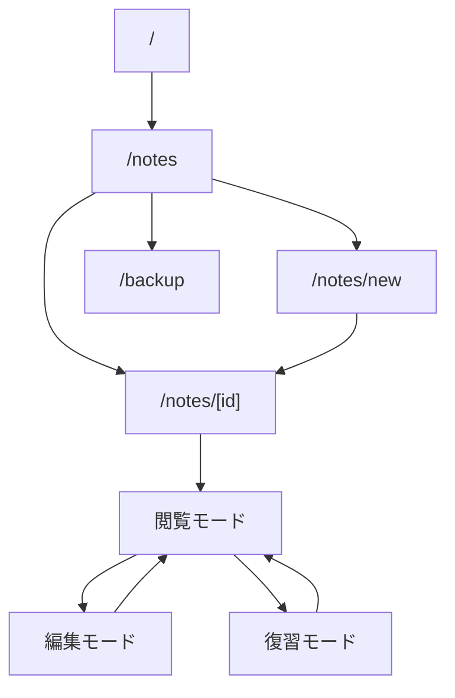

# MVP 画面設計案

確認日: 2026-06-14

## 位置づけ

このドキュメントは、フルリニューアル版 Cornell Method Notebook の MVP 画面設計案です。

MVP の目的は、コーネルメソッドの「記録、整理、要約、想起、復習」を日常的に回せることです。画面設計では、ノート管理機能よりも学習サイクルの操作性を優先します。

## 画面一覧

| 画面ID | パス | 画面名 | 役割 |
| --- | --- | --- | --- |
| COM-001 | 全画面 | 共通レイアウト | グローバルナビ、メイン領域 |
| NTE-010 | `/notes` | ノート一覧 | ノート検索、復習対象確認、新規作成入口 |
| NTE-020 | `/notes/new` | ノート作成 | Cornell 形式で新規ノートを作る |
| NTE-030 | `/notes/[id]` | ノート詳細 | 閲覧、編集、復習モードを切り替える |
| BAK-010 | `/backup` | バックアップ | DB バックアップの作成・確認 |

MVP では `/tasks/review` のような独立した復習タスク画面は作りません。復習対象は `/notes` で絞り込み、詳細画面の復習モードで実施します。

この方針は発注者承認済みです。

## 共通レイアウト COM-001

### 表示要素

- アプリ名
- ナビゲーション
  - ノート一覧
  - 新規作成
  - バックアップ

### MVP では表示しないもの

- 復習タスク専用ナビ
- 未完タスクバッジ
- ユーザーアイコン
- 認証・ログアウト導線

## ノート一覧 NTE-010

### 目的

保存済みノートを探し、読み返し、復習対象へ入るための画面です。

### 表示要素

| 項目 | 内容 |
| --- | --- |
| 新規作成ボタン | `/notes/new` へ遷移 |
| フリーワード検索 | title, overview, body, summary, cue.text を対象 |
| 日付 From / To | noteDate の範囲検索 |
| タグフィルタ | OR 条件 |
| 復習対象フィルタ | `nextReviewDate <= today` のノートを表示 |
| ノート一覧 | タイトル、日付、タグ、要約状態、復習予定日を表示 |

### ノート一覧カードの表示

- タイトル
- 学習日
- 学習元
- タグ
- Cue 件数
- 要約状態
  - 要約あり
  - 要約未作成
- 復習状態
  - 復習予定なし
  - 復習予定日
  - 復習期限到来
  - 復習済み

### 主要アクション

| アクション | 結果 |
| --- | --- |
| 新規作成 | `/notes/new` へ遷移 |
| 検索 | 条件に一致するノート一覧を表示 |
| ノート選択 | `/notes/[id]` へ遷移 |
| 復習対象のみ表示 | 復習予定日が今日以前のノートだけを表示 |

### MVP ではやらないこと

- 一覧からの直接編集
- 一覧からの直接削除
- PDF 出力
- ページ単位の一括操作
- 右クリックメニュー

## ノート作成 NTE-020

### 目的

コーネルメソッド形式で新しいノートを作成します。

### 入力項目

| 項目 | 必須 | 説明 |
| --- | --- | --- |
| タイトル | 必須 | ノートタイトル |
| 学習日 | 必須 | 今日以前 |
| 学習元タイプ | 任意 | book, lecture, video, article, other |
| 学習元タイトル | 任意 | 書籍名、講義名、動画名など |
| 概要 | 任意 | ノート全体の短い説明 |
| タグ | 任意 | 最大12個 |
| キーワード / 質問 | 任意 | Cue リスト |
| ノート本文 | 任意 | Markdown |
| サマリー | 任意 | Markdown |
| 次回復習日 | 任意 | 復習予定日 |

### レイアウト

デスクトップ:

- 上部: タイトル、学習日、学習元、タグ
- 中央: Cornell レイアウト
  - 左: キーワード / 質問
  - 右: ノート本文
- 下部: サマリー、次回復習日、保存ボタン

モバイル:

- タイトル、学習日、学習元、タグ
- キーワード / 質問
- ノート本文
- サマリー
- 次回復習日、保存ボタン

### 主要アクション

| アクション | 結果 |
| --- | --- |
| Cue 追加 | キーワード / 質問行を追加 |
| Cue 削除 | 対象 Cue を削除 |
| 保存 | ノートを作成し `/notes/[id]` へ遷移 |
| キャンセル | `/notes` へ戻る |

### MVP ではやらないこと

- 自動保存
- 下書き保存
- D&D 並び替え
- Cue と本文範囲のリンク
- Markdown 専用エディタ、リッチな Markdown ツールバー

## ノート詳細 NTE-030

### 目的

保存済みノートを閲覧、編集、復習します。

### 画面モード

| モード | 役割 |
| --- | --- |
| 閲覧モード | Cornell レイアウトでノートを読む |
| 編集モード | ノート内容を更新する |
| 復習モード | Cue とサマリーを見て本文を思い出す |

### 閲覧モード

表示:

- タイトル
- 学習日
- 学習元
- タグ
- 概要
- Cue リスト
- Markdown 表示された本文
- Markdown 表示されたサマリー
- 次回復習日
- 最終復習日

アクション:

| アクション | 結果 |
| --- | --- |
| 編集 | 編集モードへ切替 |
| 復習 | 復習モードへ切替 |
| 削除 | 確認後に削除し `/notes` へ戻る |

### 編集モード

表示・入力:

- ノート作成画面と同じ入力項目

アクション:

| アクション | 結果 |
| --- | --- |
| 保存 | 更新して閲覧モードへ戻る |
| キャンセル | 変更を破棄して閲覧モードへ戻る |
| Cue 追加 | Cue を追加 |
| Cue 削除 | Cue を削除 |

### 復習モード

目的:

- Cue とサマリーを手がかりに本文を思い出す。

初期表示:

- タイトル
- 学習日
- タグ
- Cue リスト
- サマリー
- 本文は非表示

アクション:

| アクション | 結果 |
| --- | --- |
| 本文を表示 | Markdown 表示された本文を表示 |
| 本文を隠す | 本文を再度非表示 |
| 復習済みにする | `reviewedAt` を更新。必要に応じて次回復習日を変更 |
| 閲覧へ戻る | 閲覧モードへ戻る |

### 復習モードの注意点

- 採点や正誤判定はしない。
- 自動で次回復習日を計算しない。
- 本文表示状態は保存しない。

## バックアップ BAK-010

### 目的

ローカル DB の破損や誤操作に備えます。

### 表示要素

- バックアップ作成ボタン
- 最新バックアップ一覧
- 保存先パス
- 失敗時のエラーメッセージ

### 主要アクション

| アクション | 結果 |
| --- | --- |
| バックアップ作成 | SQLite DB ファイルを backup 配下へコピー |
| バックアップ一覧更新 | 最新状態を再取得 |

### MVP ではやらないこと

- バックアップログ DB 管理
- バックアップからの自動復元
- スケジュール実行 UI

## 画面遷移

## MVP 受け入れ条件

- ノートを作成できる。
- 作成したノートを一覧で確認できる。
- ノートを閲覧できる。
- ノートを編集して保存できる。
- Cue、本文、サマリーが Cornell レイアウトで表示される。
- 復習モードで本文を隠せる。
- 復習モードで本文を表示できる。
- 復習済みにできる。
- 次回復習日で復習対象を絞り込める。
- タイトル、日付、タグで絞り込める。
- 要約未作成のノートが一覧と詳細でわかる。
- バックアップを作成できる。

## Open Question

| ID | 論点 | Manager 推奨 |
| --- | --- | --- |
| Q-001 | 詳細画面の初期表示は閲覧モードでよいか | はい |
| Q-002 | 新規作成後は詳細の閲覧モードへ遷移でよいか | はい |
| Q-003 | 復習対象一覧は `/notes` のフィルタで扱い、専用画面は MVP 外でよいか | はい（発注者承認済み） |
| Q-004 | 削除は MVP では確認ダイアログ + 物理削除でよいか | はい |
| Q-005 | バックアップ画面のパスは `/backup` でよいか | はい |

## 次に決めること

発注者確認後、この画面設計を元に MVP API 設計へ進む。
