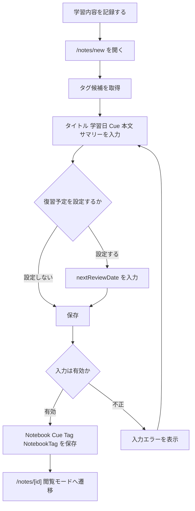
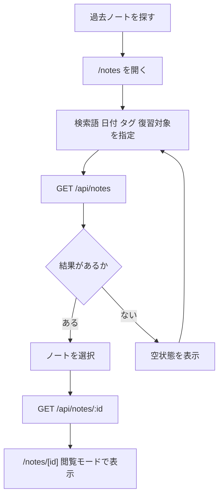
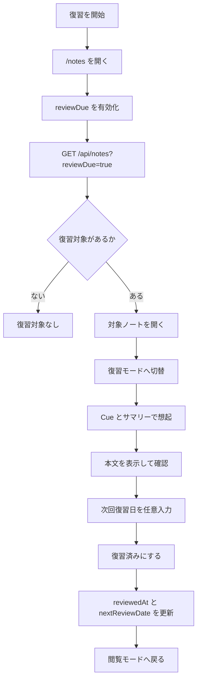
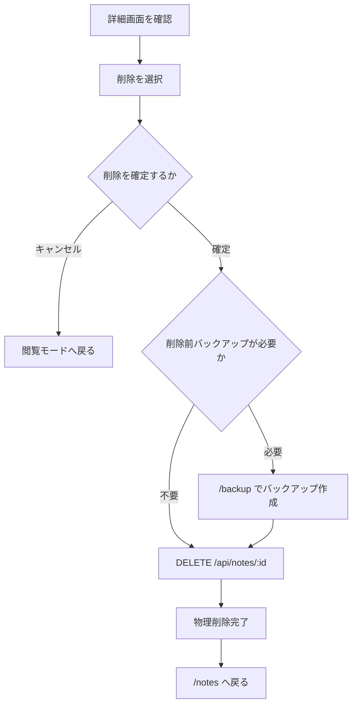
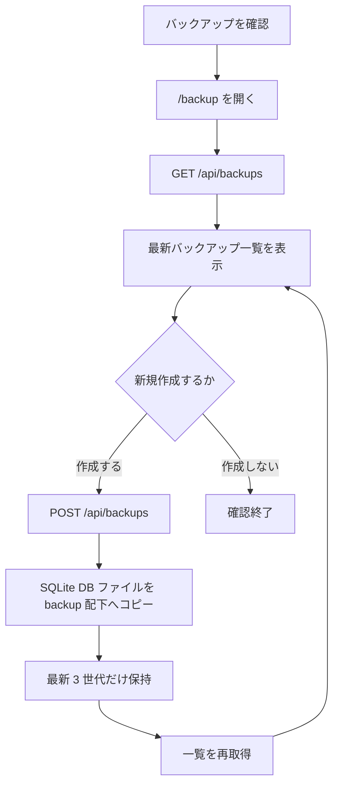

# MVP 業務フロー図

確認日: 2026-06-21

## 位置づけ

このドキュメントは、Cornell Method Notebook MVP の主要業務フローを Mermaid で整理した図別設計書です。

参照元:

- `doc/diagrams/MVP_UML_DESIGN.md`
- `doc/workflows/MVP_WORKFLOW_DESIGN.md`
- `doc/requirements/MVP_SYSTEM_SPEC.md`

MVP は `Notebook`, `Cue`, `Tag`, `NotebookTag` を中心に、明示保存、物理削除、手動復習予定、手動バックアップで成立させます。自動保存、Undo、専用復習タスク画面、PDF 出力は Phase 2 とします。

## 学習記録作成

MVP では作成時に自動保存やドラフトを持ちません。保存ボタンで確定し、未登録タグは保存時に自動作成します。

## 検索・閲覧

検索は参照のみで DB を更新しません。タグは OR 条件、並び順は `noteDate desc, updatedAt desc` 固定です。

## 復習

MVP の復習は `Notebook.reviewedAt` と `Notebook.nextReviewDate` のみで管理します。1日後 / 1週間後タスクや復習進捗テーブルは Phase 2 です。

## 削除

MVP は確認ダイアログ後に物理削除します。ソフトデリート、Undo Snackbar、`SoftDeleteBuffer` は Phase 2 です。

## バックアップ

MVP はファイルコピーと最新 3 世代保持のみを扱います。DB 管理のバックアップログ、再試行専用 API、自動復元は Phase 2 です。
