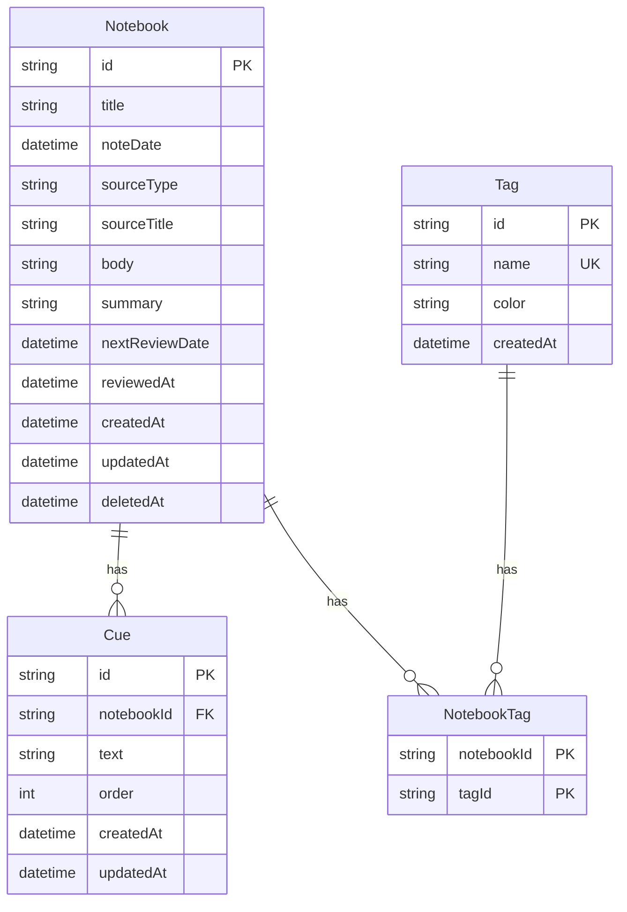

# MVP ER 図

確認日: 2026-06-21

## 位置づけ

このドキュメントは、Cornell Method Notebook MVP の永続データ関係を Mermaid erDiagram で整理した図別設計書です。

参照元:

- `doc/diagrams/MVP_UML_DESIGN.md`
- `doc/data/MVP_DATA_DESIGN.md`
- `doc/requirements/MVP_SYSTEM_SPEC.md`

MVP の永続データは `Notebook`, `Cue`, `Tag`, `NotebookTag` を中心にします。本文カード分割、Cue と本文カードのリンク、ドラフト、復習進捗、Undo、バックアップログは Phase 2 とします。

## Notebook / Cue / Tag / NotebookTag

MVP の永続データは上記 4 エンティティです。`Notebook.deletedAt` はスキーマ上の将来候補ですが、MVP の削除 API は物理削除として扱います。

## MVP 外エンティティの注記

Phase 2 の候補:

- `NoteCard`: 本文カード分割
- `NoteCueLink`: Cue と本文カードの関連
- `NotebookDraftState`: 自動保存、下書き、楽観ロック
- `NotebookReviewProgress`: 1日後 / 1週間後の復習進捗
- `SoftDeleteBuffer`: Undo とソフトデリート
- `BackupLog`: バックアップ実行履歴
