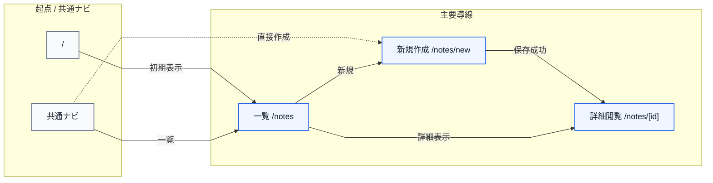
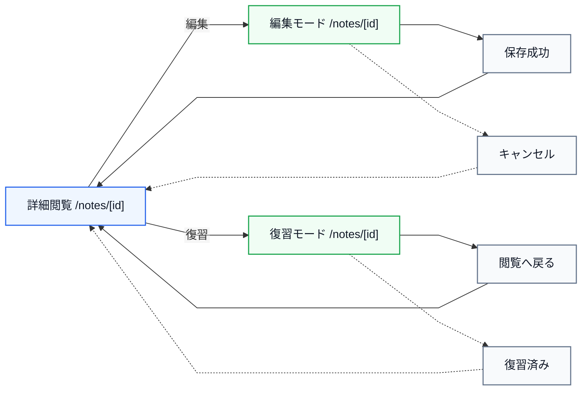
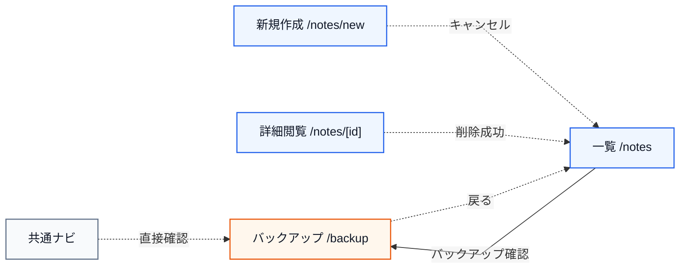

# MVP 画面遷移図

確認日: 2026-06-21

## 位置づけ

このドキュメントは、Cornell Method Notebook MVP の画面遷移を Mermaid flowchart で整理した図別設計書です。

参照元:

- `doc/diagrams/MVP_UML_DESIGN.md`
- `doc/screens/MVP_SCREEN_INVENTORY.md`
- `doc/screens/MVP_SCREEN_DESIGN.md`
- `doc/requirements/MVP_SYSTEM_SPEC.md`

MVP の画面は `/notes`, `/notes/new`, `/notes/[id]`, `/backup` を中心にします。`/tasks/review`, `/notes/backup`, PDF 出力画面、タグ管理画面は Phase 2 とします。

## Main route: root nav notes new detail

## Detail modes: view edit review

## Support routes: backup cancel delete return

MVP では `/tasks/review`、`/notes/backup`、PDF 出力画面、タグ管理画面は作りません。復習対象確認は `/notes` のフィルタ、復習操作は `/notes/[id]` の復習モード、バックアップは `/backup` に集約します。
