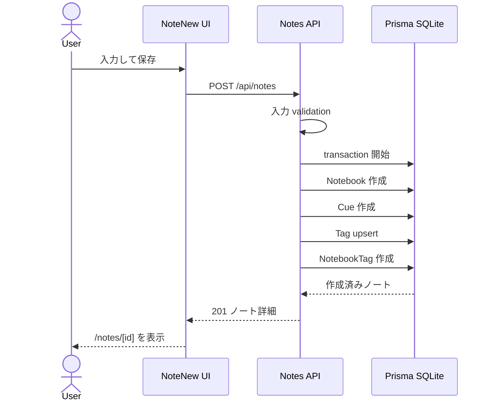
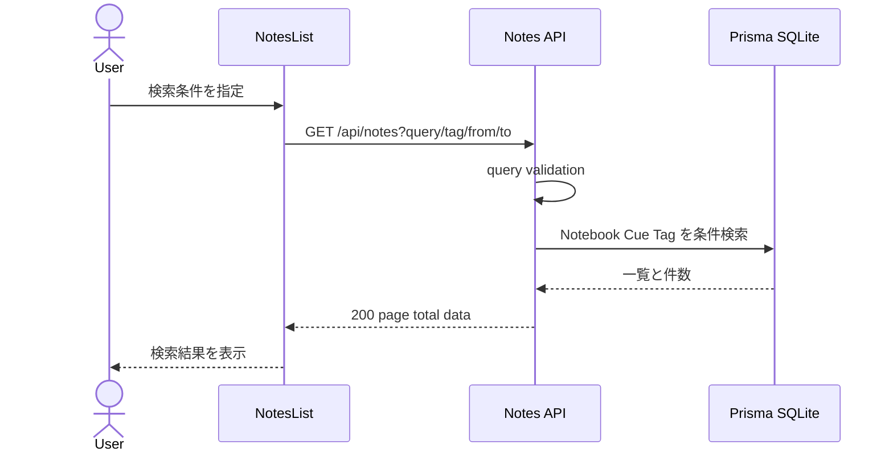
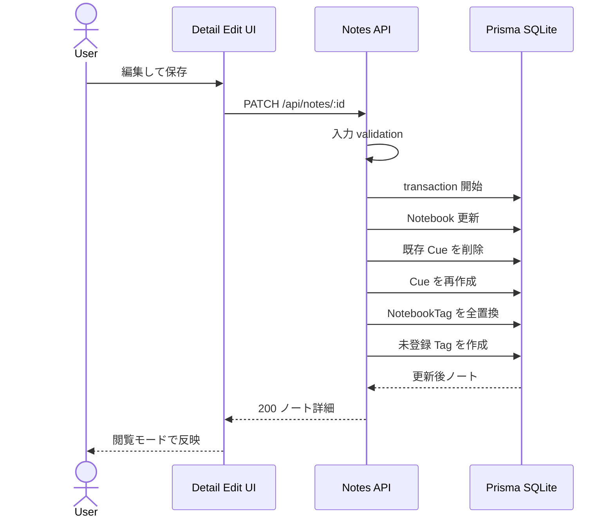
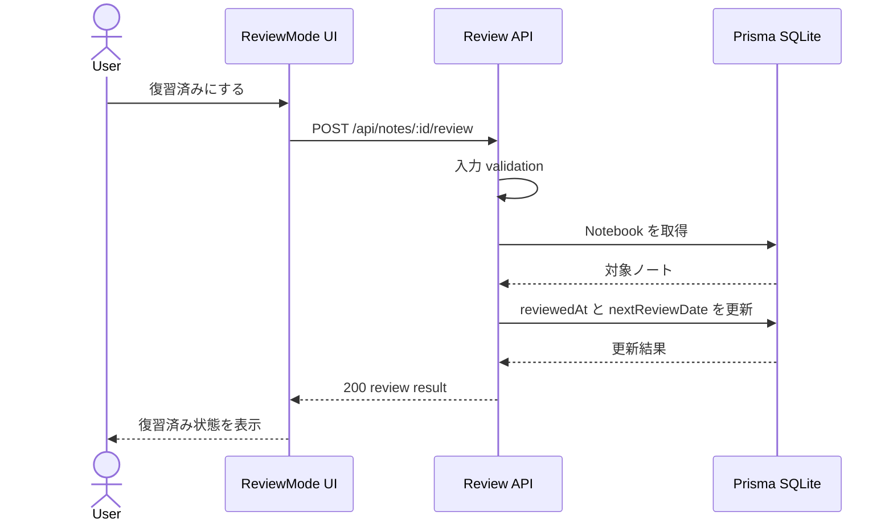
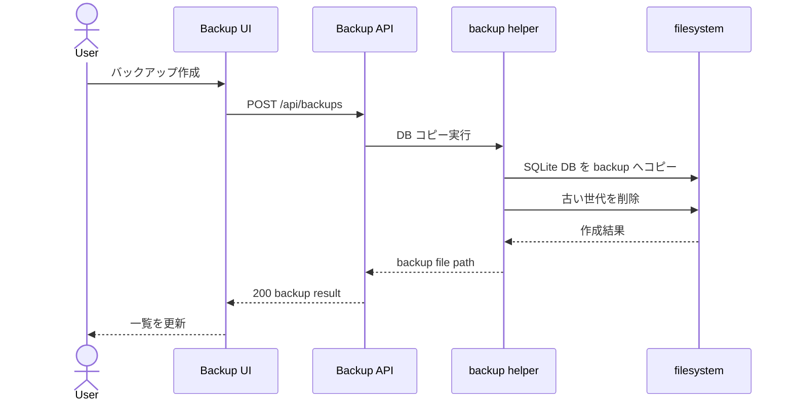

# MVP シーケンス図

確認日: 2026-06-21

## 位置づけ

このドキュメントは、Cornell Method Notebook MVP の主要操作における UI / API / DB / filesystem の責務境界を Mermaid sequenceDiagram で整理した図別設計書です。

参照元:

- `doc/diagrams/MVP_UML_DESIGN.md`
- `doc/workflows/MVP_WORKFLOW_DESIGN.md`
- `doc/api/MVP_API_DESIGN.md`
- `doc/requirements/MVP_SYSTEM_SPEC.md`

MVP は明示保存、Cue / Tag 関連の全置換、手動復習済み更新、手動バックアップで成立させます。差分更新 API、自動保存、楽観ロック、再試行専用バックアップ API は Phase 2 とします。

## ノート作成

## ノート検索

## ノート編集

MVP の編集は Cue と Tag 関連を全置換します。差分更新 API と楽観ロックは Phase 2 です。

## 復習済み更新

## バックアップ作成

