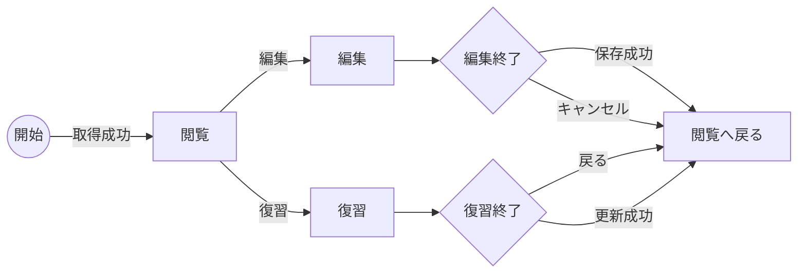
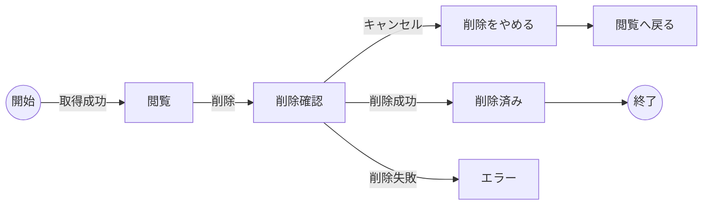
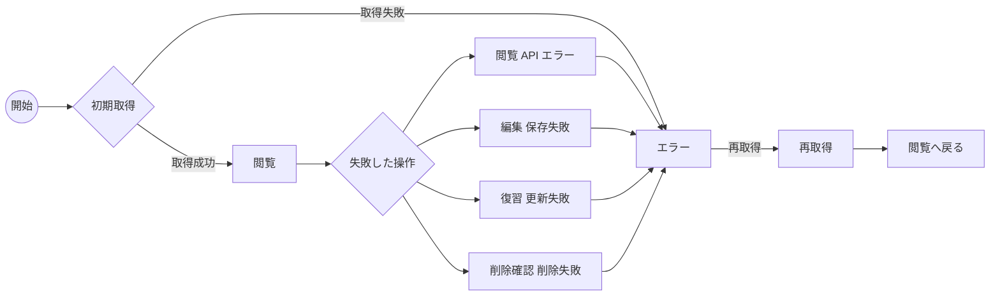
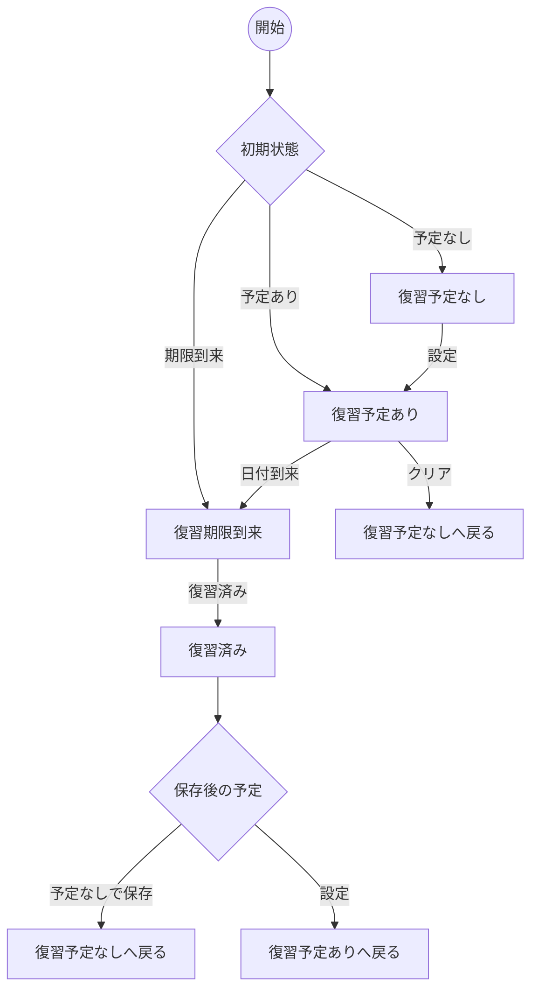

# MVP 状態遷移図

確認日: 2026-06-21

## 位置づけ

このドキュメントは、Cornell Method Notebook MVP の主要状態を Mermaid flowchart で整理した図別設計書です。

参照元:

- `doc/diagrams/MVP_UML_DESIGN.md`
- `doc/screens/MVP_SCREEN_INVENTORY.md`
- `doc/workflows/MVP_WORKFLOW_DESIGN.md`
- `doc/requirements/MVP_SYSTEM_SPEC.md`

MVP の詳細画面は閲覧、編集、復習、削除確認を同一詳細画面内の状態として扱います。読みやすさのため、通常モード遷移、削除遷移、エラー復帰遷移は図を分けて示します。削除 Undo、自動保存停止、409 競合、復習タスク進捗テーブルは Phase 2 とします。

## 詳細画面モード normal mode transitions

通常操作では閲覧を起点に編集または復習へ入り、保存成功、キャンセル、戻る、更新成功で閲覧へ戻ります。

## 詳細画面モード delete transitions

削除系では、閲覧から削除確認へ入り、キャンセルで閲覧へ戻ります。MVP では deleted からの復元遷移はありません。Undo による復元は Phase 2 です。

## 詳細画面モード error recovery transitions

エラー復帰系では、各操作状態から API 失敗でエラーへ入り、再取得成功で閲覧へ戻ります。

## ノート復習状態

`reviewed` は `reviewedAt` が更新された直後の状態を表します。MVP では復習履歴を複数件保持せず、最新の `reviewedAt` のみを保存します。
