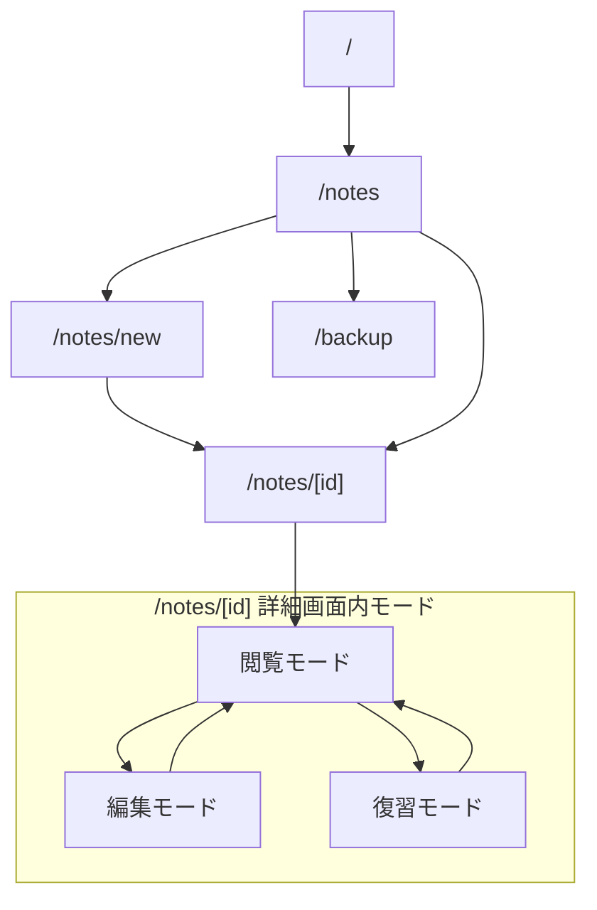

# MVP 画面設計案

確認日: 2026-06-14

## 位置づけ

このドキュメントは、フルリニューアル版 Cornell Method Notebook の MVP 画面設計案です。

MVP の目的は、コーネルメソッドの「記録、整理、要約、想起、復習」を日常的に回せることです。画面設計では、ノート管理機能よりも学習サイクルの操作性を優先します。

## 画面一覧

| 画面ID | パス | 画面名 | 役割 |
| --- | --- | --- | --- |
| COM-001 | 全画面 | 共通レイアウト | グローバルナビ、メイン領域 |
| NTE-010 | `/notes` | ノート一覧 | ノート検索、復習対象確認、新規作成入口 |
| NTE-020 | `/notes/new` | ノート作成 | Cornell 形式で新規ノートを作る |
| NTE-030 | `/notes/[id]` | ノート詳細 | 閲覧、編集、復習モードを切り替える |
| BAK-010 | `/backup` | バックアップ | DB バックアップの作成・確認 |

MVP では `/tasks/review` のような独立した復習タスク画面は作りません。復習対象は、ユーザーが手動で設定する `nextReviewDate` が存在し、`nextReviewDate <= today` となったノートです。`/notes` で絞り込み、`/notes/[id]` の詳細画面内の復習モードで実施します。

復習日と完了記録のルールは次のとおりです。

- `/notes/new` の `nextReviewDate` は `noteDate + 7日` を初期入力とし、保存前に変更または空欄化できる。
- 既存ノートの `nextReviewDate` が未設定でも、編集開始時に自動補完しない。`noteDate` を変更しても、ユーザーが設定した次回復習日は自動移動しない。
- 復習完了時は `POST /api/notes/:id/review` を呼び、`reviewedAt` とユーザーが入力した次回復習日を更新する。復習後の日付も自動計算しない。
- `/tasks/review`、1 日後 / 1 週間後の自動タスク、`review status`、未完了タスクバッジは Phase 2 以降の機能である。

この方針は発注者承認済みです。

## 共通レイアウト COM-001

### 表示要素

- アプリ名
- ナビゲーション
  - ノート一覧
  - 新規作成
  - バックアップ

### MVP では表示しないもの

- 復習タスク専用ナビ
- 未完タスクバッジ
- ユーザーアイコン
- 認証・ログアウト導線

## ノート一覧 NTE-010

### 目的

保存済みノートを探し、読み返し、復習対象へ入るための画面です。

### 表示要素

| 項目 | 内容 |
| --- | --- |
| 新規作成ボタン | `/notes/new` へ遷移 |
| フリーワード検索 | title, overview, body, summary, cue.text を対象 |
| 日付 From / To | noteDate の範囲検索 |
| タグフィルタ | OR 条件 |
| 復習対象フィルタ | 設定済みの `nextReviewDate` が `today` 以前のノートを表示 |
| ノート一覧 | タイトル、日付、タグ、要約状態、次回復習日、最終復習日時を表示 |

### ノート一覧カードの表示

- タイトル
- 学習日
- 学習元
- タグ
- Cue 件数
- 要約状態
  - 要約あり
  - 要約未作成
- 復習情報（`nextReviewDate` と `reviewedAt` から表示）
  - 次回復習日未設定
  - 次回復習日
  - 復習対象（次回復習日が今日以前）
  - 最終復習日時

### 主要アクション

| アクション | 結果 |
| --- | --- |
| 新規作成 | `/notes/new` へ遷移 |
| 検索 | 条件に一致するノート一覧を表示 |
| ノート選択 | `/notes/[id]` へ遷移 |
| 復習対象のみ表示 | 設定済みの次回復習日が今日以前のノートだけを表示 |

### MVP ではやらないこと

- 一覧からの直接編集
- 一覧からの直接削除
- PDF 出力
- ページ単位の一括操作
- 右クリックメニュー

### UI 状態詳細

#### validation 表示

| 対象 | 表示タイミング | 表示場所 | 文言 |
| --- | --- | --- | --- |
| 日付 From / To | From または To のフォーカスアウト時、検索実行時 | 検索フォーム下 | `開始日は終了日以前の日付を指定してください。` |
| API query validation | 一覧取得 API が 400 を返した時 | 検索フォーム下または検索結果上の error alert | API の `message` を表示。field 別詳細が必要な場合は日付欄近くに表示する |

MVP の一覧画面では、日付は `<input type="date">` を前提にする。`react-day-picker`、クイックセレクト、日付ソート切替は MVP 外とする。

#### button disabled 条件

| ボタン / 入力 | disabled 条件 |
| --- | --- |
| 検索 | 一覧取得中 |
| クリア | 原則 disabled にしない |
| タグ選択 | タグ候補取得中、または追加可能なタグ候補が 0 件 |
| タグ追加 | タグ未選択、または既に選択済み |
| タグ条件チップ削除 | 原則 disabled にしない |
| 前へ | 1 ページ目、またはページ情報未取得 |
| 次へ | 最終ページ、またはページ情報未取得 |
| 新規作成 | 原則 disabled にしない |

#### loading / error / empty

| 状態 | 表示 |
| --- | --- |
| 一覧取得中 | 検索結果エリアに `読み込み中...` を表示し、検索ボタンを disabled にする |
| タグ候補取得中 | タグ select の先頭 option に `タグ読み込み中` を表示し、select を disabled にする |
| 一覧取得失敗 | 検索結果上に赤系の alert で API `message`、または `読み込みに失敗しました` を表示する |
| タグ候補取得失敗 | 同じ error alert に `タグ候補の読み込みに失敗しました` または API `message` を表示する |
| 検索結果 0 件 | `条件に一致するノートはありません。` と、検索条件変更または新規作成を促す補助文を表示する |
| 復習対象 0 件 | 復習対象フィルタ適用時も同じ empty 表示でよい。MVP では専用タスク画面へ誘導しない |
| タグ 0 件 | select は `タグを選択` 表示のまま disabled。タグはノート保存時に作成する |

#### 成功時挙動

- 検索成功時は検索結果、総件数、必要に応じてページャを更新する。
- クリア時は検索条件を初期化し、次の一覧取得で全件条件へ戻す。
- 一覧画面では DB 更新を伴う成功通知は表示しない。

## ノート作成 NTE-020

### 目的

コーネルメソッド形式で新しいノートを作成します。

### 入力項目

| 項目 | 必須 | 説明 |
| --- | --- | --- |
| タイトル | 必須 | ノートタイトル |
| 学習日 | 必須 | 今日以前 |
| 学習元タイプ | 任意 | book, lecture, video, article, other |
| 学習元タイトル | 任意 | 書籍名、講義名、動画名など |
| 概要 | 任意 | ノート全体の短い説明 |
| タグ | 任意 | 最大12個 |
| キーワード / 質問 | 任意 | Cue リスト |
| ノート本文 | 任意 | Markdown |
| サマリー | 任意 | Markdown |
| 次回復習日 | 任意 | 新規作成では `学習日 + 7日` を初期入力。保存前に変更または空欄化できる。既存ノートの未設定値は自動補完しない |

### 復習日の初期値・編集ルール

- 新規作成時は `nextReviewDate = noteDate + 7日` をフォームへ初期入力する。
- ユーザーは保存前に初期値を別の日付へ変更するか、空欄にして保存できる。
- 既存ノートの編集開始時は保存済みの `nextReviewDate` をそのまま表示し、未設定値を自動補完しない。
- 既存ノートで `noteDate` を変更しても、手動設定済みの `nextReviewDate` は自動移動しない。

### レイアウト

デスクトップ:

- 上部: タイトル、学習日、学習元、タグ
- 中央: Cornell レイアウト
  - 左: キーワード / 質問
  - 右: ノート本文
- 下部: サマリー、次回復習日、保存ボタン

モバイル:

- タイトル、学習日、学習元、タグ
- キーワード / 質問
- ノート本文
- サマリー
- 次回復習日、保存ボタン

### 主要アクション

| アクション | 結果 |
| --- | --- |
| Cue 追加 | キーワード / 質問行を追加 |
| Cue 削除 | 対象 Cue を削除 |
| 保存 | ノートを作成し `/notes/[id]` へ遷移 |
| キャンセル | `/notes` へ戻る |

### MVP ではやらないこと

- 自動保存
- 下書き保存
- D&D 並び替え
- Cue と本文範囲のリンク
- Markdown 専用エディタ、リッチな Markdown ツールバー

### UI 状態詳細

#### validation 表示

作成画面では、HTML 標準 validation に加えて、保存 API の field 別 error を各入力欄の直下に表示する。API 全体の `message` はフォーム上部の alert に表示する。

| 対象 | 表示タイミング | 表示場所 | 文言 |
| --- | --- | --- | --- |
| タイトル未入力 | 保存実行時 | タイトル欄直下 | `タイトルは必須です` |
| タイトル 120 文字超 | 保存実行時 | タイトル欄直下 | `タイトルは120文字以内で入力してください` |
| 学習日不正形式 | 保存実行時 | 学習日欄直下 | `YYYY-MM-DD形式で入力してください` |
| 学習日未来日 | 保存実行時。UI では `max=today` でも抑止する | 学習日欄直下 | `未来日は入力できません` |
| 学習元タイトル 120 文字超 | 保存実行時 | 学習元タイトル欄直下 | `出典タイトルは120文字以内で入力してください` |
| 概要 400 文字超 | 保存実行時 | 概要欄直下 | `概要は400文字以内で入力してください` |
| Cue 120 文字超 | 保存実行時 | 対象 Cue 欄直下 | `キューは120文字以内で入力してください` |
| 空 Cue | 保存前に trim して除外する。API に送る場合は保存実行時 | 対象 Cue 欄直下 | `キューは必須です` |
| タグ 13 件目追加 | タグ追加操作時 | タグ入力欄下 | `タグは12件以内で入力してください。` |
| タグ重複追加 | タグ追加操作時 | タグ入力欄下 | `同じタグは追加できません。` |
| タグ名 30 文字超 / 使用不可文字 | 保存実行時 | 対象タグの error 表示 | API の field 別 message |
| 次回復習日が学習日より前 | 保存実行時 | 次回復習日欄直下 | `次回復習日は記載日以降の日付を入力してください` |

#### button disabled 条件

| ボタン / 入力 | disabled 条件 |
| --- | --- |
| 保存 | 保存中 |
| キャンセル | 原則 disabled にしない |
| Cue 追加 | 原則 disabled にしない |
| Cue 削除 | 原則 disabled にしない |
| タグ追加 | 現コード方針ではクリック可能。ただし空入力は何もしない。12 件超・重複は local error を表示する |
| タグ削除 | 原則 disabled にしない |

#### loading / error / empty

| 状態 | 表示 |
| --- | --- |
| 保存中 | 保存ボタンを `保存中...` に変更し disabled にする |
| 保存失敗 | フォーム上部に赤系 alert で API `message`、または `保存に失敗しました。通信状態またはAPIを確認してください。` を表示する |
| field error | 各入力欄の直下に赤系テキストで表示し、対象入力に `aria-invalid` を付与する |
| Cue 0 件 | Cue 欄に `Cue は未追加です。` を表示する |
| 本文 preview 空 | `本文のプレビューはまだありません。` を表示する |
| サマリー preview 空 | `サマリーのプレビューはまだありません。` を表示する |

#### 保存成功時挙動

- `POST /api/notes` 成功後は、レスポンスの `id` を使って `/notes/[id]` へ遷移し、詳細閲覧モードを表示する。
- 未登録タグが含まれる場合は保存時に自動作成される。MVP では作成タグ専用の toast は不要。
- 自動保存、下書きステータス、409 競合 UI は表示しない。

## ノート詳細 NTE-030

### 目的

保存済みノートを閲覧、編集、復習します。

### 画面モード

| モード | 役割 |
| --- | --- |
| 閲覧モード | Cornell レイアウトでノートを読む |
| 編集モード | ノート内容を更新する |
| 復習モード | Cue で想起し、本文を確認した後に Summary（サマリー）を開いて確認する |

### 閲覧／復習共通の詳細画面シェル

閲覧モードと復習モードは、目的と操作が異なっても、同じ詳細画面シェルを維持する。モードラベルやモードごとの操作ボタンは変更してよいが、表示領域の順序・位置をモードごとに組み替えない。

- ヘッダー領域に、一覧へ戻る導線、現在のモードラベル、モード固有の操作ボタンを置く。
- ヘッダー領域内にタイトルとメタ情報（学習日、学習元、タグ、次回復習日、最終復習日時）を置き、その下に概要を置く。
- 概要の下に Cornell レイアウトを置く。デスクトップでは Cue／キーワード／質問を左、本文を右に配置し、幅は基本的に 30% / 70% とする。
- Cornell レイアウトの下にサマリーを置く。復習モードではサマリーの内容を初期非表示にし、復習操作と復習記録はサマリーの後ろに追加する。
- モバイルでも「ヘッダー・メタ情報・概要 → Cornell（Cue／本文）→ サマリー」の基本順序を維持する。狭い幅では Cornell 部分の表示方法をレスポンシブに調整してよいが、Cue と本文の関係を別の上段構成へ移さない。

復習モードのレイアウト上の差分は、共通シェル内の本文領域とサマリー内容を初期状態で非表示にすること、本文を同じ本文領域で表示／非表示に切り替えること、Cue での想起後にサマリーを開けること、復習操作と復習記録を追加することに限る。Cue、本文領域、サマリーの位置は閲覧モードから変更しない。

### 閲覧モード

表示:

- タイトル
- 学習日
- 学習元
- タグ
- 概要
- Cue リスト
- Markdown 表示された本文
- Markdown 表示されたサマリー
- 次回復習日
- 最終復習日

アクション:

| アクション | 結果 |
| --- | --- |
| 編集 | 編集モードへ切替 |
| 復習 | 復習モードへ切替 |
| 削除 | 確認後に削除し `/notes` へ戻る |

### 編集モード

表示・入力:

- ノート作成画面と同じ入力項目

アクション:

| アクション | 結果 |
| --- | --- |
| 保存 | 更新して閲覧モードへ戻る |
| キャンセル | 変更を破棄して閲覧モードへ戻る |
| Cue 追加 | Cue を追加 |
| Cue 削除 | Cue を削除 |

### 復習モード

目的:

- Cue を先に見て本文を思い出し、本文を確認した後にサマリーを開いて答え合わせする。

レイアウト:

- 閲覧モードと同じヘッダー領域、タイトル・メタ情報、概要、Cornell レイアウト、サマリーの位置を使う。
- Cornell レイアウトでは Cue を左、本文領域を右に置く。本文領域だけを初期状態でマスクし、サマリーの内容も初期非表示にする。Cue とサマリーを別の上段領域へ移動しない。
- 復習記録と復習操作は、共通シェルのサマリーの後ろに追加する。

初期表示:

- タイトル
- 学習日
- 学習元
- タグ
- 概要
- Cue リスト
- 本文領域（本文は非表示）
- サマリー（内容は初期非表示。Cue で想起し、本文を確認した後に開く）
- 次回復習日、最終復習日時

アクション:

| アクション | 結果 |
| --- | --- |
| 本文を表示 | Markdown 表示された本文を表示 |
| 本文を隠す | 本文を再度非表示 |
| 復習済みにする | `POST /api/notes/:id/review` を呼び、`reviewedAt` を現在日時に更新。入力した `nextReviewDate` を保存し、変更または空欄化を反映 |
| サマリーを開く | Cue で想起し、本文を確認した後にサマリーの Markdown を表示 |
| 閲覧へ戻る | 閲覧モードへ戻る |

### 復習モードの注意点

- 採点や正誤判定はしない。
- 自動で次回復習日を計算しない。
- 本文表示状態は保存しない。

### UI 状態詳細

#### 詳細取得

| 状態 | 表示 |
| --- | --- |
| 詳細取得中 | App Router / Server Component のロード中表示に委譲する。必要になった場合のみページ単位の loading UI を追加する |
| 404 / 取得失敗 | `ノートが見つかりません`、`指定されたノートは削除されたか、取得に失敗しました。`、`一覧へ戻る` を表示する |

#### 閲覧モード

| 項目 | 表示 |
| --- | --- |
| 概要なし | `概要は未入力です。` |
| タグなし | `タグなし` |
| Cue なし | `Cue は未追加です。` |
| 本文なし | `本文は未入力です。` |
| サマリーなし | `サマリーは未入力です。` |
| 次回復習日なし | `未設定` |
| 最終復習日時なし | `未記録` |

#### 編集モード

編集モードは作成画面と同じ validation、button disabled、保存中、保存失敗表示を使う。

| 操作 | 成功時挙動 |
| --- | --- |
| 保存 | `PATCH /api/notes/:id` 成功後、詳細画面の閲覧モードへ戻る。画面データは再取得または router refresh で更新する |
| キャンセル / 閲覧へ戻る | 未保存変更を保存せず閲覧モードへ戻る。MVP では未保存変更確認ダイアログは必須にしない |

#### 復習モード

| 状態 / 操作 | 表示・挙動 |
| --- | --- |
| 共通シェル | 閲覧モードと同じヘッダー、概要、Cue／本文の Cornell 配置、サマリーの位置を維持する。モードラベルと操作ボタンだけが異なる |
| 初期表示 | 共通シェルの本文領域とサマリー内容を非表示にし、`本文は非表示です。Cue で思い出してから本文を表示し、確認後にサマリーを開いてください。` と表示する |
| 本文を表示 | 同じ本文領域で本文 Markdown を表示し、`本文を隠す` ボタンを表示する |
| 本文を隠す | 同じ本文領域を再度マスクする。表示状態は保存しない |
| サマリーを開く | Cue での想起と本文確認の後に、同じサマリー領域で Summary Markdown を表示する |
| Cue なし | `Cue は未追加です。` |
| サマリーなし | サマリーを開いた後に `サマリーは未入力です。` |
| 本文なし | 本文表示時に `本文は未入力です。` |
| 復習済み更新中 | `復習済みにする` ボタンを `更新中...` に変更し disabled にする |
| 復習済み更新失敗 | 詳細ヘッダー下に赤系 alert で API `message`、または `復習済み更新に失敗しました。通信状態またはAPIを確認してください。` を表示する |
| 復習済み更新成功 | `reviewedAt` と `nextReviewDate` を画面状態へ反映し、本文表示を閉じ、閲覧モードへ戻る |

#### 削除

| 状態 / 操作 | 表示・挙動 |
| --- | --- |
| 削除ボタン | 削除中のみ disabled |
| 削除確認 | ブラウザ確認 UI または同等の確認 UI で `このノートを削除します。よろしいですか？` を表示する |
| 確認キャンセル | API を呼ばず閲覧モードに留まる |
| 削除中 | 削除ボタンを `削除中...` に変更し disabled にする |
| 削除失敗 | 詳細ヘッダー下に赤系 alert で API `message`、または `削除に失敗しました。通信状態またはAPIを確認してください。` を表示する |
| 削除成功 | `/notes` へ遷移し、一覧を再取得する |

MVP の削除は、確認 UI で確定した後に `DELETE /api/notes/:id` を実行して物理削除する。削除後の Undo / 復元は保証しない。5 秒 Undo Snackbar、ソフトデリート、Undo buffer（`SoftDeleteBuffer`）、`/api/undo`、期限切れ後の purge は MVP では提供せず、Phase 2 以降の要件である。

## バックアップ BAK-010

### 目的

ローカル DB の破損や誤操作に備えます。

### 表示要素

- バックアップ作成ボタン
- 最新バックアップ一覧
- 保存先パス
- 失敗時のエラーメッセージ

### 主要アクション

| アクション | 結果 |
| --- | --- |
| バックアップ作成 | SQLite DB ファイルを backup 配下へコピー |
| バックアップ一覧更新 | 最新状態を再取得 |

### MVP ではやらないこと

- バックアップログ DB 管理
- バックアップからの自動復元
- スケジュール実行 UI

### UI 状態詳細

#### button disabled 条件

| ボタン | disabled 条件 |
| --- | --- |
| バックアップ作成 | 作成中 |
| 一覧更新 | 一覧取得中、またはバックアップ作成中 |
| ノート一覧へ | 原則 disabled にしない |

#### loading / error / empty

| 状態 | 表示 |
| --- | --- |
| 一覧取得中 | 最新バックアップ欄に `バックアップ一覧を読み込み中...` を表示する |
| バックアップ作成中 | 作成ボタンを `作成中...` に変更し disabled にする |
| バックアップ 0 件 | `バックアップはまだありません。` と `バックアップ作成から現在の SQLite DB を保存できます。` を表示する |
| 一覧取得失敗 | 赤系 alert で API `message`、または `バックアップ一覧の取得に失敗しました。` を表示する |
| 作成失敗 | 赤系 alert で API `message`、または `バックアップの作成に失敗しました。` を表示する |

#### 成功時挙動

- `POST /api/backups` 成功後は `バックアップファイル名 を作成しました。` を表示する。
- 成功後に `GET /api/backups` を再実行し、最新 3 世代の一覧を更新する。
- バックアップからの復元、retry 専用 API、ログ詳細表示は MVP 外とする。

## 画面遷移

## MVP 受け入れ条件

- ノートを作成できる。
- 作成したノートを一覧で確認できる。
- ノートを閲覧できる。
- ノートを編集して保存できる。
- Cue、本文、サマリーが Cornell レイアウトで表示される。
- 復習モードで本文を隠せる。
- 復習モードで本文を表示できる。
- 復習モードで Summary を初期非表示にし、Cue と本文確認の後に開ける。
- 復習済みにできる。
- 次回復習日で復習対象を絞り込める。
- 新規作成時の次回復習日が `noteDate + 7日` で初期入力され、既存ノートの未設定値は自動補完されない。
- タイトル、日付、タグで絞り込める。
- 要約未作成のノートが一覧と詳細でわかる。
- バックアップを作成できる。

## Open Question

| ID | 論点 | Manager 推奨 |
| --- | --- | --- |
| Q-001 | 詳細画面の初期表示は閲覧モードでよいか | はい |
| Q-002 | 新規作成後は詳細の閲覧モードへ遷移でよいか | はい |
| Q-003 | 復習対象一覧は `/notes` のフィルタで扱い、専用画面は MVP 外でよいか | はい（発注者承認済み） |
| Q-004 | 削除は MVP では確認ダイアログ + 物理削除でよいか | はい |
| Q-005 | バックアップ画面のパスは `/backup` でよいか | はい |

### MVP / Phase 2 の復習境界

| MVP | Phase 2 以降 |
| --- | --- |
| 手動管理の `nextReviewDate`、新規作成時の `noteDate + 7日` 初期値、詳細画面内の復習モード、`POST /api/notes/:id/review` による `reviewedAt` と次回日更新、復習時 Summary の初期非表示 | `/tasks/review`、1 日後 / 1 週間後の自動タスク、`review status`、未完了タスクバッジ |

## 次に決めること

発注者確認後、この画面設計を元に MVP API 設計へ進む。
