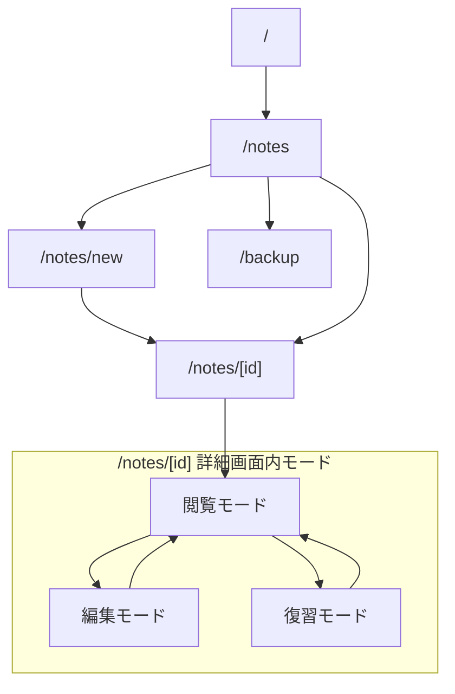

# MVP 画面設計案（紙面中心 UI 目標）

確認日: 2026-07-18

## 位置づけ

このドキュメントは、フルリニューアル版 Cornell Method Notebook の MVP 画面設計案です。今回の更新では、現在の入力フォーム中心の見た目から「紙面を中心にした学習ノート」へ向けた To-Be UI を、後続 Worker が実装できる粒度で定義します。

MVP の目的は、コーネルメソッドの「記録、整理、要約、想起、復習」を日常的に回せることです。画面設計では、ノート管理機能よりも学習サイクルの操作性を優先します。

現行 MVP の route、API、Prisma / SQLite のデータ、明示保存、復習、削除方式は [`doc/implementation/MVP_CONTRACT.md`](../implementation/MVP_CONTRACT.md) が正本です。この文書のレイアウト変更は UI の目標を定めるものであり、契約やデータ構造を変更しません。As-Is（現状・比較基準）と To-Be（実装目標）は明示的に分け、To-Be の実装完了はコードの存在だけでなく runtime QA で判定します。

視覚的な正本は [`mvp-paper-note-canvas-concept.png`](assets/mockups/mvp-paper-note-canvas-concept.png) です。以下の紙面、色の関係、情報階層、操作位置はこの PNG を基準にし、standalone HTML は状態差分を確認する補助資料として扱います。

## 目標コンセプト: 紙面を中心にした学習ノート

### 表現の原則

目標 UI では、画面の主役をフォーム部品ではなく、タイトルから Cue、本文、Summary へ続く一枚の学習紙面にします。紙らしさは強い skeuomorphism ではなく、深いアプリクロームと暖色の紙面、罫線、余白、タイポグラフィの関係で表現します。

- 画面背景は深いフォレストグリーン系のアプリクロームとし、その中央に暖色の一枚紙面を置く。紙面の外周には十分な余白と控えめな一層の影を設け、紙面と背景の境界を識別できるようにする。
- PC では紙面を画面中央で広く使う。親レイアウトの狭い `max-w` に閉じ込めず、本文列の読み書き幅を優先する。紙面幅は viewport に応じて外周 gutter を差し引く fluid rule を基準にし、1440px 前後でも画面の大部分を一枚紙面として使う。極端に広い viewport のための上限は、本文の可読幅を守る目的で別途設ける。
- Canvas 本文を最も広い読み書き領域にし、タイトルと本文の視線を最短にする。
- 紙面全体を一つの連続したシートとして扱い、情報を細かい浮遊カードへ分割しない。
- セクションの境界は薄い横罫線、Cornell の縦罫線、余白で示す。入力欄・表示欄に強いカード影、厚い枠、過剰な角丸を使わない。
- タイトルは最も強いタイポグラフィ、Cue とメタ情報は補助的なサイズ・色、本文は読みやすい行間で表示する。新しいフォント依存は追加せず、既存のフォントスタックを使う。
- 編集面は紙面から浮いた入力フォームに見せず、薄い境界線と明確な focus 表示を持つ書き込み面として扱う。アクセシビリティのため入力境界とエラー表示は省略しない。
- 紙面は暖色の白〜アイボリー系を基本とし、背景画像や装飾イラストを必須にしない。紙面の暖かさは背景色、薄い罫線、余白で保つ。

### 共通ヘッダーの固定要素

アプリクローム上部には、作成・編集・閲覧・復習の全状態で次の共通ヘッダーを置く。紙面外のクロームと紙面内のノート内容を混同しない。

| 要素 | 表示・役割 | 状態差分 |
| --- | --- | --- |
| アプリ名 | `CORNELL NOTEBOOK` とブランドマーク | なし。全画面で同じ位置に置く |
| ノート一覧 | `/notes` へ戻る主要ナビ | なし |
| 新規作成 | `/notes/new` へ移動する主要ナビ | なし |
| 編集状態 | 現在の `新規作成`、`編集中`、`閲覧中`、`復習中` を小さな状態バッジで表示 | ラベルと状態色のみ変更し、紙面の骨格は変えない |
| バックアップ | `/backup` への既存 MVP 導線。概念 PNG の視覚的優先順位を崩さない補助ナビ | 画面幅が狭い場合は補助ナビへ折り返してよい |

アプリクロームのヘッダーは深いフォレストグリーン上に置き、暖色の紙面へ視線を導く。紙面内には必要に応じて「一覧へ戻る」や詳細画面のモード操作を置くが、アプリ名・一覧・新規作成・状態バッジを紙面内へ重複表示しない。

### 情報階層の固定

上から下の順序を次のように固定します。編集・閲覧・復習で紙面の骨格を入れ替えず、モード差分は表示状態と操作だけに限定します。

1. **タイトル帯**: 全モードで紙面上部にタイトルを表示する。閲覧・復習では大きな見出し、作成・編集では同じ位置のタイトル入力欄とする。タイトルを Cornell や Summary の中へ重複表示しない。MVP では sticky header を必須にせず、タイトル帯を紙面の識別子として扱う。
2. **コンパクトなメタ情報帯**: 学習日、学習元、タグをタイトル直下に一行のメタ情報として置き、幅が足りなければ自然に折り返す。基本情報を大きな独立カードにはしない。
3. **Cornell 本文領域**: Cue と本文を紙面の中心に置く。Cue は左、本文は右で、本文側を主役にする。
4. **Summary と紙面フッター**: Cornell の下に Summary を置き、次回復習日と保存・キャンセルなどの操作を紙面の末尾にまとめる。

タイトルは「全モードで常に紙面の識別子として表示する」という意味で常時表示とします。スクロール中も固定すること、タイトルを編集画面の上部と本文近くに二重表示することは MVP の要件にしません。

### 作成・編集・閲覧・復習の共通骨格と状態差分

以下の順序を全状態で共有し、状態差分は入力可否・本文開示・復習操作に限定する。

| 状態 | タイトル／メタ情報 | Cornell | Summary / フッター |
| --- | --- | --- | --- |
| 作成 | タイトル入力を主見出し位置、学習日・学習元・タグを入力可能なメタ情報帯 | Cue 入力リスト、Canvas editor、幅・高さの数値入力と適用操作 | Summary textarea と任意の簡易 Preview。次回復習日、キャンセル、保存を紙面下部に置き、保存を右下の主操作にする |
| 編集 | 作成と同じ位置に既存値を表示・編集 | 作成と同じ。保存済み `CanvasDocumentV1` を復元し、用紙寸法だけを変更できる | `PATCH` の明示保存。保存・キャンセルを右下のフッターに集約 |
| 閲覧 | タイトルを大きな見出し、メタ情報を表示専用帯として表示 | Cue リストを左、保存済み Canvas 本文を右。本文列を主役にする | Summary を全幅で Markdown 表示。上部に編集・復習・削除、下部に次回復習情報 |
| 復習 | 閲覧と同じ位置・値。状態バッジは `復習中` | Cue を先に表示。Canvas 本文を初期マスクし、列幅を縮めない。本文確認後に開示 | Summary の内容は初期非表示。本文確認後に同じ全幅領域で開き、復習済み操作をその直後に置く |

本文、Cue、Summary のデータを状態ごとに分割・複製しない。表示状態だけを UI state として持ち、復習中の本文開示状態は保存しない。

### Cornell の幅と本文の扱い

- Cornell の目安は Cue 28〜32% / 本文 68〜72% とし、MVP 契約の約 30% / 70% を基準にします。Cue を広げて本文を圧迫しないことを優先します。
- 本文は、Canvas 上の自由配置・読み返しに使うため最も広い列とします。本文を主役にする理由は、学習記録の情報量と読み書きの滞在時間が Cue より大きく、狭い本文では紙面中心という目的が失われるためです。
- 本文列の中では、**Canvas editor / viewer と用紙サイズ操作を配置することを目標の基本配置**とします。幅・高さの数値入力は用紙寸法を変更し、表示倍率の操作とは別に扱います。
- 閲覧モードでは本文列に保存済み Canvas を表示し、編集モードでは Canvas editor を置きます。既存 `bodyMode=markdown` のノートだけは従来の Markdown 表示・Preview を使い、Cue / Summary の Markdown Preview と sanitize 契約は維持します。

### Canvas 本文領域と用紙サイズ操作

- Cornell の Cue は左欄に残し、中央の本文領域は右側のフリー入力 Canvas とする。Summary は Cornell の下に残し、Canvas 本文を Summary の Markdown へ統合しない。
- Canvas の用紙は `CanvasDocumentV1.page` で表し、既定値は幅 1200px・高さ 800px、幅・高さとも 320〜4000px の整数 px を許容する。
- 本文領域の操作帯に `幅` と `高さ` の数値入力、および `適用` 操作を置く。値は表示倍率ではなく用紙そのものの寸法として扱う。
- Fit / 50% / 100% / 200% は表示用倍率の操作であり、用紙サイズの選択肢として置かない。表示倍率を内部に残す場合も、用紙寸法の state・保存値と分離する。
- 適用時は `page.width` / `page.height` だけを変更し、Canvas 要素の `x`, `y`, `width`, `height`, `points`, `style` を自動変更しない。用紙を小さくして要素が境界外になっても、削除・移動・縮小・自動クリップを行わない。
- 保存・復元では既存の Canvas JSON 保存領域を使う。既存の 1200x800 Canvas document は自動変換せず、用紙サイズ変更だけで Prisma migration を追加しない。
- Canvas text 要素から作られる `searchText` は一覧検索に使う。用紙サイズだけを変更した場合、一覧検索結果と `searchText` は変えない。

### 紙面シェルの密度

紙面シェルはページの中央に置きますが、狭い固定幅に閉じ込めません。1280px / 1440px 前後では利用可能な横幅を本文に優先的に配分し、タイトル帯・メタ情報帯・Cornell・Summary が一つの読み流れに見えることを目標にします。目標 UI の実装では、見た目のカード枚数を減らすためにデータの Cue リストや本文文字列を分割・統合しません。

### レスポンシブ境界

- `1280px` / `1440px` 前後では、アプリクロームの左右余白の内側に広い紙面を置き、紙面内の左右 padding を確保した上で Cue 約 30% / 本文約 70% とする。紙面を狭くするために本文列を別のカードや横並び Preview で二分しない。
- `768px` では紙面、タイトル、メタ情報、Cornell、Summary、主要操作が画面内で確認できることを確認する。Cornell は原則として左 Cue / 右本文の関係を維持する。
- `768px` 未満では本格的なモバイル編集最適化を MVP の必須条件にしない。現行 MVP 方針に従い、Cornell の作業面に限った局所横スクロールは許容するが、`body` やアプリ全体に横スクロールを発生させない。横スクロールを採用する場合は Cornell の wrapper 内に閉じ込める。
- `375px` では紙面外周を縮めてページ全体の横幅に収め、タイトル・メタ情報・Summary は通常の縦スクロールで到達できるようにする。Cue の追加・削除、Cue 入力、Canvas 操作、用紙サイズ入力、Summary Preview、保存・キャンセルも到達可能にする。
- 375 / 768px で Cornell を縦積みに変更すること、Cue と本文を別ページへ分けること、本文を隠して全体を縮めることは現行 MVP の必須要件ではない。変更する場合は別途モバイル方針を更新する。

### アクセシビリティ契約

- `header` / `nav` / `main` / 紙面の `article` / `footer` を意味的に分け、紙面にはタイトルとの `aria-labelledby` を付ける。アプリ名、ノート一覧、新規作成、状態バッジは視覚だけでなく accessible name を持つ。
- 紙面内の見出しはタイトルを `h1` とし、Cue、本文、Summary を `h2` 以下の順序で置く。タイトルを表示と入力で二重に読み上げない。
- すべての title、日付、学習元、タグ、Cue、本文、Summary、次回復習日は label または明確な accessible name を持つ。エラーは `aria-invalid` と `aria-describedby` で対象入力に関連付ける。
- 保存中、復習更新中、削除失敗、入力エラーは視覚的な色だけに依存せず、文言で示す。状態変更や alert は必要に応じて `role="status"` / `role="alert"` とする。
- ボタン、リンク、開閉操作、本文表示／非表示、Summary 開示はキーボードから到達・操作でき、focus-visible を常に確認できること。Preview の checkbox は表示専用であり、クリックで保存値を変更しない。
- Cornell の局所横スクロールを許容する場合は、ページ全体の overflow と区別できる wrapper、見出し、キーボード到達性を持たせる。MVP では D&D や高度なショートカットの追加を要求しない。

## As-Is と To-Be の境界

次の As-Is は、2026-07-16 時点の対象コードを静的に照合したスナップショットです。旧カード中心画面だけを現状として扱わず、既に入っている紙面 shell、メタ情報 grid、stacked Preview も含めて記録します。静的な class の存在は To-Be 完了を意味しません。To-Be の完了は、対象 task の完了条件と runtime QA の証跡で判定します。

| 観点 | 現状実装（As-Is、今回変更しない） | 目標 UI（To-Be、後続 coding task の対象） |
| --- | --- | --- |
| ノートの外観 | `layout.tsx` / `globals.css` にフォレスト系背景と `note-paper-shell` があり、create と detail の成功経路は暖色紙面を共有する。ただし紙面幅は `min(1280px, ...)`、内側は角丸 Section とカードが残る | 深いフォレストグリーンのアプリクローム中央に、viewport に応じて広がる暖色の一枚紙面を置く。薄い罫線・余白・タイポグラフィで領域を示し、細かいカードを主役にしない |
| 基本情報 / タイトル | create は `.note-paper-heading` 内の大きな `input.note-paper-title`、detail view/review は `h1.note-paper-title`。edit は外側の `h1` と embedded `NoteEditor` の title input が二重になる | 全モードで一つの主見出しを同じ帯に置く。入力時も title input をその位置に置き、状態ラベルは紙面外 chrome の右上にも同期する |
| メタ情報 | create は 4 列の `.note-paper-meta-grid`、detail は 5 項目を 4 列から折り返す grid。ラベルと入力コントロールが縦に積まれ、画像の一行帯にはなっていない | 学習日・学習元・タグを一行の inline/flex 帯に寄せ、足りない幅だけ自然に折り返す。入力候補や tag chip などの操作は帯の中に残す |
| Cornell | create は wrapper 内 `min-w-[640px]` と `3fr / 7fr`、detail は `lg` 以上だけ `0.32fr / 0.68fr`。Cue は rounded row、罫線は grid の上下と中央線が中心で、detail の狭幅には局所 scroll wrapper がない | 約 30% / 70% を維持しつつ本文側の幅を最優先する。Cue / 本文を一枚の ruled surface として扱い、中央縦罫線と薄い横罫線を共通化する |
| Canvas 本文 / Markdown Preview | Canvas editor / viewer と `bodyMode`、Canvas JSON の保存・復元境界が存在する。既存 Markdown mode では従来の本文 Preview を使う | Canvas 本文は右側の自由配置面とし、用紙サイズ入力を本文領域に置く。Summary / Cue の Markdown Preview は維持し、Canvas の表示倍率と用紙寸法を分離する |
| Summary | create/edit は Summary `MarkdownField` と `.note-paper-footer` が同じ Section にあるが、Preview は常時表示、保存は黒い通常 button。detail view は全幅 Section、review は hidden placeholder の後に別 `復習記録` Section | Cornell の下に全幅 Summary を置く紙面の締めくくり。編集時 Preview は開閉または簡易表示、閲覧時は Markdown 表示、復習時は内容を初期非表示。保存・復習操作は Summary 後の一体化した footer に集約 |
| 共通状態表示 | `layout.tsx` の header は brand と nav のみで、`編集中` などは紙面内 `.note-paper-kicker` にしかない。右上の状態 badge は未実装 | app chrome の右上に `新規作成` / `編集中` / `閲覧中` / `復習中` を表示し、紙面内の状態表示との重複読み上げを避ける |
| 詳細画面 | `/notes/[id]/page.tsx` は成功時に `note-paper-page` で包む。`NoteDetailModes` が view/review shell と edit shell を持つが、edit は見出し重複、review の Cornell は 1024px 未満で一列化する | 同一紙面シェルを共有し、閲覧・復習ではタイトル帯から Summary までの位置を保つ。編集は create と同じ一枚紙面内で一つの title field、detail は同じ Cornell wrapper を全幅で使う |

旧レイアウトを記録した screenshot、PNG wireframe、NTE-020 の方針資料は比較・履歴資料として残します。そこにある「カード中心」「本文内の横分割」は旧状態または過去案の記述であり、この文書の To-Be 目標を上書きしません。後続実装後に必要な範囲で runtime screenshot を更新します。

## 紙面中心 UI 静的モック（確認用）

後続の UI coding 前に情報階層と見た目を確認するため、概念 PNG と standalone HTML を用意しています。概念 PNG が視覚的な正本、HTML は編集・閲覧・復習の表示状態と操作順を確認する補助資料です。どちらも本番 runtime QA や既存画面の受け入れ証跡ではありません。

| 種別 | 成果物 |
| --- | --- |
| 視覚的な正本 | [`mvp-paper-note-canvas-concept.png`](assets/mockups/mvp-paper-note-canvas-concept.png) |
| standalone HTML（補助） | [`mvp-paper-note-canvas-mock.html`](assets/mockups/mvp-paper-note-canvas-mock.html) |

以前の編集／復習別 PNG export は現行の参照画像から外します。過去の task や summary に残る場合も履歴資料として扱い、現行 UI の視覚的な正本・PASS 根拠には再利用しません。

## 概念画像と現行 DOM の詳細差分（静的監査）

この節は、`mvp-paper-note-canvas-concept.png`（1672 × 941）を上から下へ分解し、2026-07-16 時点の対象コードを DOM / class / 表示 state まで照合した記録です。画像上の座標は概算であり pixel-perfect の実装値ではありません。`実装済み` は構造と挙動が現行コードに存在すること、`部分一致` は一部の構造または styling だけが一致すること、`未実装` は対象要素がないこと、`仕様と画像が競合` は画像をそのまま再現すると MVP 契約または既存操作を壊すことを表します。いずれも runtime PASS の宣言ではありません。

### 画像の上から下への領域分解

| 順序 | 画像上の領域（概算） | 視覚正本で確認できる要素 | UI の責務として固定する内容 |
| --- | --- | --- | --- |
| 1 | app chrome（画像上端〜約 68px） | 深いフォレストグリーン、左の `C` マークとアプリ名、一覧・新規作成の導線、右上の `編集中` badge | 紙面外の `header` / `nav` として扱う。ブランド、主要 nav、現在の画面 state を一行の chrome に置き、紙面内の内容と混ぜない |
| 2 | 紙面外周（x 約 38〜1634、y 約 69〜913） | 暖色アイボリーの一枚紙面、丸い外周、薄い境界、控えめな影、四辺の外周余白 | `/notes/new` と `/notes/[id]` の成功経路を一つの `article` / shell として包む。紙面幅は viewport に応じて fluid にし、外周 gutter と inner padding を別に調整する |
| 3 | タイトル帯（y 約 110〜180） | 紙面左上の大きなタイトル、タイトル下の余白。画像ではフォーム label や別の基本情報 card は見えない | 作成・編集では一つの title input、閲覧・復習では一つの `h1` を同じ主見出し位置に置く。長いタイトルは折り返しても紙面幅を壊さない |
| 4 | メタ情報帯（y 約 185〜228） | 学習日、学習元、タグが一行に並び、細い縦 separator と下の横罫線でタイトル帯と Cornell を分ける | `noteDate`、`sourceType` / `sourceTitle`、`tags` を inline/flex の帯へ寄せる。入力時の date/select/tag candidate は操作可能なまま、狭幅では field 単位で自然に wrap する |
| 5 | Cornell 本体（y 約 228〜783） | Cue が左、本文が右。紙面内幅に対して Cue は約 28%、本文は約 72%。中央の縦罫線と両列の細い横罫線、Cue の番号付き行 | 一つの Cornell wrapper の中で Cue / 本文を 28〜32% / 68〜72%（MVP の約 30% / 70%）に保つ。データを card 単位へ分割せず、罫線と余白で行を示す |
| 6 | Canvas 本文（本文列、y 約 228〜783） | Cue の右側に自由配置 Canvas。閲覧時は保存済み document、復習時は同じ領域を mask → 表示する | 編集時は Canvas editor と幅・高さ数値入力・適用操作を置く。表示倍率は用紙寸法から分離し、既存要素の座標・寸法・points・style を変更しない。既存 Markdown mode の Preview は互換表示として維持する |
| 7 | Summary / 保存フッター（y 約 784〜912） | Cornell 全幅を横切る罫線、左に `Summary / 要約と次の一歩` と本文、右下にオレンジの保存ボタン | Summary は Cornell の下の全幅領域に置く。作成・編集の次回復習日、キャンセル、保存を同じ footer に集約し、広い幅では保存を右下主操作にする |

### 現行 create / detail view / edit / review の DOM と表示 state

| 状態 | 現行 route / component | 現行 DOM / class の構造 | 初期表示と操作 state | 画像との差分・判断 |
| --- | --- | --- | --- | --- |
| create | `/notes/new` → `src/app/notes/new/page.tsx` → `NoteEditor mode="create"` | `.note-paper-page` の中に `form.note-paper-editor.note-paper-shell.note-paper-content`。`.note-paper-heading` に `TitleInput`、`.note-paper-meta-grid`、`.note-paper-cornell-grid`、Canvas editor、Summary `MarkdownField`、`.note-paper-footer` | Cue 追加・削除、date/select/source/tag 入力、Canvas 操作、用紙幅・高さの数値入力と適用、Summary textarea / Preview、次回復習日、キャンセル、明示保存が表示される。保存中は `保存中...` かつ disabled | 紙面・タイトル・metagrid・Canvas・footer の骨格は部分的に一致。右上 chrome state、画像相当の ruled line、inline meta、footer の orange primary は未達 |
| detail view | `/notes/[id]` → `NoteDetailModes mode="view"` | `.note-paper-shell.note-paper-content.note-paper-detail`。heading は mode kicker + `h1.note-paper-title` + 戻る / 編集 / 復習 / 削除。続いて `MetaGrid`、alert、Cornell の Cue `Section` と Canvas viewer（legacy `bodyMode=markdown` は Markdown 表示）、Summary `Section` | 保存済み Canvas と Summary は常時表示。legacy Markdown 本文は互換表示する。削除は confirm 後に実行 | 一枚紙面と title h1 / body width は部分一致。メタ情報は grid、Cue と Canvas は nested Section/card、Summary は footer ではなく section、chrome state は未実装 |
| detail edit | `/notes/[id]` の `mode="edit"` → `NoteDetailModes` → `NoteEditor shell={false}` | 外側に `.note-paper-detail-editor` と mode 見出し `h1`。その直下に embedded `NoteEditor` が title `TextInput`、metagrid、Cornell、Canvas、Summary、footer を描画 | 外側の `閲覧へ戻る` と、内側 footer の `キャンセル` が両方存在。フォーム入力、Cue / tag / Canvas 用紙サイズ / 明示保存は維持 | 画像の一枚タイトルに対し title が外側 h1 + 内側 input の二重になる。create と同じ paper sequence へ統合する必要がある |
| review | `/notes/[id]` の `mode="review"` → `NoteDetailModes` | view と同じ `.note-paper-detail` / heading / MetaGrid / Cornell shell。body は `showBody`、Summary は `showSummary`、最後に `復習記録` Section | mode 切替時に `showBody=false`、`showSummary=false`。Cue、本文 placeholder と `本文を表示`、Summary placeholder と disabled `本文確認後に開く` が表示。本文表示後に Summary を開き、`復習済みにする` で API 更新 | 本文・Summary の初期開示順は契約と一致し実装済み。画像の Summary が見えるのは `編集中` を示す create/edit 視覚正本と解釈する。review は同じ位置で内容だけ mask する |
| route wrapper / error | `src/app/notes/new/page.tsx`, `src/app/notes/[id]/page.tsx` | 成功経路は `.note-paper-page` で shell を委譲。`[id]/page.tsx` の not-found branch は旧来の赤系 `max-w-3xl` card | success path の route / data fetch は変更しない。404 は紙面正本の成功画面とは別 state | wrapper は実装済みで独立 coding task 不要。not-found の紙面化は本 task の成功画面差分から外し、必要なら別 task とする |

### 領域別の差分判定

| 領域 | 視覚正本の期待 | 現行コードで確認できること | 判定 | 次の実装で直すこと |
| --- | --- | --- | --- | --- |
| app chrome | 左に brand / nav、右上に state badge。紙面を導く暗い帯 | `layout.tsx` に `.app-chrome-header`、brand、`/notes`・`/notes/new`・`/backup` nav。state badge はない | 部分一致 | header に state slot と right alignment を追加し、create/edit/view/review から状態を同期する。nav / route は維持 |
| 紙面外周 | 画面幅の大部分を占める暖色一枚紙面、外周余白、丸い境界、影 | `note-paper-shell`、warm paper token、border-radius、shadow はある。幅は `min(1280px, ...)` で画像より狭い | 部分一致 | `clamp()` による outer gutter と inner padding、広い desktop の fluid width、紙面内 overflow を定義する |
| タイトル大見出し | 一枚だけの大きな title が紙面の主役 | detail view/review は `h1.note-paper-title`、create は大きな title input。edit は外側 h1 と内側 input が重複し、create input は semantic h1 ではない | 部分一致 | edit の重複をなくし、入力時も一つの主見出し帯に置く。label / error / focus は残す |
| メタ一行帯 | date / source / tags が separator 付きの一行帯 | `.note-paper-meta-grid` は存在するが、create 4 項目・detail 5 項目の grid。labels と controls が縦積みで、狭幅は段落化する | 部分一致 | wide では inline/flex の一行帯、狭幅では field 単位の wrap。tag candidate / new tag / chip は削らない |
| Cue / 本文の罫線 | Cue 約 28%、本文約 72%、中央縦罫線、両列に横罫線、Cue は numbered row | create/detail の比率と縦線は desktop にある。create は 640px floor の局所 scroll、detail は 1024px 未満で一列化。横線は grid 上下中心で notebook ruled line がない。Cue は rounded card | 部分一致 | create/detail で同じ wrapper を使い、fluid 30/70、局所 scroll、background repeating-line / thin borders を共通化。Cue の入力操作は残す |
| Canvas 本文の位置 | 本文列に自由配置 Canvas の用紙と、編集時の幅・高さ入力および適用操作を置く。legacy Markdown body mode のみ `Markdown Preview` を使う | Canvas editor / viewer と保存・復元境界が存在する。用紙寸法の入力 UI と表示倍率の分離は未達。legacy body mode は rendered Markdown を使う | 部分一致（Canvas の配置と JSON 境界は存在） | Canvas 用紙の paper-native surface、サイズ操作、表示倍率の分離、空 state を整える。Cue / Summary の GFM / sanitize / checkbox は維持 |
| Summary 全幅 | Cornell 下に全幅 Summary、上端横罫線、左本文 | create/edit の Summary は全幅 Section、detail view は全幅 Section、review は内容を隠す placeholder が同じ場所にある | 部分一致 | Summary を紙面 footer として意味的・視覚的にまとめ、編集 Preview の開閉／簡易表示を明示する。review の初期非表示は維持 |
| 保存フッター | 紙面最下段、左に Summary、右下に orange 保存 button | `.note-paper-footer` と右寄せ button はあるが、`div`、黒い button、Save icon / orange treatment なし。next date と actions が同じ grid | 部分一致 | `<footer>` 相当の一体領域、responsive action row、accent primary の styling を追加する。保存処理と disabled state は変更しない |
| 状態表示 | chrome 右上に `編集中`（状態ごとに label/color を切替） | `.note-paper-kicker` に `新規ノート` / `編集モード` / `閲覧モード` / `復習モード` はあるが、app chrome には出ない | 未実装（紙面 kicker は部分実装） | chrome state badge を追加し、二重読み上げを避ける accessible name を設計する |
| 既存フォーム操作 | 画像に見えない入力・保存操作も壊さず使えること | 明示保存、POST/PATCH、Cue add/remove/order、タグ候補 / 新規タグ / max 12 / duplicate error、date max、field error、保存中 disabled、cancel、review body/Summary reveal、delete confirm が存在 | 実装済み（保護対象） | layout task では DOM の意味と event handler を保ち、visual change と state placement だけを行う |

### 画像と MVP 仕様が競合する点の解決

| 論点 | 画像だけを読んだ場合 | 既存 MVP 契約との競合 | 正本としての解決 |
| --- | --- | --- | --- |
| 画像の state | 右上が `編集中` で、Canvas 本文と Summary が見えている | 閲覧・復習の状態も同じ画像で表そうとすると、復習時 Summary 初期非表示と衝突する | PNG は create/edit の visual reference と解釈する。view は Canvas/Summary 表示、review は同じ位置で Canvas/Summary 内容を初期 mask する |
| Cue / 本文のデータ構造 | 画像は番号付き Cue 行と本文の自由配置面を見せる | MVP は Cue リストと `CanvasDocumentV1`。既存 `bodyMode=markdown` の本文は互換保持する。NoteCard / D&D / Cue link は Phase 2 | 行・罫線・番号の視覚だけを寄せ、Canvas 要素を NoteCard や Cue link へ自動分割しない |
| Summary / 保存 | 画像はオレンジの icon 付き保存 button | 保存 API、明示保存、保存中 disabled、作成後 / 編集後の遷移が MVP 契約 | 色・位置・icon は styling の範囲で整える。button は既存の submit と `POST` / `PATCH` を維持し、autosave や Undo は追加しない |
| メタ情報の省略 | 画像に next review / reviewedAt がない | 手動 `nextReviewDate`、`reviewedAt`、学習元・タグは MVP の表示・操作対象 | wide では metadata/footer に収め、画像にない値も省略しない。狭幅では順序を保ったまま wrap する |

### 1440px と 375px の responsive ルール

固定 viewport ごとの pixel 値を正本にせず、次の fluid rule を実装・QA の基準にします。

| 観点 | 1440px 前後 | 375px 前後 | 現行との差分 |
| --- | --- | --- | --- |
| app chrome | brand、主要 nav、state badge を一行に寄せる。補助 nav は主視線を奪わない | brand と nav は複数行化可。nav の局所 scroll は chrome 内だけに閉じる | header は grid / nav まで実装済みだが state badge がなく、nav の見た目も画像の左寄せ構成と異なる |
| 紙面幅 | `inline-size: min(100%, calc(100vw - 2 * var(--paper-outer-gutter)))`。gutter と inner padding は `clamp()` で広がり、極端な wide のみ可読幅上限を適用 | paper shell は viewport を超えない。outer gutter と radius を縮め、inner padding は content が読める最小値まで fluid にする | 現行 `min(1280px, ...)` は 1440px で紙面を狭める。375px では `calc` と global `overflow-x: clip` で外周は守れる |
| title / metadata | title は一つの大見出し。metadata は separator 付き inline/flex row、tag chip は同じ帯で wrap | title は折り返し、metadata は field 単位に wrap / stack。横長 controls は paper を押し広げない | 現行 create/detail は grid で、画像の一行帯にならない。375px では metadata が一列になるため操作は到達可能だが視覚は別物 |
| Cornell | container の available width から cue 28〜32% / body 68〜72% を算出し、本文を主列にする。Cue / body の vertical rule と horizontal rule を同じ surface に描く | body 全体ではなく Cornell wrapper のみ `overflow-x: auto`。内部は min-content で 30/70 を維持し、ページは通常の縦 scroll | create は wrapper 内 `min-w-[640px]` で局所 scroll がある。detail は wrapper がなく、`lg` 未満で一列化するため同じ rule を適用できない |
| Canvas / legacy Markdown | Canvas の用紙と編集操作を本文列いっぱいに置く。legacy Markdown body mode だけ textarea → Preview を縦配置する | Canvas の用紙と表示倍率を分離し、Canvas の overflow は本文用紙の viewer 内に閉じる。legacy Markdown の table / code overflow は Preview 内に閉じる | Canvas editor / viewer は存在するが、可変用紙とサイズ操作は未実装。legacy body mode の stacked Preview は既存挙動 |
| Summary / footer | Summary は紙面全幅。保存は `margin-inline-start: auto` 相当で右下、next date / cancel は同じ footer の左〜中段 | Summary、next date、cancel、save が縦 scroll で到達できる。save は横幅を超えず、primary action として見つけられる | 現行 footer は right aligned だが div / black button。review record は Summary と別 Section |

responsive の実装では、`body` / app shell に横 overflow を許さず、Cornell にだけ名前付き wrapper を持たせます。`min-w-[640px]` のような固定 floor を detail へコピーするのではなく、列比率を保てる min-content と wrapper の `overflow-x: auto` を使います。Cornell を縦積みにするかどうかは viewport 数値ではなく、本文が意味のある入力幅を保てるかで判断し、MVP ではデスクトップの左右関係を優先します。

### 監査後の UI coding task（1 file 1 task）

次の coding task は、一つの task が一つの実装ファイルだけを変更する粒度で投入します。ページ wrapper は既に shell 委譲だけを行っているため、`src/app/notes/new/page.tsx` と `src/app/notes/[id]/page.tsx` は成功経路の独立 task にせず、error branch を紙面化する場合だけ別 task とします。

| 順序 | task | 変更ファイル（1 task 1 file） | 目的と完了条件 | 依存 |
| --- | --- | --- | --- | --- |
| 1 | `UI-PAPER-011` 共通 chrome state slot | `src/app/layout.tsx` | brand / nav の既存 route を維持し、右上 state badge の DOM slot、accessible name、狭幅の折り返し位置を定義する。状態値は後続の create/detail component が供給でき、paper 内 kicker と二重表示しない | なし |
| 2 | `UI-PAPER-012` paper shell / ruling / responsive CSS | `src/app/globals.css` | fluid paper width、outer gutter、inner padding、warm paper、薄い横罫線、Cornell vertical rule、local scroll wrapper、Summary/footer、state badge の styling を共通化する。`body` 全体の横 overflow と既存 focus/error styling を壊さない | `UI-PAPER-011` |
| 3 | `UI-PAPER-013` shared Markdown field | `src/shared/markdown/markdown-field.tsx` | Cue / Summary の textarea → Preview stacked 配置と paper-native Preview surface を固定する。GFM、`rehype-sanitize`、checkbox の read-only / `preventDefault`、label、`aria-describedby`、empty state、既存 `layout` prop の互換性を維持する。legacy Markdown body mode の互換表示も壊さない | `UI-PAPER-012` |
| 4 | `UI-PAPER-014` create/edit paper | `src/app/notes/_components/note-editor.tsx` | create と embedded edit の title 重複をなくし、metadata inline/wrap、Cue 行、Canvas editor と用紙サイズ操作、全幅 Summary、次回復習日・cancel・orange primary save の footer を一つの順序へ揃える。Cue/tag/date/validation、POST/PATCH、明示保存は不変 | `UI-PAPER-012`, `UI-PAPER-013` |
| 5 | `UI-PAPER-015` detail view/review paper | `src/app/notes/_components/note-detail-modes.tsx` | view/review の同一 shell、detail の Cornell local wrapper と 30/70、Summary footer、view の表示、review の body/Summary 初期 mask → 開示、復習記録・削除確認・戻る導線を整える。`GET` / review / delete と UI state の非永続化は不変 | `UI-PAPER-012`, `UI-PAPER-013`, `UI-PAPER-014` |
| 6 | `QA-PAPER-011` visual / interaction evidence | `doc/testing/TEST_SCENARIOS.md` | 375 / 768 / 1280 / 1440px の create/edit/view/review を fixture 付きで確認し、paper width、state badge、title、metadata、Cue/body rules、Preview、Summary/footer、overflow、keyboard、保存・復習・削除回帰を記録する。未実施は PASS にしない | `UI-PAPER-014`, `UI-PAPER-015` |

投入順は `011 → 012 → 013 → 014 → 015 → QA-PAPER-011` とします。`UI-PAPER-014` と `UI-PAPER-015` は 013 完了後に並行可能ですが、edit の shell 受け渡しを共有するため、Manager が両 task の完了条件を照合してから QA へ進めます。既存の `UI-PAPER-001`〜`UI-PAPER-010` は紙面 shell の先行変更履歴として扱い、この監査で未達と判断した部分だけを上記 task へ再分解します。

## 現行 MVP 契約を変更しない実装境界

### 後続 UI task で変更してよい範囲

- 共通の紙面シェル、紙面の余白、罫線、タイポグラフィ、入力面の表示スタイル。
- `src/app/notes/_components/note-editor.tsx` の作成・編集レイアウト、基本情報の圧縮／開閉、Cornell の配置、Summary フッターの配置。
- `src/app/notes/_components/note-detail-modes.tsx` の閲覧・復習レイアウト、同じ紙面シェルの共有、モード固有の開閉操作の配置。
- `src/shared/markdown/markdown-field.tsx` の Cue / Summary 入力と Preview の配置・共通 styling。GFM、`rehype-sanitize`、Preview checkbox の表示専用挙動は維持する。legacy Markdown body mode の互換表示も壊さない。
- 必要最小限の shared styling / design token と、目標 UI を検証する screenshot / runtime QA の記録。

### 変更してはいけない範囲

- `/notes`、`/notes/new`、`/notes/[id]`、`/backup` の canonical route と、画面内モードの構成。
- `GET /api/notes`、`POST /api/notes`、`GET /api/notes/:id`、`PATCH /api/notes/:id`、`DELETE /api/notes/:id`、`POST /api/notes/:id/review`、タグ・バックアップ API の method、payload、response、エラー契約。
- Prisma schema、SQLite のデータモデル、`Notebook.bodyMode` / legacy `body`、`NotebookCanvas`、Cue リスト、Tag / NotebookTag の関係。
- 明示保存のみの保存方式、Cue / Tag の更新時全置換、新規 `nextReviewDate = noteDate + 7日`、手動復習、復習時の Cue → 本文 → Summary の順序。
- 確認後の物理削除と、MVP で Undo / soft delete / 復元を保証しない契約。
- ドラフト、autosave、409 競合、NoteCard / D&D、専用復習タスク、PDF、タグ管理 UI など Phase 2 の機能。

### 契約境界の実装チェック

後続 UI Worker は、次の値と副作用を変更せずに表示位置・styling・表示状態だけを変更する。

| 契約項目 | 固定内容 |
| --- | --- |
| canonical route | `/notes`、`/notes/new`、`/notes/[id]`、`/backup`。詳細の閲覧・編集・復習は `/notes/[id]` 内のモード切替 |
| notes payload | `title`、`noteDate`、`sourceType`、`sourceTitle`、`bodyMode`、条件付きの `body` / `canvas`、`summary`、`nextReviewDate`、`cues[{ text, order }]`、`tags[{ name, color }]`。Canvas 本文は `CanvasDocumentV1`、既存 `bodyMode=markdown` は 1 本の Markdown 文字列 |
| API | `GET /api/notes`、`POST /api/notes`、`GET /api/notes/:id`、`PATCH /api/notes/:id`、`DELETE /api/notes/:id`、`POST /api/notes/:id/review`、`GET /api/tags`、`GET /api/backups`、`POST /api/backups` の method / payload / response / error を維持 |
| Prisma / SQLite | MVP の `Notebook`、`NotebookCanvas`、`Tag`、`NotebookTag`、`Cue` と既存 column mapping を維持。用紙サイズは Canvas JSON 内の `page.width` / `page.height` に保存し、寸法専用 column / migration は追加しない。`NoteCard`、`CueCard`、`NoteCueLink`、draft 用 model を追加しない |
| 保存 | 作成・更新ともユーザーの明示的な保存操作だけで確定する。新規保存後は `/notes/[id]`、編集保存後は閲覧モードへ戻る |
| 復習 | `nextReviewDate` を手動管理し、復習完了は `POST /api/notes/:id/review`。Cue → Canvas 本文確認 → Summary の順序、本文開示状態の非永続化を維持 |
| 削除 | 確認 UI の後に `DELETE /api/notes/:id` を実行し、Notebook を物理削除する。Undo、soft delete、復元保証は追加しない |

この task 自体ではコード、設定、依存関係、Prisma schema、DB、API、UI component、テストコード、画像、生成物を変更しません。上記は後続 Worker が変更対象を判断するための境界です。

## 後続 Worker task の分割と依存順

この節の正本は、上の「監査後の UI coding task（1 file 1 task）」です。`UI-PAPER-001`〜`UI-PAPER-010` はこれまでの紙面 shell / chrome / Preview 改修の履歴 ID であり、現在の次 task として再投入しません。次に投入する順序は次の通りです。

```text
UI-PAPER-011 layout.tsx
        ↓
UI-PAPER-012 globals.css
        ↓
UI-PAPER-013 markdown-field.tsx
        ↓
UI-PAPER-014 note-editor.tsx ──┐
                               ├─ QA-PAPER-011
UI-PAPER-015 note-detail-modes.tsx ─┘
```

各 task の対象 file、依存、完了条件は上の表に固定します。`src/app/notes/new/page.tsx` と `src/app/notes/[id]/page.tsx` は成功経路の wrapper として現状で足りるため、別の layout coding task に分割しません。

## 既存 screenshot と受け入れ証跡の扱い

既存の NTE-020 / NTE-030 screenshot と受け入れ記録は、今回の目標 UI ではなく旧レイアウトの証跡です。具体的には、NTE-020 の `nte020-policy-c-new-{375,768,1280,1440}.png` は Policy C の新規作成画面、NTE-030 の `runtime-note-detail-view-1440.png` / `runtime-note-detail-review-1440.png` は現行の詳細画面シェルを記録しています。これらは削除せず、履歴資料として残します。

紙面中心 UI の実装後は、NTE-020 の作成・編集、NTE-030 の閲覧・復習について 375 / 768 / 1280 / 1440px を再取得し、本文幅、タイトル帯、Summary の表示順、ページ全体の overflow、保存・復習操作を再確認します。旧 screenshot の PASS や task status だけで新レイアウトを PASS と判定しません。runtime を直接確認していない viewport / 状態は未実施のまま記録します。

## 画面一覧

| 画面ID | パス | 画面名 | 役割 |
| --- | --- | --- | --- |
| COM-001 | 全画面 | 共通レイアウト | グローバルナビ、メイン領域 |
| NTE-010 | `/notes` | ノート一覧 | ノート検索、復習対象確認、新規作成入口 |
| NTE-020 | `/notes/new` | ノート作成 | Cornell 形式で新規ノートを作る |
| NTE-030 | `/notes/[id]` | ノート詳細 | 閲覧、編集、復習モードを切り替える |
| BAK-010 | `/backup` | バックアップ | DB バックアップの作成・確認 |

MVP では `/tasks/review` のような独立した復習タスク画面は作りません。復習対象は、ユーザーが手動で設定する `nextReviewDate` が存在し、`nextReviewDate <= today` となったノートです。`/notes` で絞り込み、`/notes/[id]` の詳細画面内の復習モードで実施します。

復習日と完了記録のルールは次のとおりです。

- `/notes/new` の `nextReviewDate` は `noteDate + 7日` を初期入力とし、保存前に変更または空欄化できる。
- 既存ノートの `nextReviewDate` が未設定でも、編集開始時に自動補完しない。`noteDate` を変更しても、ユーザーが設定した次回復習日は自動移動しない。
- 復習完了時は `POST /api/notes/:id/review` を呼び、`reviewedAt` とユーザーが入力した次回復習日を更新する。復習後の日付も自動計算しない。
- `/tasks/review`、1 日後 / 1 週間後の自動タスク、`review status`、未完了タスクバッジは Phase 2 以降の機能である。

この方針は発注者承認済みです。

## 共通レイアウト COM-001

### 表示要素

- 深いフォレストグリーン系のアプリクローム
- 共通ヘッダー
  - アプリ名 `CORNELL NOTEBOOK` とブランドマーク
  - ノート一覧
  - 新規作成
  - 現在の状態バッジ（新規作成／編集中／閲覧中／復習中）
  - バックアップ（補助ナビとして維持）
- 共通メイン領域
  - 中央の暖色一枚紙面
  - 紙面外周の余白と控えめな影

### 紙面外の共通表示ルール

- アプリ名、ノート一覧、新規作成、状態バッジは、作成・編集・閲覧・復習で同じクローム上部に置く。
- 紙面は `main` 内の一つの `article` として扱い、紙面の内側に別の大きな白カードを重ねない。
- `/backup` は MVP route としてナビゲーション可能にするが、概念 PNG の主視線（アプリ名 → 一覧 → 新規作成 → 状態）を優先し、狭い幅では補助ナビへ折り返してよい。
- 375px / 768px でも共通ヘッダーが画面幅を押し広げない。ナビゲーションは折り返しまたは複数行化してよい。

### MVP では表示しないもの

- 復習タスク専用ナビ
- 未完タスクバッジ
- ユーザーアイコン
- 認証・ログアウト導線

## ノート一覧 NTE-010

### 目的

保存済みノートを探し、読み返し、復習対象へ入るための画面です。

### 表示要素

| 項目 | 内容 |
| --- | --- |
| 新規作成ボタン | `/notes/new` へ遷移 |
| フリーワード検索 | title, legacy `bodyMode=markdown` の body、summary、cue.text、Canvas text 要素由来の `searchText` を対象 |
| 日付 From / To | noteDate の範囲検索 |
| タグフィルタ | OR 条件 |
| 復習対象フィルタ | 設定済みの `nextReviewDate` が `today` 以前のノートを表示 |
| ノート一覧 | タイトル、日付、タグ、要約状態、次回復習日、最終復習日時を表示 |

### ノート一覧カードの表示

- タイトル
- 学習日
- 学習元
- タグ
- Cue 件数
- 要約状態
  - 要約あり
  - 要約未作成
- 復習情報（`nextReviewDate` と `reviewedAt` から表示）
  - 次回復習日未設定
  - 次回復習日
  - 復習対象（次回復習日が今日以前）
  - 最終復習日時

### 主要アクション

| アクション | 結果 |
| --- | --- |
| 新規作成 | `/notes/new` へ遷移 |
| 検索 | 条件に一致するノート一覧を表示 |
| ノート選択 | `/notes/[id]` へ遷移 |
| 復習対象のみ表示 | 設定済みの次回復習日が今日以前のノートだけを表示 |

### MVP ではやらないこと

- 一覧からの直接編集
- 一覧からの直接削除
- PDF 出力
- ページ単位の一括操作
- 右クリックメニュー

### UI 状態詳細

#### validation 表示

| 対象 | 表示タイミング | 表示場所 | 文言 |
| --- | --- | --- | --- |
| 日付 From / To | From または To のフォーカスアウト時、検索実行時 | 検索フォーム下 | `開始日は終了日以前の日付を指定してください。` |
| API query validation | 一覧取得 API が 400 を返した時 | 検索フォーム下または検索結果上の error alert | API の `message` を表示。field 別詳細が必要な場合は日付欄近くに表示する |

MVP の一覧画面では、日付は `<input type="date">` を前提にする。`react-day-picker`、クイックセレクト、日付ソート切替は MVP 外とする。

#### button disabled 条件

| ボタン / 入力 | disabled 条件 |
| --- | --- |
| 検索 | 一覧取得中 |
| クリア | 原則 disabled にしない |
| タグ選択 | タグ候補取得中、または追加可能なタグ候補が 0 件 |
| タグ追加 | タグ未選択、または既に選択済み |
| タグ条件チップ削除 | 原則 disabled にしない |
| 前へ | 1 ページ目、またはページ情報未取得 |
| 次へ | 最終ページ、またはページ情報未取得 |
| 新規作成 | 原則 disabled にしない |

#### loading / error / empty

| 状態 | 表示 |
| --- | --- |
| 一覧取得中 | 検索結果エリアに `読み込み中...` を表示し、検索ボタンを disabled にする |
| タグ候補取得中 | タグ select の先頭 option に `タグ読み込み中` を表示し、select を disabled にする |
| 一覧取得失敗 | 検索結果上に赤系の alert で API `message`、または `読み込みに失敗しました` を表示する |
| タグ候補取得失敗 | 同じ error alert に `タグ候補の読み込みに失敗しました` または API `message` を表示する |
| 検索結果 0 件 | `条件に一致するノートはありません。` と、検索条件変更または新規作成を促す補助文を表示する |
| 復習対象 0 件 | 復習対象フィルタ適用時も同じ empty 表示でよい。MVP では専用タスク画面へ誘導しない |
| タグ 0 件 | select は `タグを選択` 表示のまま disabled。タグはノート保存時に作成する |

#### 成功時挙動

- 検索成功時は検索結果、総件数、必要に応じてページャを更新する。
- クリア時は検索条件を初期化し、次の一覧取得で全件条件へ戻す。
- 一覧画面では DB 更新を伴う成功通知は表示しない。

## ノート作成 NTE-020

### 目的

コーネルメソッド形式で新しいノートを作成します。

### 入力項目

| 項目 | 必須 | 説明 |
| --- | --- | --- |
| タイトル | 必須 | ノートタイトル |
| 学習日 | 必須 | 今日以前 |
| 学習元タイプ | 任意 | book, lecture, video, article, other |
| 学習元タイトル | 任意 | 書籍名、講義名、動画名など |
| タグ | 任意 | 最大12個 |
| キーワード / 質問 | 任意 | Cue リスト |
| ノート本文 | 任意 | Canvas の自由配置本文。既存 `bodyMode=markdown` は互換表示 |
| 用紙サイズ | 任意 | 幅・高さの整数 px。既定 1200x800、許容 320〜4000。幅・高さの数値入力と適用操作で変更 |
| サマリー | 任意 | Markdown |
| 次回復習日 | 任意 | 新規作成では `学習日 + 7日` を初期入力。保存前に変更または空欄化できる。既存ノートの未設定値は自動補完しない |

### 復習日の初期値・編集ルール

- 新規作成時は `nextReviewDate = noteDate + 7日` をフォームへ初期入力する。
- ユーザーは保存前に初期値を別の日付へ変更するか、空欄にして保存できる。
- 既存ノートの編集開始時は保存済みの `nextReviewDate` をそのまま表示し、未設定値を自動補完しない。
- 既存ノートで `noteDate` を変更しても、手動設定済みの `nextReviewDate` は自動移動しない。

### レイアウト

この画面は「基本情報を埋めるフォーム」ではなく、タイトルから本文へすぐ入れる紙面として表示する。作成画面ではタイトル入力を紙面の主見出し位置に置き、保存まで紙面の骨格を保つ。

デスクトップ（768px 以上を主対象）:

- 紙面シェル上部にタイトル入力を単独の主見出しとして置く。学習日はタイトル直下のコンパクトなメタ情報帯に置く。
- 学習元タイプ、学習元タイトル、タグはメタ情報帯へ寄せる。既存タグ候補、新規タグ入力、タグチップは一つのメタ情報領域内で折り返し可能にし、独立した大きな基本情報カードにしない。
- Cornell はメタ情報帯の直後に置く。Cue を左 28〜32%、本文を右 68〜72% とし、約 30% / 70% を基準に本文へ幅を優先配分する。
- Cue 追加は Cue 見出しの横、Cue 削除は各 Cue 行の中に置く。Cue はカードを積むのではなく、薄い区切り線を持つ行／リストとして扱う。
- 本文列は `ノート本文` の Canvas editor とし、Canvas 上に文字・図形・線・ストロークを自由配置する。Canvas の操作帯に幅・高さの数値入力、単位 `px`、`適用` を置く。
- `Fit` / `50%` / `100%` / `200%` は表示倍率として別の操作群に置く場合のみ表示し、用紙サイズの入力候補にはしない。
- Cornell の下に Summary を紙面の締めとして置く。Summary textarea は紙面幅を活かし、Summary Preview は開閉可能な簡易 Preview を基本とする。
- 次回復習日、キャンセル、保存は Summary の下の紙面フッターにまとめる。保存を主操作、キャンセルを副操作とし、sticky footer は MVP の必須要件にしない。

モバイル（768px 未満）:

- デスクトップ優先の判断を維持し、本格的な縦積み編集最適化や専用操作案内は MVP の必須条件にしない。
- タイトル、メタ情報帯、Summary は通常のページ縦スクロールで確認できるようにする。メタ情報は画面幅に合わせて折り返す。
- Cornell は 2 列の関係を保つため局所的な横スクロールを許容する。横スクロールは Cornell 作業面の内側に閉じ込め、紙面全体やナビゲーションの意図しない横 overflow は発生させない。
- 375px 前後でも Cue 追加・削除、Cue 入力、Canvas 操作、用紙サイズ入力、Summary Preview、キャンセル、保存へ到達できることを最低限の条件とする。モバイルでの入力効率や表示密度の最適化は後続課題とする。

#### 作成画面の紙面順序

```text
タイトル入力（常時表示）
学習日 / 学習元 / タグ（コンパクトなメタ情報帯）
メタ情報帯
  ┌ Cue 28〜32% ───────────┬ 本文 68〜72% ─────────────────┐
  │ Cue リスト              │ Canvas 用紙                  │
  │                         │ 幅 [1200] 高さ [800] [適用]  │
  └─────────────────────────┴───────────────────────────────┘
Summary textarea → Summary Preview（開閉）
次回復習日 / キャンセル / 保存（紙面フッター）
```

上図は表示順と幅の優先順位を示す目標であり、現在の DOM や component の実装済み状態を示すものではない。

### 主要アクション

| アクション | 結果 |
| --- | --- |
| Cue 追加 | キーワード / 質問行を追加 |
| Cue 削除 | 対象 Cue を削除 |
| 保存 | ノートを作成し `/notes/[id]` へ遷移 |
| キャンセル | `/notes` へ戻る |

### MVP ではやらないこと

- 自動保存
- 下書き保存
- D&D 並び替え
- Cue と本文範囲のリンク
- Markdown 専用エディタ、リッチな Markdown ツールバー

### UI 状態詳細

#### validation 表示

作成画面では、HTML 標準 validation に加えて、保存 API の field 別 error を各入力欄の直下に表示する。API 全体の `message` はフォーム上部の alert に表示する。

| 対象 | 表示タイミング | 表示場所 | 文言 |
| --- | --- | --- | --- |
| タイトル未入力 | 保存実行時 | タイトル欄直下 | `タイトルは必須です` |
| タイトル 120 文字超 | 保存実行時 | タイトル欄直下 | `タイトルは120文字以内で入力してください` |
| 学習日不正形式 | 保存実行時 | 学習日欄直下 | `YYYY-MM-DD形式で入力してください` |
| 学習日未来日 | 保存実行時。UI では `max=today` でも抑止する | 学習日欄直下 | `未来日は入力できません` |
| 学習元タイトル 120 文字超 | 保存実行時 | 学習元タイトル欄直下 | `出典タイトルは120文字以内で入力してください` |
| Cue 120 文字超 | 保存実行時 | 対象 Cue 欄直下 | `キューは120文字以内で入力してください` |
| 空 Cue | 保存前に trim して除外する。API に送る場合は保存実行時 | 対象 Cue 欄直下 | `キューは必須です` |
| タグ 13 件目追加 | タグ追加操作時 | タグ入力欄下 | `タグは12件以内で入力してください。` |
| タグ重複追加 | タグ追加操作時 | タグ入力欄下 | `同じタグは追加できません。` |
| タグ名 30 文字超 / 使用不可文字 | 保存実行時 | 対象タグの error 表示 | API の field 別 message |
| 次回復習日が学習日より前 | 保存実行時 | 次回復習日欄直下 | `次回復習日は記載日以降の日付を入力してください` |

#### button disabled 条件

| ボタン / 入力 | disabled 条件 |
| --- | --- |
| 保存 | 保存中 |
| キャンセル | 原則 disabled にしない |
| Cue 追加 | 原則 disabled にしない |
| Cue 削除 | 原則 disabled にしない |
| タグ追加 | 現コード方針ではクリック可能。ただし空入力は何もしない。12 件超・重複は local error を表示する |
| タグ削除 | 原則 disabled にしない |

#### loading / error / empty

| 状態 | 表示 |
| --- | --- |
| 保存中 | 保存ボタンを `保存中...` に変更し disabled にする |
| 保存失敗 | フォーム上部に赤系 alert で API `message`、または `保存に失敗しました。通信状態またはAPIを確認してください。` を表示する |
| field error | 各入力欄の直下に赤系テキストで表示し、対象入力に `aria-invalid` を付与する |
| Cue 0 件 | Cue 欄に `Cue は未追加です。` を表示する |
| 本文 preview 空 | `本文のプレビューはまだありません。` を表示する |
| サマリー preview 空 | `サマリーのプレビューはまだありません。` を表示する |

#### 保存成功時挙動

- `POST /api/notes` 成功後は、レスポンスの `id` を使って `/notes/[id]` へ遷移し、詳細閲覧モードを表示する。
- 未登録タグが含まれる場合は保存時に自動作成される。MVP では作成タグ専用の toast は不要。
- 自動保存、下書きステータス、409 競合 UI は表示しない。

## ノート詳細 NTE-030

### 目的

保存済みノートを閲覧、編集、復習します。

### 画面モード

| モード | 役割 |
| --- | --- |
| 閲覧モード | Cornell レイアウトでノートを読む |
| 編集モード | ノート内容を更新する |
| 復習モード | Cue で想起し、本文を確認した後に Summary（サマリー）を開いて確認する |

### 閲覧／復習共通の詳細画面シェル

閲覧モードと復習モードは、目的と操作が異なっても、同じ紙面シェルを維持する。モードラベルやモードごとの操作ボタンは変更してよいが、タイトル帯、メタ情報帯、Cornell、Summary の順序・位置をモードごとに組み替えない。

- 紙面上部に一覧へ戻る導線、現在のモードラベル、タイトルを置く。タイトルは全モードで紙面の識別子として表示する。
- タイトル直下に学習日、学習元、タグ、次回復習日、最終復習日時をコンパクトなメタ情報帯として置く。メタ情報を本文より大きなカードにしない。
- メタ情報帯の下に Cornell を置く。デスクトップでは Cue を左 28〜32%、本文を右 68〜72% とし、中央の縦罫線で境界を示す。約 30% / 70% の契約を保ちながら本文を主役にする。
- Cornell の下に紙面全幅の Summary を置く。閲覧では Canvas 本文と Summary を表示し、復習では同じ Canvas 本文領域を初期マスク、同じ Summary 領域を初期非表示にする。既存 `bodyMode=markdown` のノートだけは本文を Markdown 表示する。
- 閲覧モードの編集・復習・削除は紙面上部の操作帯に置く。編集モードの保存・キャンセルは Summary 後の紙面フッターに置く。復習済み操作は Summary 後の復習記録領域に置く。
- モバイルでも「タイトル帯・メタ情報 → Cornell → Summary」の基本順序を維持する。768px 未満では Cornell 内の局所横スクロールを許容するが、ページ全体の横 overflow は許容しない。

復習モードのレイアウト上の差分は、本文領域と Summary 内容を初期状態で非表示にすること、本文を同じ本文領域で表示／非表示に切り替えること、本文確認後に Summary を開けること、復習操作と復習記録を追加することに限る。Cue、本文領域、Summary の位置は閲覧モードから変更しない。

### 閲覧モード

紙面上部のタイトル帯とメタ情報帯から本文へ視線を下ろせる読み取り画面とする。セクションごとに白いカードを重ねず、Cue と本文の間の罫線、本文の余白、Summary の区切りでノートの構造を示す。

表示:

- タイトル
- 学習日
- 学習元
- タグ
- Cue リスト
- Canvas 本文（既存 `bodyMode=markdown` のノートは Markdown 表示）
- Markdown 表示されたサマリー
- 次回復習日
- 最終復習日

アクション:

| アクション | 結果 |
| --- | --- |
| 編集 | 編集モードへ切替 |
| 復習 | 復習モードへ切替 |
| 削除 | 確認後に削除し `/notes` へ戻る |

編集・復習・削除の操作は紙面上部の操作帯に置く。本文や Summary の下へ操作を散在させず、閲覧開始時に現在のモードと次の行動が分かるようにする。

### 編集モード

表示・入力:

- ノート作成画面と同じ紙面順序・入力項目
- タイトルは紙面上部に常時表示し、本文は Cue 右側の広い列、Summary は紙面下部に置く
- Canvas editor と用紙サイズ操作を本文列に置き、表示倍率は用紙寸法と分離する。Summary Preview は開閉または簡易表示にする。既存 `bodyMode=markdown` の本文だけ textarea と Preview を縦並びにする

アクション:

| アクション | 結果 |
| --- | --- |
| 保存 | 更新して閲覧モードへ戻る |
| キャンセル | 変更を破棄して閲覧モードへ戻る |
| Cue 追加 | Cue を追加 |
| Cue 削除 | Cue を削除 |

### 復習モード

目的:

- Cue を先に見て本文を思い出し、本文を確認した後にサマリーを開いて答え合わせする。

レイアウト:

- 閲覧モードと同じヘッダー領域、タイトル・メタ情報、Cornell レイアウト、サマリーの位置を使う。
- Cornell レイアウトでは Cue を左、本文領域を右に置く。本文領域だけを初期状態でマスクし、サマリーの内容も初期非表示にする。本文のマスクは列の幅を縮めず、想起前後で紙面の位置関係を保つ。
- Summary の開く操作は、本文を表示して確認した後に同じ Summary 見出しまたは領域内で実行できるようにする。Cue と Summary を別の上段領域へ移動しない。
- 復習記録と `復習済みにする` は、共通シェルの Summary の後ろに追加する。

初期表示:

- タイトル
- 学習日
- 学習元
- タグ
- Cue リスト
- 本文領域（本文は非表示）
- サマリー（内容は初期非表示。Cue で想起し、本文を確認した後に開く）
- 次回復習日、最終復習日時

アクション:

| アクション | 結果 |
| --- | --- |
| 本文を表示 | Canvas 本文を表示する。既存 `bodyMode=markdown` のノートは Markdown 表示する |
| 本文を隠す | 本文を再度非表示 |
| 復習済みにする | `POST /api/notes/:id/review` を呼び、`reviewedAt` を現在日時に更新。入力した `nextReviewDate` を保存し、変更または空欄化を反映 |
| サマリーを開く | Cue で想起し、本文を確認した後にサマリーの Markdown を表示 |
| 閲覧へ戻る | 閲覧モードへ戻る |

### 復習モードの注意点

- 採点や正誤判定はしない。
- 自動で次回復習日を計算しない。
- 本文表示状態は保存しない。

### UI 状態詳細

#### 詳細取得

| 状態 | 表示 |
| --- | --- |
| 詳細取得中 | App Router / Server Component のロード中表示に委譲する。必要になった場合のみページ単位の loading UI を追加する |
| 404 / 取得失敗 | `ノートが見つかりません`、`指定されたノートは削除されたか、取得に失敗しました。`、`一覧へ戻る` を表示する |

#### 閲覧モード

| 項目 | 表示 |
| --- | --- |
| タグなし | `タグなし` |
| Cue なし | `Cue は未追加です。` |
| 本文なし | `本文は未入力です。` |
| サマリーなし | `サマリーは未入力です。` |
| 次回復習日なし | `未設定` |
| 最終復習日時なし | `未記録` |

#### 編集モード

編集モードは作成画面と同じ validation、button disabled、保存中、保存失敗表示を使う。

| 操作 | 成功時挙動 |
| --- | --- |
| 保存 | `PATCH /api/notes/:id` 成功後、詳細画面の閲覧モードへ戻る。画面データは再取得または router refresh で更新する |
| キャンセル / 閲覧へ戻る | 未保存変更を保存せず閲覧モードへ戻る。MVP では未保存変更確認ダイアログは必須にしない |

#### 復習モード

| 状態 / 操作 | 表示・挙動 |
| --- | --- |
| 共通シェル | 閲覧モードと同じヘッダー、Cue／本文の Cornell 配置、サマリーの位置を維持する。モードラベルと操作ボタンだけが異なる |
| 初期表示 | 共通シェルの本文領域とサマリー内容を非表示にし、`本文は非表示です。Cue で思い出してから本文を表示し、確認後にサマリーを開いてください。` と表示する |
| 本文を表示 | 同じ本文領域で Canvas 本文を表示し、`本文を隠す` ボタンを表示する。既存 `bodyMode=markdown` のノートは Markdown 表示する |
| 本文を隠す | 同じ本文領域を再度マスクする。表示状態は保存しない |
| サマリーを開く | Cue での想起と本文確認の後に、同じサマリー領域で Summary Markdown を表示する |
| Cue なし | `Cue は未追加です。` |
| サマリーなし | サマリーを開いた後に `サマリーは未入力です。` |
| 本文なし | Canvas 要素が空、または legacy Markdown 本文が空の場合に `本文は未入力です。` |
| 復習済み更新中 | `復習済みにする` ボタンを `更新中...` に変更し disabled にする |
| 復習済み更新失敗 | 詳細ヘッダー下に赤系 alert で API `message`、または `復習済み更新に失敗しました。通信状態またはAPIを確認してください。` を表示する |
| 復習済み更新成功 | `reviewedAt` と `nextReviewDate` を画面状態へ反映し、本文表示を閉じ、閲覧モードへ戻る |

#### 削除

| 状態 / 操作 | 表示・挙動 |
| --- | --- |
| 削除ボタン | 削除中のみ disabled |
| 削除確認 | ブラウザ確認 UI または同等の確認 UI で `このノートを削除します。よろしいですか？` を表示する |
| 確認キャンセル | API を呼ばず閲覧モードに留まる |
| 削除中 | 削除ボタンを `削除中...` に変更し disabled にする |
| 削除失敗 | 詳細ヘッダー下に赤系 alert で API `message`、または `削除に失敗しました。通信状態またはAPIを確認してください。` を表示する |
| 削除成功 | `/notes` へ遷移し、一覧を再取得する |

MVP の削除は、確認 UI で確定した後に `DELETE /api/notes/:id` を実行して物理削除する。削除後の Undo / 復元は保証しない。5 秒 Undo Snackbar、ソフトデリート、Undo buffer（`SoftDeleteBuffer`）、`/api/undo`、期限切れ後の purge は MVP では提供せず、Phase 2 以降の要件である。

## バックアップ BAK-010

### 目的

ローカル DB の破損や誤操作に備えます。

### 表示要素

- バックアップ作成ボタン
- 最新バックアップ一覧
- 保存先パス
- 失敗時のエラーメッセージ

### 主要アクション

| アクション | 結果 |
| --- | --- |
| バックアップ作成 | SQLite DB ファイルを backup 配下へコピー |
| バックアップ一覧更新 | 最新状態を再取得 |

### MVP ではやらないこと

- バックアップログ DB 管理
- バックアップからの自動復元
- スケジュール実行 UI

### UI 状態詳細

#### button disabled 条件

| ボタン | disabled 条件 |
| --- | --- |
| バックアップ作成 | 作成中 |
| 一覧更新 | 一覧取得中、またはバックアップ作成中 |
| ノート一覧へ | 原則 disabled にしない |

#### loading / error / empty

| 状態 | 表示 |
| --- | --- |
| 一覧取得中 | 最新バックアップ欄に `バックアップ一覧を読み込み中...` を表示する |
| バックアップ作成中 | 作成ボタンを `作成中...` に変更し disabled にする |
| バックアップ 0 件 | `バックアップはまだありません。` と `バックアップ作成から現在の SQLite DB を保存できます。` を表示する |
| 一覧取得失敗 | 赤系 alert で API `message`、または `バックアップ一覧の取得に失敗しました。` を表示する |
| 作成失敗 | 赤系 alert で API `message`、または `バックアップの作成に失敗しました。` を表示する |

#### 成功時挙動

- `POST /api/backups` 成功後は `バックアップファイル名 を作成しました。` を表示する。
- 成功後に `GET /api/backups` を再実行し、最新 3 世代の一覧を更新する。
- バックアップからの復元、retry 専用 API、ログ詳細表示は MVP 外とする。

## 画面遷移



## MVP 受け入れ条件

- ノートを作成できる。
- 作成したノートを一覧で確認できる。
- ノートを閲覧できる。
- ノートを編集して保存できる。
- Cue、本文、サマリーが Cornell レイアウトで表示される。
- 復習モードで本文を隠せる。
- 復習モードで本文を表示できる。
- 復習モードで Summary を初期非表示にし、Cue と本文確認の後に開ける。
- 復習済みにできる。
- 次回復習日で復習対象を絞り込める。
- 新規作成時の次回復習日が `noteDate + 7日` で初期入力され、既存ノートの未設定値は自動補完されない。
- タイトル、日付、タグで絞り込める。
- 要約未作成のノートが一覧と詳細でわかる。
- バックアップを作成できる。

### 紙面中心 UI の受け入れ観点

以下は目標 UI 実装後に runtime で確認する観点です。静的な class 確認、既存 screenshot の存在、Worker task の `done` だけでは PASS としません。

- 1280px 前後の `/notes/new` と `/notes/[id]` 編集モードで、タイトルが紙面上部の主役として確認でき、日付・学習元・タグがコンパクトなメタ情報帯に収まる。
- 1280px / 1440px 前後で、Cornell の Cue が約 30%、Canvas 本文が約 70% となり、本文列が Cue より広い。Canvas の操作面が画面幅のために狭くなっていない。
- Canvas 本文の幅・高さ入力と適用操作が本文領域にあり、Fit / 50% / 100% / 200% の表示倍率操作と用紙サイズ操作が混同されていない。
- 基本情報が大きなカードとして本文を押し下げず、タグが長くてもメタ情報帯からはみ出さない。
- Summary は Cornell の下にあり、編集時は Preview の開閉または簡易表示、閲覧時は Markdown 表示、復習開始時は Summary 内容が非表示である。
- 閲覧モードの編集・復習・削除は紙面上部、作成・編集の保存・キャンセルは紙面フッター、復習済みは Summary 後の復習記録領域にあり、操作が重複・分散しない。
- 768px 前後で紙面全体、タイトル、主要操作、入力欄が壊れず、Cue と本文の関係を確認できる。
- 375px 前後でページ全体の意図しない横 overflow がなく、基本情報と Summary は縦スクロールで確認できる。Cornell 内の局所横スクロールを許容する場合も、Cue 追加・削除、Canvas 操作、用紙サイズ入力、保存へ到達できる。
- 375px / 768px で Cue / Summary の Markdown Preview の GFM、sanitize、checkbox の表示専用挙動が維持される。Canvas 本文は Markdown Preview として扱わない。
- NTE-020 の作成・編集、NTE-030 の閲覧・復習について、目標 UI 実装後の screenshot と実操作を再取得する。旧 screenshot を新レイアウトの証跡として再利用しない。

## 確認済みの MVP 前提

| ID | 論点 | Manager 推奨 |
| --- | --- | --- |
| Q-001 | 詳細画面の初期表示は閲覧モードでよいか | はい |
| Q-002 | 新規作成後は詳細の閲覧モードへ遷移でよいか | はい |
| Q-003 | 復習対象一覧は `/notes` のフィルタで扱い、専用画面は MVP 外でよいか | はい（発注者承認済み） |
| Q-004 | 削除は MVP では確認ダイアログ + 物理削除でよいか | はい |
| Q-005 | バックアップ画面のパスは `/backup` でよいか | はい |

### MVP / Phase 2 の復習境界

| MVP | Phase 2 以降 |
| --- | --- |
| 手動管理の `nextReviewDate`、新規作成時の `noteDate + 7日` 初期値、詳細画面内の復習モード、`POST /api/notes/:id/review` による `reviewedAt` と次回日更新、復習時 Summary の初期非表示 | `/tasks/review`、1 日後 / 1 週間後の自動タスク、`review status`、未完了タスクバッジ |

## 次の実装入口

API / DB の設計は変更せず、監査後の順序 `UI-PAPER-011`（共通 chrome state slot）→ `UI-PAPER-012`（shared paper CSS）→ `UI-PAPER-013`（Markdown Preview）→ `UI-PAPER-014` / `UI-PAPER-015`（create/edit、detail/view/review）へ進む。各 UI task は本書の To-Be と [`MVP_CONTRACT.md`](../implementation/MVP_CONTRACT.md) を照合し、未確認の runtime を PASS として扱わない。
