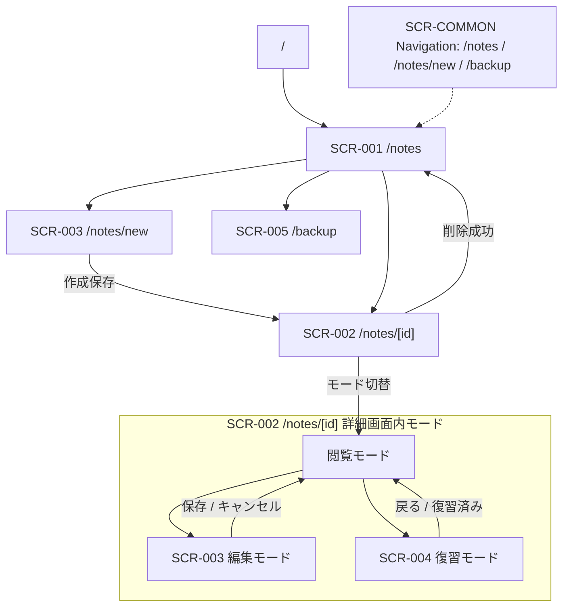

# MVP 画面棚卸し

作成日: 2026-06-21

## 位置づけ

このドキュメントは、Cornell Method Notebook の MVP 画面を、実装・テスト・タスク分割で参照しやすい粒度に棚卸ししたものです。

現行 MVP の正本は [`doc/implementation/MVP_CONTRACT.md`](../implementation/MVP_CONTRACT.md) です。特に MVP では、ノート本文は 1 つの Markdown 本文として扱い、復習はユーザーが手動管理する `nextReviewDate` の対象フィルタと、`/notes/[id]` の復習モードで扱います。専用タスク画面や自動復習間隔は Phase 2 以降です。

## 参照資料

| 種別 | パス | 参照内容 |
| --- | --- | --- |
| 必須 | `doc/screens/MVP_SCREEN_DESIGN.md` | 画面一覧、表示要素、主要アクション、遷移、MVP/Phase 2 境界 |
| 必須 | `doc/api/MVP_API_DESIGN.md` | API 一覧、リクエスト/レスポンス、エラー、MVP 外 API |
| 必須 | `doc/data/MVP_DATA_DESIGN.md` | MVP エンティティ、画面で扱うデータ、Phase 2 データ |
| 必須 | `doc/implementation/MVP_IMPLEMENTATION_TASKS.md` | 実装順序、UI/API タスク境界 |
| 必須 | `doc/diagrams/MVP_UML_DESIGN.md` | 図別設計書への index / 目次 |
| 必須 | `doc/diagrams/MVP_SCREEN_TRANSITION_DIAGRAM.md` | 画面遷移図 |
| 必須 | `doc/diagrams/MVP_STATE_DIAGRAMS.md` | 詳細画面モード、ノート復習状態の状態遷移図 |
| 必須 | `doc/diagrams/MVP_SEQUENCE_DIAGRAMS.md` | 画面操作に関わる主要シーケンス図 |
| 必須 | `doc/diagrams/MVP_ER_DIAGRAM.md` | 画面で扱う主要データの関係図 |
| 可能なら | `/Users/kazuya/Downloads/prompts/docs/miscellaneous/画面棚卸し注意点.md` | Action と Data の分離、共通レイアウト・画面外要素の捕捉 |

### 参照できなかった資料

なし。

## 画面 ID 対応

| 棚卸しID | MVP 画面設計ID | パス / 形式 | 画面名 | 備考 |
| --- | --- | --- | --- | --- |
| `SCR-COMMON` | `COM-001` | 全画面 / 共通部品 | 共通レイアウト / ナビゲーション | 画面外に見落としやすいナビを独立管理する |
| `SCR-001` | `NTE-010` | `/notes` / ページ | Notes List | ノート検索、復習対象確認、新規作成入口 |
| `SCR-002` | `NTE-030` | `/notes/[id]` / ページ | Note Detail | 閲覧／復習で共有する詳細画面シェル |
| `SCR-003` | `NTE-020` + `NTE-030` 編集モード | `/notes/new`, `/notes/[id]` 編集モード / ページまたはモード | Note New/Edit | 作成・編集共通フォーム |
| `SCR-004` | `NTE-030` 復習モード | `/notes/[id]` 復習モード / モード | Review | 同一詳細画面内のモード。MVP では独立した `/tasks/review` 画面を作らない |
| `SCR-005` | `BAK-010` | `/backup` / ページ | Backup | DB バックアップ作成・一覧確認 |

## 画面別棚卸し

### SCR-COMMON Common Layout / Navigation

| 項目 | 内容 |
| --- | --- |
| 画面ID | `SCR-COMMON` |
| 画面名 | 共通レイアウト / ナビゲーション |
| 目的 | MVP の主要画面へ迷わず移動できる共通導線を提供する。 |
| 利用者 | ローカル環境で利用する個人ユーザー |
| 表示データ | アプリ名、ナビゲーション項目（ノート一覧、新規作成、バックアップ）、メイン表示領域 |
| 入力データ | なし |
| 主要アクション | ノート一覧へ移動、新規作成へ移動、バックアップへ移動 |
| 副作用のある操作 | なし。ナビゲーションは表示状態と URL の変更のみ。 |
| 遷移元 / 遷移先 | 全画面から `/notes`, `/notes/new`, `/backup` へ遷移可能。`/` は `/notes` へ誘導する想定。 |
| 利用 API | なし |
| エラー / 空状態 / ローディング | 共通レイアウト自体ではなし。各ページの状態表示に委譲する。 |
| MVP 範囲 | アプリ名、ノート一覧、新規作成、バックアップへのナビ。認証なし。 |
| Phase 2 送り | 復習タスク専用ナビ、未完タスクバッジ、ユーザーアイコン、認証・ログアウト導線、権限別メニュー。 |

### SCR-001 Notes List

| 項目 | 内容 |
| --- | --- |
| 画面ID | `SCR-001` |
| 画面名 | Notes List |
| 目的 | 保存済みノートを検索・絞り込みし、閲覧・復習・新規作成へ進む入口にする。 |
| 利用者 | ローカル環境で利用する個人ユーザー |
| 表示データ | ノート一覧、タイトル、学習日、学習元、タグ、Cue 件数、要約状態、次回復習日、最終復習日時、ページ情報 |
| 入力データ | フリーワード検索、日付 From、日付 To、タグフィルタ、復習対象フィルタ、ページ番号 |
| 主要アクション | 新規作成へ移動、検索条件を適用、復習対象のみ表示、ノート詳細へ移動、タグ候補を参照 |
| 副作用のある操作 | なし。検索・絞り込み・ページ移動は DB を更新しない。 |
| 遷移元 / 遷移先 | `SCR-COMMON` または `/` から `/notes` へ。新規作成で `/notes/new`、ノート選択で `/notes/[id]`、バックアップ導線で `/backup` へ。 |
| 利用 API | `GET /api/notes`, `GET /api/tags` |
| エラー / 空状態 / ローディング | 一覧取得中、タグ候補取得中、検索結果 0 件、復習対象 0 件、API エラー、入力不正（無効日付、From > To）。 |
| MVP 範囲 | フリーワード、日付、タグ OR 条件、手動 `nextReviewDate` による復習対象フィルタ。並び順は `noteDate desc, updatedAt desc` 固定。要約未作成、次回復習日、最終復習日時を表示する。 |
| Phase 2 送り | 一覧からの直接編集、一覧からの直接削除、PDF 出力、一括操作、右クリックメニュー、タグ管理 UI、ソート切替、専用復習タスク画面。 |

#### SCR-001 Action / Data

| 区分 | 内容 |
| --- | --- |
| Action | `GET /api/notes` で一覧取得、検索条件変更、復習対象フィルタ適用、ノート詳細へ遷移、新規作成へ遷移 |
| Data | `query`, `tag`, `from`, `to`, `reviewDue`, `page`, `id`, `title`, `noteDate`, `sourceType`, `sourceTitle`, `overview`, `summary`, `cueCount`, `hasSummary`, `nextReviewDate`, `reviewedAt`, `tags` |

#### SCR-001 UI State / Conditions

| 区分 | 内容 |
| --- | --- |
| 主な表示項目 | 画面タイトル、新規作成ボタン、フリーワード、From/To、タグ OR 条件、復習対象のみ、検索結果件数、ノートカード、ページャ |
| validation 表示 | From > To は From/To の blur 時と検索実行時に検索フォーム下へ `開始日は終了日以前の日付を指定してください。` を表示する。API query validation は検索結果上の error alert に API `message` を表示する。 |
| disabled | 検索は一覧取得中。タグ select はタグ取得中または追加可能候補 0 件。タグ追加は未選択または重複。前へは 1 ページ目。次へは最終ページ。 |
| loading | 一覧取得中は検索結果欄に `読み込み中...`。タグ取得中は select に `タグ読み込み中`。 |
| error | 一覧取得失敗またはタグ取得失敗は赤系 alert。field 別 query error が必要な場合は対象入力近くへ表示する。 |
| empty | 検索結果 0 件、復習対象 0 件とも `条件に一致するノートはありません。` を表示する。タグ 0 件はタグ select を追加不可状態にする。 |
| 成功時挙動 | 一覧取得成功で検索結果、総件数、ページャを更新する。検索・ページ移動は DB を更新しないため成功 toast は出さない。 |
| MVP 外 | 日付 range picker、今日/過去 7 日/過去 30 日、ソート切替、PDF export、一覧直接編集・削除、右クリックメニュー。 |

### SCR-002 Note Detail

| 項目 | 内容 |
| --- | --- |
| 画面ID | `SCR-002` |
| 画面名 | Note Detail |
| 目的 | 保存済みノートを共通の Cornell 詳細画面シェルで閲覧し、同一画面内の編集・復習・削除へ進める。 |
| 利用者 | ローカル環境で利用する個人ユーザー |
| 表示データ | タイトル、学習日、学習元、タグ、概要、Cue リスト、Markdown 表示された本文、Markdown 表示されたサマリー、次回復習日、最終復習日時、要約状態、復習モードの本文表示状態 |
| 入力データ | 閲覧モードではなし。削除時は確認ダイアログの確認操作。 |
| 主要アクション | 編集モードへ切替、復習モードへ切替、削除確認を開く、削除実行、一覧へ戻る |
| 副作用のある操作 | 削除実行で `DELETE /api/notes/:id` を呼び出し、ノートを物理削除する。 |
| 遷移元 / 遷移先 | `/notes` または `/notes/new` 保存後から `/notes/[id]` へ。編集は同一ページの編集モード、復習は同一ページの復習モード。削除成功後は `/notes` へ。 |
| 利用 API | `GET /api/notes/:id`, `DELETE /api/notes/:id` |
| エラー / 空状態 / ローディング | 詳細取得中、404 ノートなし、API エラー、Markdown 表示エラー時のフォールバック、削除失敗、削除確認キャンセル。 |
| MVP 範囲 | 共通の詳細画面シェルによる閲覧、編集モード切替、復習モード切替、確認ダイアログ付き削除、Markdown 表示、sanitize。復習モードでは共通 Cornell の本文領域と Summary 内容を初期非表示にし、Cue で想起して本文を確認した後に Summary を開く。 |
| Phase 2 送り | 5 秒 Undo Snackbar、ソフトデリート、Undo buffer（`SoftDeleteBuffer`）、`/api/undo`、期限切れ後の purge、ドラフト状態、楽観ロック、本文カード分割、Cue と本文範囲の厳密リンク、閲覧モードでのノートカード単位非表示。 |

MVP の削除は、確認 UI で確定した後に `DELETE /api/notes/:id` を実行して物理削除する。削除後の Undo / 復元は保証しない。上記の Undo / ソフトデリート関連機能は Phase 2 以降である。

#### SCR-002 Action / Data

| 区分 | 内容 |
| --- | --- |
| Action | 詳細取得、編集モードへ切替、復習モードへ切替、削除確認、削除、一覧へ戻る |
| Data | `id`, `title`, `noteDate`, `sourceType`, `sourceTitle`, `overview`, `body`, `summary`, `nextReviewDate`, `reviewedAt`, `cues`, `tags` |

#### SCR-002 UI State / Conditions

| 区分 | 内容 |
| --- | --- |
| 主な表示項目 | タイトル、タグ、学習日、学習元、次回復習日、最終復習日時、概要、Cue、本文 Markdown、サマリー Markdown、一覧へ戻る、編集、復習、削除 |
| 共通シェル | 閲覧／復習でタイトル・メタ情報・ヘッダー、概要、Cornell（Cue 左／本文 右を基本に 30% / 70%）、サマリーの順序と位置を共有する。 |
| モード差分 | 閲覧は本文を表示する。復習は同じ本文領域を初期マスクし、表示／非表示操作と復習記録を追加する。モードラベルや操作ボタンの違いはレイアウト変更を意味しない。 |
| loading | 詳細取得中は App Router / Server Component の loading に委譲する。MVP ではページ専用 skeleton は必須にしない。 |
| error | 404 または取得失敗は `ノートが見つかりません` と `一覧へ戻る` を表示する。削除失敗は詳細ヘッダー下に赤系 alert を表示する。 |
| empty | 概要なし、タグなし、Cue なし、本文なし、サマリーなし、次回復習日なし、最終復習日時なしをそれぞれ明示する。 |
| disabled | 削除ボタンは削除中のみ disabled。編集、復習、一覧へ戻るは通常 disabled にしない。 |
| 削除成功時挙動 | 確認 UI で確定後に `DELETE /api/notes/:id` を呼び、成功したら `/notes` へ遷移して一覧を再取得する。 |
| MVP 外 | Undo Snackbar、ソフトデリート、ドラフト、409 競合 UI、NoteCard 単位の非表示。 |

### SCR-003 Note New/Edit

| 項目 | 内容 |
| --- | --- |
| 画面ID | `SCR-003` |
| 画面名 | Note New/Edit |
| 目的 | Cornell 形式のノートを作成・更新する。作成と編集で共通フォームを使う。 |
| 利用者 | ローカル環境で利用する個人ユーザー |
| 表示データ | 作成時は初期値、編集時は既存ノート。タグ候補。バリデーションエラー。保存中状態。新規作成時は `nextReviewDate = noteDate + 7日` を初期表示する。 |
| 入力データ | タイトル、学習日、学習元タイプ、学習元タイトル、概要、タグ、Cue リスト、本文 Markdown、サマリー Markdown、次回復習日 |
| 主要アクション | Cue 追加、Cue 削除、タグ入力、Markdown 入力、プレビュー確認、保存、キャンセル |
| 副作用のある操作 | 作成保存で `POST /api/notes` を呼び出し Notebook / Cue / Tag / NotebookTag を作成する。編集保存で `PATCH /api/notes/:id` を呼び出し Notebook を更新し Cue / Tag 関連を全置換する。未登録タグは保存時に自動作成される。 |
| 遷移元 / 遷移先 | `/notes` または共通ナビから `/notes/new` へ。作成成功後は `/notes/[id]` へ。詳細閲覧モードから編集モードへ切替。編集保存後は閲覧モードへ。キャンセルは作成時 `/notes`、編集時は閲覧モードへ戻る。 |
| 利用 API | 作成時 `POST /api/notes`, 編集時 `GET /api/notes/:id`, `PATCH /api/notes/:id`, タグ候補 `GET /api/tags` |
| エラー / 空状態 / ローディング | 初期表示中、保存中、入力不正、保存失敗、タグ候補取得失敗、編集対象 404、キャンセル確認の要否は実装時確認。 |
| MVP 範囲 | 明示的な保存、textarea + Markdown preview、Cue 追加・削除、タグ最大 12 件、タイトル・日付等のバリデーション、Cue / Tag は更新時全置換。新規作成の次回復習日は `noteDate + 7日` を初期値とし、変更・空欄化を許可する。 |
| Phase 2 送り | 自動保存、下書き保存、楽観ロック、D&D 並び替え、Cue と本文範囲のリンク、NoteCard 分割、高機能 Markdown エディタ、リッチな Markdown ツールバー、Cue / Tag 差分更新 API。 |

#### SCR-003 Action / Data

| 区分 | 内容 |
| --- | --- |
| Action | 入力、Cue 追加、Cue 削除、タグ候補参照、未登録タグの保存時自動作成、作成保存、更新保存、キャンセル |
| Data | `title`, `noteDate`, `sourceType`, `sourceTitle`, `overview`, `body`, `summary`, `nextReviewDate`, `cues[].text`, `cues[].order`, `tags[].name` |

#### SCR-003 UI State / Conditions

| 区分 | 内容 |
| --- | --- |
| 主な表示項目 | 基本情報、タイトル、学習日、学習元タイプ、学習元タイトル、概要、タグ、Cue リスト、本文 textarea + preview、サマリー textarea + preview、次回復習日、保存、キャンセル |
| validation 表示 | 保存 API の field 別 error を対象入力直下へ表示し、API 全体の `message` をフォーム上部の alert に表示する。タグ 12 件超と重複はタグ追加時にも local error を表示する。 |
| disabled | 保存は保存中のみ disabled。キャンセル、Cue 追加、Cue 削除、タグ削除は通常 disabled にしない。タグ追加は空入力なら何もしない。 |
| loading | 保存中は保存ボタンを `保存中...` に変更する。編集初期値の詳細取得は親画面に委譲する。 |
| error | 保存失敗はフォーム上部の赤系 alert。field error は `aria-invalid` と入力欄直下の赤系テキストで表示する。 |
| empty | Cue 0 件は `Cue は未追加です。`。本文 preview 空は `本文のプレビューはまだありません。`。サマリー preview 空は `サマリーのプレビューはまだありません。`。 |
| 次回復習日 | 新規作成では `noteDate + 7日` を初期入力する。既存ノートの未設定値は編集開始時にも未設定のままとし、`noteDate` の変更で手動設定済みの次回復習日を自動移動しない。 |
| 保存成功時挙動 | 作成成功は `/notes/[id]` へ遷移する。編集成功は閲覧モードへ戻り、表示データを更新する。未登録タグは保存時に自動作成する。 |
| キャンセル | 作成時は `/notes` へ戻る。編集時は保存せず閲覧モードへ戻る。MVP では未保存変更確認は必須にしない。 |
| MVP 外 | 自動保存、下書き、楽観ロック、D&D、NoteCard 分割、高機能 Markdown editor、Markdown ツールバー、Cmd/Ctrl ショートカット。 |

### SCR-004 Review

`SCR-004` は独立した画面ではなく、`SCR-002 Note Detail` の共通詳細画面シェル上で切り替える復習モードを表す。復習時も概要、Cue、本文領域、サマリーの位置は閲覧モードと共通にし、本文領域と Summary 内容を初期非表示にする。Cue で想起し、本文を確認した後に Summary を開く。

| 項目 | 内容 |
| --- | --- |
| 画面ID | `SCR-004` |
| 画面名 | Review |
| 目的 | 共通の詳細画面シェルで Cue から本文を思い出し、本文を確認した後に Summary を開いて確認し、復習済みを記録する。 |
| 利用者 | ローカル環境で利用する個人ユーザー |
| 表示データ | タイトル、学習日、学習元、タグ、概要、Cue リスト、サマリー（初期非表示）、本文表示状態、次回復習日、最終復習日時 |
| 入力データ | 本文表示/非表示と Summary 開閉の UI 操作、復習済み操作時の任意の次回復習日 |
| 主要アクション | 本文を表示、本文を隠す、Summary を開く、復習済みにする、閲覧モードへ戻る |
| 副作用のある操作 | 復習済みにする操作で `POST /api/notes/:id/review` を呼び出し、`reviewedAt` と `nextReviewDate` を更新する。本文表示/非表示は UI 状態のみで保存しない。 |
| 遷移元 / 遷移先 | `/notes` の復習対象フィルタから `/notes/[id]` へ移動後、詳細画面内で復習モードへ切替。復習完了または戻る操作で詳細閲覧モードへ。 |
| 利用 API | `GET /api/notes/:id`, `POST /api/notes/:id/review` |
| エラー / 空状態 / ローディング | 詳細取得中、復習済み更新中、更新失敗、404 ノートなし、Cue なし、サマリーなし、本文なしまたは空文字。 |
| MVP 範囲 | 共通シェル内の本文初期マスク、Summary 初期非表示、Cue → 本文確認 → Summary の順序、本文表示/非表示切替、復習済み更新、次回復習日の手動設定またはクリア。採点や正誤判定なし。 |
| Phase 2 送り | `/tasks/review` 専用画面、1 日後 / 1 週間後の自動タスク、`review status`、未完了タスクバッジ、自動での次回復習日計算、`NotebookReviewProgress`、復習進捗履歴、本文表示状態の永続化。 |

#### SCR-004 Action / Data

| 区分 | 内容 |
| --- | --- |
| Action | 復習対象ノートを開く、本文を表示、本文を隠す、復習済みにする、任意の次回復習日を保存、閲覧モードへ戻る |
| Data | `id`, `title`, `noteDate`, `tags`, `cues`, `summary`, `body`, `reviewedAt`, `nextReviewDate` |

#### SCR-004 UI State / Conditions

| 区分 | 内容 |
| --- | --- |
| 主な表示項目 | 共通シェルのタイトル・メタ情報・概要、Cue、本文領域、サマリー（初期非表示）、本文非表示メッセージ、本文表示/非表示ボタン、Summary 開く操作、次回復習日、復習済みにする、閲覧へ戻る |
| レイアウト | 閲覧モードと同じヘッダー、概要、Cue／本文の Cornell 配置、サマリーの順序と位置を維持する。本文と Summary の表示状態、復習操作・記録だけがモード固有の差分である。 |
| validation 表示 | `nextReviewDate` 不正時は API `message` を復習モード内の error alert に表示する。MVP では復習フォーム内の field 別表示は任意。 |
| disabled | 復習済みにするボタンは更新中のみ disabled。本文表示/非表示、閲覧へ戻るは通常 disabled にしない。 |
| loading | 復習済み更新中はボタンを `更新中...` に変更する。 |
| error | 復習済み更新失敗は詳細ヘッダー下の赤系 alert に表示する。 |
| empty | Cue なし、サマリーなし、本文なしを各セクションで明示する。本文と Summary 内容は初期状態では必ず非表示にする。 |
| 想起順序 | Cue で想起し、本文を表示して確認した後に Summary を開く。 |
| 成功時挙動 | `reviewedAt` と `nextReviewDate` を画面に反映し、本文表示を閉じ、閲覧モードへ戻る。 |
| MVP 外 | `/tasks/review`、1 日後 / 1 週間後の自動タスク、`review status`、未完了タスクバッジ、自動次回復習日計算、採点、正誤判定。 |

### SCR-005 Backup

| 項目 | 内容 |
| --- | --- |
| 画面ID | `SCR-005` |
| 画面名 | Backup |
| 目的 | SQLite DB ファイルのバックアップを作成し、最新バックアップを確認できるようにする。 |
| 利用者 | ローカル環境で利用する個人ユーザー |
| 表示データ | 最新バックアップ一覧、バックアップファイル名、作成日時、保存先パス、失敗時のエラーメッセージ |
| 入力データ | バックアップ作成操作、一覧更新操作 |
| 主要アクション | バックアップ作成、バックアップ一覧更新 |
| 副作用のある操作 | バックアップ作成で `POST /api/backups` を呼び出し、SQLite DB ファイルを `backup/` 配下へコピーする。最新 3 世代を保持し、4 世代目以降は古いものから削除する。 |
| 遷移元 / 遷移先 | 共通ナビまたは `/notes` から `/backup` へ。必要に応じて `/notes` に戻る。削除前の任意バックアップ導線としても利用可能。 |
| 利用 API | `GET /api/backups`, `POST /api/backups` |
| エラー / 空状態 / ローディング | 一覧取得中、バックアップ作成中、バックアップ 0 件、一覧取得失敗、作成失敗、DB ファイル未検出、保存先権限エラー。 |
| MVP 範囲 | バックアップ一覧表示、手動バックアップ作成、最新 3 世代保持、成功/失敗メッセージ。 |
| Phase 2 送り | バックアップログ DB 管理、バックアップからの自動復元、スケジュール実行 UI、`POST /api/backups/retry`、ログ詳細画面。 |

#### SCR-005 Action / Data

| 区分 | 内容 |
| --- | --- |
| Action | バックアップ一覧取得、バックアップ作成、作成後の一覧再取得、エラー表示 |
| Data | `backups[].file`, `backups[].createdAt`, `backups[].path`, `ok`, `backup.file`, `backup.path`, エラー `{ code, message, errors? }` |

#### SCR-005 UI State / Conditions

| 区分 | 内容 |
| --- | --- |
| 主な表示項目 | 画面タイトル、説明、ノート一覧へ、バックアップ作成、最新バックアップ一覧、ファイル名、作成日時、保存先パス、一覧更新 |
| disabled | バックアップ作成は作成中。一覧更新は一覧取得中または作成中。ノート一覧へは通常 disabled にしない。 |
| loading | 初期表示と一覧更新中は `バックアップ一覧を読み込み中...`。作成中は作成ボタンを `作成中...` に変更する。 |
| error | 一覧取得失敗と作成失敗は赤系 alert に API `message`、または画面既定の失敗文言を表示する。 |
| empty | バックアップ 0 件は `バックアップはまだありません。` と `バックアップ作成から現在の SQLite DB を保存できます。` を表示する。 |
| 成功時挙動 | 作成成功後は `ファイル名 を作成しました。` を表示し、一覧を再取得する。最新 3 世代だけを表示対象にする。 |
| MVP 外 | バックアップログ DB 管理、自動復元、スケジュール UI、`POST /api/backups/retry`、ログ詳細画面。 |

## API と画面の対応表

| API | 利用画面 | 用途 | 副作用 | MVP / Phase 2 |
| --- | --- | --- | --- | --- |
| `GET /api/notes` | `SCR-001` | ノート一覧、検索、復習対象フィルタ、ページング | なし | MVP |
| `POST /api/notes` | `SCR-003` | ノート作成 | Notebook / Cue / Tag / NotebookTag 作成 | MVP |
| `GET /api/notes/:id` | `SCR-002`, `SCR-003`, `SCR-004` | 詳細表示、編集初期値、復習表示 | なし | MVP |
| `PATCH /api/notes/:id` | `SCR-003` | ノート更新 | Notebook 更新、Cue / Tag 関連全置換 | MVP |
| `DELETE /api/notes/:id` | `SCR-002` | ノート削除 | 物理削除 | MVP |
| `POST /api/notes/:id/review` | `SCR-004` | 復習済み更新 | `reviewedAt`, `nextReviewDate` 更新 | MVP |
| `GET /api/tags` | `SCR-001`, `SCR-003` | タグ候補一覧 | なし | MVP |
| `GET /api/backups` | `SCR-005` | バックアップ一覧 | なし | MVP |
| `POST /api/backups` | `SCR-005` | バックアップ作成 | DB ファイルコピー、世代整理 | MVP |
| `POST /api/undo` | なし | 削除 Undo（Phase 2） | ソフトデリート復元 | Phase 2 |
| `/api/review-tasks` | なし | 専用復習タスク取得・更新（Phase 2 のみ） | 復習進捗更新 | Phase 2（MVP API ではない） |
| `/api/notes/export` | なし | PDF 出力 | PDF 生成 | Phase 2 |
| `/api/tags/:id` | なし | タグ編集・削除 | Tag 更新・削除 | Phase 2 |
| `/api/backups/retry` | なし | バックアップ再試行 | DB ファイルコピー | Phase 2 |

## 画面遷移

画面遷移の詳細図は `doc/diagrams/MVP_SCREEN_TRANSITION_DIAGRAM.md`、詳細画面モードなどの状態遷移は `doc/diagrams/MVP_STATE_DIAGRAMS.md` も参照してください。

## MVP / Phase 2 境界サマリー

| 領域 | MVP | Phase 2 送り |
| --- | --- | --- |
| ノート構造 | 本文は 1 つの Markdown、Cue はリスト | NoteCard 分割、NoteCueLink、本文カード単位の非表示 |
| 保存 | 明示的な作成・更新保存 | 自動保存、下書き、楽観ロック、409 競合 UI |
| 削除 | 確認ダイアログ + 物理削除。削除後の Undo / 復元なし | ソフトデリート、5 秒 Undo Snackbar、Undo buffer（`SoftDeleteBuffer`）、`/api/undo`、期限切れ後の purge |
| 復習 | 手動管理の `nextReviewDate` と `reviewedAt`、新規作成時の `noteDate + 7日` 初期値、詳細内復習モード、`POST /api/notes/:id/review` | `/tasks/review`、1 日後 / 1 週間後の自動タスク、`review status`、未完了タスクバッジ、自動間隔反復 |
| タグ | ノート保存時の自動作成、候補一覧、一覧フィルタ | タグ管理 UI、名称変更、削除、右クリックメニュー |
| Markdown | textarea + preview、表示時 sanitize | 高機能エディタ、ツールバー、ショートカット拡張 |
| 一覧 | 検索、日付、タグ OR、復習対象 | PDF 出力、一括操作、ソート切替 |
| バックアップ | 一覧、手動作成、最新 3 世代保持 | ログ DB 管理、自動復元、再試行 API、スケジュール UI |

## 未決事項 / 実装時確認

| ID | 内容 | 影響 |
| --- | --- | --- |
| U-001 | 作成・編集キャンセル時に未保存変更がある場合、確認ダイアログを出すか。 | UI タスク `mvp-note-form` の操作仕様。MVP 文書では明示なし。 |
| U-002 | バリデーションエラー文言の最終表現。 | UI 表示とテスト期待値。ルール自体は `doc/api/MVP_API_DESIGN.md` に従う。 |
| U-003 | `/` から `/notes` への誘導方法を redirect にするかリンク表示にするか。 | 共通レイアウト実装。画面遷移上は `/notes` を起点にする。 |
