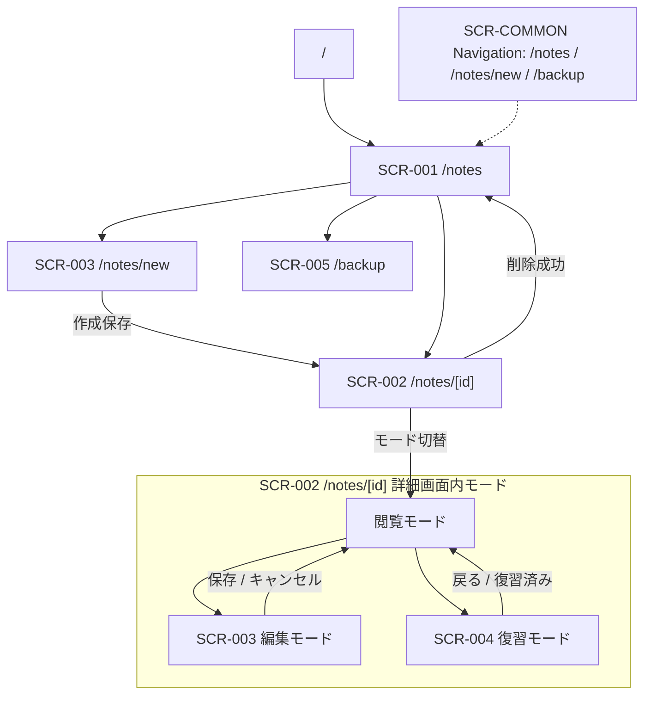

# MVP 画面棚卸し

更新日: 2026-07-16

## 位置づけ

このドキュメントは、Cornell Method Notebook の MVP 画面を、実装・テスト・タスク分割で参照しやすい粒度に棚卸ししたものです。

現行 MVP の正本は [`doc/implementation/MVP_CONTRACT.md`](../implementation/MVP_CONTRACT.md) です。特に MVP では、ノート本文は 1 つの Markdown 本文として扱い、復習はユーザーが手動管理する `nextReviewDate` の対象フィルタと、`/notes/[id]` の復習モードで扱います。専用タスク画面や自動復習間隔は Phase 2 以降です。

この棚卸しは、現状実装の部品・データ・Action / Data と、後続 UI task が実装する目標 UI を分けて記録します。今回の目標は「紙面を中心にした学習ノート」です。紙面の見た目を変えても、route、API、Prisma / SQLite、1 本の本文、Cue リスト、明示保存、手動復習、確認後の物理削除は変更しません。視覚的な正本は [`mvp-paper-note-canvas-concept.png`](assets/mockups/mvp-paper-note-canvas-concept.png) です。

## 紙面中心 UI の棚卸し基準

### As-Is と To-Be

As-Is は既存実装・旧証跡を比較するための基準、To-Be は後続 Worker が実装する規範です。As-Is の記述とコードの一部が一致しなくなっても、それだけで To-Be 完了とは判定しません。完了判定は各 task の条件と runtime QA の証跡で行います。

| 対象 | 現状実装（As-Is） | 目標 UI（To-Be） |
| --- | --- | --- |
| 共通のノート面 | `layout.tsx` / `globals.css` にフォレスト系背景と `note-paper-shell` があり、create/detail 成功経路は暖色紙面を共有する。紙面は `min(1280px, ...)` で、card / rounded Section も残る | 深いフォレストグリーンのアプリクローム中央に viewport 連動の暖色一枚紙面。薄い横罫線、Cue／本文の縦罫線、余白、タイポグラフィで章立てを示し、細かいカードや強い影を主役にしない |
| app chrome / state | `layout.tsx` は brand と `/notes`・`/notes/new`・`/backup` nav を表示するが、右上 state badge はなく、状態は紙面内 kicker のみ | brand / nav と `新規作成`・`編集中`・`閲覧中`・`復習中` の state badge を共通 chrome に置く。紙面内の title / content と責務を分ける |
| タイトル | create は `.note-paper-heading` 内の大きな title input、detail view/review は `h1.note-paper-title`。detail edit は外側 h1 と embedded input が重複する | 全モードで紙面上部に一つの主見出し。編集時は同じ位置の title input、閲覧・復習時は大きな h1 |
| 基本情報 | create は 4 列、detail は 5 項目の `.note-paper-meta-grid`。label + control が縦積みで画像の一行帯ではない。概要は create open / edit closed / view closed / review open | 学習日・学習元・タグをコンパクトな inline/flex メタ情報帯、概要を開閉領域として扱う。タイトルは基本情報の折りたたみ対象にしない |
| Cornell | create は wrapper 内 `min-w-[640px]` の `3fr / 7fr`、detail は `lg` 以上だけ `0.32fr / 0.68fr`。Cue は rounded row、横罫線は grid の上下中心 | 約 30% / 70% を維持し、本文を 68〜72% の主列にする。本文 textarea → Preview は縦並び。Cue / 本文を一枚の ruled surface とし、detail も局所横 scroll を持つ |
| Summary | create/edit は Summary `MarkdownField` と `.note-paper-footer` が同じ Section にあるが Preview 常時表示、save は黒 button。detail view は full-width Section、review は placeholder + 別 `復習記録` Section | Cornell 下の全幅領域。編集時 Preview は開閉／簡易、閲覧時は Markdown 表示、復習時は内容を初期非表示。保存・復習済みは Summary 後の footer へ集約 |
| 操作 | 明示保存、Cue / tag / overview / review disclosure、field error、削除 confirm などの handler は現行コードにある。edit には外側 `閲覧へ戻る` と内側 `キャンセル` が重複 | 閲覧の編集・復習・削除は上部操作帯、作成・編集の保存・キャンセルは紙面 footer、復習済みは Summary 後へ集約。既存 handler / API payload は維持 |

旧カード中心・本文内横分割の記述を含む screenshot、PNG wireframe、方針資料は履歴／比較資料として扱います。現行実装を To-Be の実装済みと記録せず、目標 UI の実装後に必要な成果物を再取得します。

### 画面共通の目標レイアウト契約

| 項目 | 目標 | 棚卸しで確認すること |
| --- | --- | --- |
| アプリクローム | 深いフォレストグリーン系。アプリ名、ノート一覧、新規作成、現在の状態バッジを共通ヘッダーに置く | 全状態で同じ位置・accessible name を持つか。`/backup` は補助ナビとして維持されるか |
| 紙面 | ノートの主役が本文である暖色の一枚紙面。中央配置、広い desktop width、外周余白、控えめな一層の影 | shell が狭い親 `max-w` に閉じ込められていないか。カード影・過剰な角丸が増えていないか |
| タイトル | 全モードで紙面上部に表示。sticky は MVP 必須ではない | 作成・編集・閲覧・復習で同じ識別位置か |
| 基本情報 | 学習日・学習元・タグはコンパクトなメタ情報帯、概要は開閉領域 | 大きな基本情報カードが本文開始位置を押し下げないか |
| Cornell | Cue 28〜32% / 本文 68〜72%、約 30% / 70% を基準。境界は縦罫線、Cue 行と本文行は薄い横罫線 | 1280 / 1440px で本文が Cue より広く、見出し・本文・箇条書きが読み物として見えるか |
| 本文 Preview | 本文列の textarea の下に Markdown Preview。横分割は目標標準にしない | `MarkdownField` の sanitize、GFM、checkbox 表示専用を維持するか |
| Summary | Cornell の下に全幅。編集時は開閉／簡易、閲覧時は表示、復習時は初期非表示 | Cue → 本文 → Summary の復習順序と同じ紙面位置か。保存を右下へ置けるか |
| 操作 | 閲覧の戻る・編集・復習・削除は上部。作成／編集の保存・キャンセルと復習済みは Summary 後 | 操作が重複・分散せず、375px でも到達可能か |

### レスポンシブ受け入れ境界

- デスクトップ優先を維持する。1280px / 1440px 前後で深いクロームの中央に viewport 連動の広い紙面を置き、紙面が狭い固定幅にならず、本文列と本文 textarea に横幅を優先配分する。既存の親 `max-w-6xl` や固定 `1280px` cap による圧迫を再導入しない。
- 1280px / 1440px では Cue 約 30% / 本文約 70% を確認し、本文列内の textarea と Preview を縦に積んでも本文の書き込み面が狭くならないことを確認する。
- 768px 未満は本格的な編集最適化を行わない。現行 MVP 方針に従い、Cornell 作業面の局所横スクロールは許容するが、ページ全体・`body`・アプリクロームの意図しない横 overflow は作らない。
- 375px では paper shell が viewport を超えず、紙面外周、基本情報帯、Summary が通常の縦スクロールで確認できる。Cornell wrapper 内だけの局所的な横スクロールを採用する場合も、Cue 追加・削除、Cue 入力、本文入力、Preview、保存・キャンセルへ到達できる。detail も create と同じ wrapper rule を使い、`lg` breakpoint だけで一列化しない。
- 375px / 768px の runtime を未確認のまま PASS にしない。viewport、モード、fixture、実施日、参照 summary を証跡に残す。

### アクセシビリティの棚卸し基準

- 共通 header、`main`、紙面 `article`、Summary footer を意味的に識別し、アプリ名・一覧・新規作成・状態バッジを accessible name 付きで確認する。
- タイトルを `h1`、Cue／本文／Summary を `h2` 以下として扱い、表示と入力の重複読み上げを避ける。入力には label、エラーには `aria-invalid` / `aria-describedby`、状態通知には `role="status"` / `role="alert"` を確認する。
- タイトル、メタ情報、Cue、本文、Summary、保存、復習、削除、開閉、本文開示がキーボードで到達・操作でき、focus-visible が見えることを確認する。
- Preview の checkbox は表示専用で、クリックしても保存データを更新しない。色や影だけで状態を伝えず、文言または accessible state を併記する。

### 紙面中心 UI 静的モック（確認用）

情報階層と紙面の見た目を先に確認するための概念 PNG と standalone HTML です。概念 PNG が視覚的な正本、HTML は状態差分を確認する補助資料です。どちらも runtime QA の証跡や現行実装の PASS 判定には使いません。

| 種別 | 成果物 |
| --- | --- |
| 視覚的な正本 | [`mvp-paper-note-canvas-concept.png`](assets/mockups/mvp-paper-note-canvas-concept.png) |
| standalone HTML（補助） | [`mvp-paper-note-canvas-mock.html`](assets/mockups/mvp-paper-note-canvas-mock.html) |

以前の編集／復習別 PNG export は現行の参照画像から外します。過去の task や summary に残る場合も履歴資料として扱い、現行 UI の視覚的な正本・PASS 根拠には再利用しません。

### 概念画像と現行 DOM の差分（静的監査）

画像（1672 × 941）を上から下へ分解し、対象ファイルの DOM / class / state を照合した。概算座標は画像の領域を共有するための目安であり、実装の固定 pixel 値ではない。`実装済み` は構造・挙動が存在すること、`部分一致` は paper styling または mode の一部だけが一致すること、`未実装` は要素がないこと、`仕様と画像が競合` は MVP 契約を優先して画像を状態別に解釈することを示す。

| 画像領域 | 視覚正本 | 現行 DOM / state | 判定 |
| --- | --- | --- | --- |
| app chrome | 暗い forest 帯、brand / 一覧 / 新規、右上の `編集中` | `layout.tsx` の `.app-chrome-header` / `.app-chrome-inner` / `.app-chrome-nav` はある。state badge はなく、`NoteEditor` / `NoteDetailModes` の `.note-paper-kicker` に状態が出る | 部分一致（state は未実装） |
| 紙面外周 | x 約 38〜1634、y 約 69〜913 の暖色一枚紙面、丸い境界と影 | create/detail success path の `.note-paper-shell`、warm token、border / shadow はある。幅は `min(1280px, ...)` | 部分一致 |
| タイトル帯 | 大きな一つの title | create は `input.note-paper-title`、view/review は `h1.note-paper-title`。edit は外側 h1 + embedded input | 部分一致（edit 重複） |
| メタ情報帯 | 学習日 / 学習元 / tag の一行、separator と下罫線 | create/detail とも `.note-paper-meta-grid`。create 4 項目、detail 5 項目で、label/control の縦積みと wrap | 部分一致 |
| Cue / 本文 | Cue 約 28%、本文約 72%、中央縦罫線、両列の横罫線、番号付き行 | create は local overflow wrapper + `3fr / 7fr`、detail は `lg` 以上だけ `0.32fr / 0.68fr`。grid 上下・中央線はあるが ruled surface / detail local wrapper はない | 部分一致 |
| 本文 Preview | 本文下部に `Markdown Preview` と淡い表示領域 | create/edit の body `MarkdownField layout="stacked"` は textarea → Preview を実装。`MarkdownPreview` は rounded white card。view/review は rendered body のみ | 部分一致（create/edit 配置は実装済み） |
| Summary | Cornell 下の全幅、上罫線、左本文 | create/edit は全幅 Section + Preview、view は表示、review は同じ場所の placeholder。ただし footer としての意味付けが弱い | 部分一致 |
| 保存 footer | Summary と同じ紙面最下段、右下の orange 保存 | `.note-paper-footer` と右寄せ actions はある。`div`、黒 button、icon なし。review は Summary と別の `復習記録` Section | 部分一致 |

### モード別の完成イメージと対象 component

| mode | 完成イメージ | 現行表示 state | 重点差分 |
| --- | --- | --- | --- |
| create | `/notes/new` の一枚紙面。title input → metadata → 概要 → Cue / body textarea → body Preview → Summary → footer | `NoteEditor mode="create"`、概要 open、body stacked、Summary Preview visible、save は明示操作 | inline metadata、ruled Cornell、画像の Preview surface / Summary footer / chrome state が不足 |
| detail view | `/notes/[id]` の同じ紙面。title h1 → metadata → 概要 → Cue / rendered body → full-width Summary | `NoteDetailModes mode="view"`、body / Summary visible、概要 closed、上部 actions | shell はある。edit/review との wrapper 共通化、罫線、metadata one-line、Summary footer、chrome state が不足 |
| detail edit | view と同じ紙面の title 帯を一つの input に置換し、create と同じ body / Summary / footer を使う | `note-detail-modes.tsx` 外側 h1 の下に `NoteEditor shell=false` が title input を再描画。戻る操作も二重 | title 重複を解消し、作成・編集の入力操作を維持したまま一枚の title band に統合 |
| review | view と同じ位置。Cue / 概要だけを手がかりにし、body → Summary の順に開示。復習記録は Summary 直後 | `showBody=false`、`showSummary=false`。本文表示後だけ Summary button enabled。完了後に body/Summary を閉じ view へ | 開示順は実装済み。detail の Cornell local wrapper と Summary/footer の見た目だけを補正し、初期 mask は変更しない |

`src/app/notes/new/page.tsx` と成功時の `src/app/notes/[id]/page.tsx` は `note-paper-page` から component に委譲するだけで、route / data contract を変更する独立 task ではない。`[id]/page.tsx` の not-found branch に残る旧赤系 card は成功画面の視覚正本とは別 state として、今回の紙面 task の PASS には含めない。

### 画像と仕様の競合を棚卸しした結果

- PNG の右上 `編集中` と visible Preview / Summary は create/edit の visual reference とする。review は MVP 契約どおり Summary 初期非表示であり、同じ位置に placeholder を出す。
- PNG に独立した概要が見えなくても、`overview` は既存 MVP payload / form の項目なので削除しない。metadata の直下に短い disclosure として置く。
- PNG の Cue / 本文の見た目を理由に `body` を NoteCard へ分割したり、Cue と本文範囲の ID を追加したりしない。現行 MVP の Cue list / 一つの Markdown body を維持する。
- PNG の orange save / icon は visual styling の目標であり、明示保存、POST / PATCH、保存中 disabled、作成後・編集後遷移は既存契約を維持する。

### 1440px / 375px の確認ルール

| viewport | 確認する responsive rule | 現行の差分 |
| --- | --- | --- |
| 1440px 前後 | paper は `calc(100vw - 2 * fluid gutter)` を上限に広がり、inner padding も `clamp()`。Cornell は container 内 Cue 28〜32% / body 68〜72%、metadata は inline/flex、Summary/footer は全幅 | shell の固定 `1280px` cap が画像より狭い。create は 30/70 と stacked body があるが、detail は nested Section と footer 分離 |
| 375px 前後 | paper は viewport 内、header / metadata / footer は wrap。横 scroll は Cornell wrapper だけに閉じ、内部の列比率を保つ。body / Markdown table の overflow は各領域内 | create は `min-w-[640px]` wrapper がある。detail は wrapper がなく `lg` 未満で一列化するため、同一 rule を適用できない |

全体 `body` の overflow を増やさず、Cornell だけに `overflow-x: auto` と min-content の境界を持たせる。viewport の数値を直接 layout 値にするのではなく、outer gutter、paper padding、content の min-content、列比率、wrap の順に responsive を決める。

### 現行 MVP 契約と UI 実装境界

| 後続 UI task で変更対象 | 変更対象外（MVP 契約） |
| --- | --- |
| 紙面 shell、罫線、余白、タイポグラフィ、入力面の styling | canonical route `/notes`, `/notes/new`, `/notes/[id]`, `/backup` |
| `note-editor.tsx` の基本情報圧縮／開閉、Cornell 配置、Summary フッター | notes / tags / review / backup API の method、payload、response、エラー |
| `note-detail-modes.tsx` の閲覧・復習シェル、本文／Summary の表示状態配置 | Prisma schema、SQLite、Notebook の 1 本の `body`、Cue / Tag 関係 |
| `markdown-field.tsx` の textarea / Preview 配置と共通 styling | 明示保存、Cue / Tag 全置換、手動 `nextReviewDate`、復習 API の契約 |
| 目標 UI の screenshot / runtime QA と証跡の更新 | 確認後の物理削除、MVP で Undo / soft delete / 復元を保証しないこと |

今回の設計 task では、コード、設定、依存関係、DB、API、UI component、テストコード、画像、生成物を変更しません。データ・API 項目を増やすためのカード分割、NoteCard / D&D、autosave、専用復習タスク、PDF、タグ管理 UI は Phase 2 以降です。

#### 契約境界の棚卸しチェック

| 契約項目 | 固定内容 |
| --- | --- |
| canonical route | `/notes`、`/notes/new`、`/notes/[id]`、`/backup`。詳細の閲覧・編集・復習は `/notes/[id]` 内のモード切替 |
| notes payload | `title`、`noteDate`、`sourceType`、`sourceTitle`、`overview`、`body`、`summary`、`nextReviewDate`、`cues[{ text, order }]`、`tags[{ name, color }]`。`body` は 1 本の Markdown 文字列 |
| API | `GET /api/notes`、`POST /api/notes`、`GET /api/notes/:id`、`PATCH /api/notes/:id`、`DELETE /api/notes/:id`、`POST /api/notes/:id/review`、`GET /api/tags`、`GET /api/backups`、`POST /api/backups` の method / payload / response / error を維持 |
| Prisma / SQLite | MVP の `Notebook`、`Tag`、`NotebookTag`、`Cue` と既存 column mapping を維持。`NoteCard`、`CueCard`、`NoteCueLink`、draft 用 model を追加しない |
| 保存 | 作成・更新とも明示的な保存操作だけで確定する。新規保存後は `/notes/[id]`、編集保存後は閲覧モードへ戻る |
| 復習 | `nextReviewDate` を手動管理し、復習完了は `POST /api/notes/:id/review`。Cue → 本文確認 → Summary の順序、本文開示状態の非永続化を維持 |
| 削除 | 確認 UI の後に `DELETE /api/notes/:id` を実行し、Notebook を物理削除する。Undo、soft delete、復元保証は追加しない |

### 後続 Worker task と依存順

この棚卸しの正本 task は、設計書の「監査後の UI coding task（1 file 1 task）」と同じ `UI-PAPER-011`〜`UI-PAPER-015` です。従来の `UI-PAPER-001`〜`UI-PAPER-010` は先行改修の履歴 ID として扱い、現行の次 task として再投入しません。

| 順序 | task | 対象 | 依存 | 完了条件 |
| --- | --- | --- | --- | --- |
| 1 | `UI-PAPER-011` | `src/app/layout.tsx` | なし | 共通 brand / nav を維持し、右上 state badge の slot、accessible name、狭幅での配置を定義する |
| 2 | `UI-PAPER-012` | `src/app/globals.css` | `UI-PAPER-011` | fluid paper width、outer gutter、横罫線、Cornell vertical rule、local scroll、Summary/footer、state badge を共通 styling にする。body overflow と focus/error styling は維持 |
| 3 | `UI-PAPER-013` | `src/shared/markdown/markdown-field.tsx` | `UI-PAPER-012` | textarea → Preview stacked と paper-native Preview surface を固定し、GFM / sanitize / checkbox read-only / label / empty state / 既存 prop 互換を維持 |
| 4 | `UI-PAPER-014` | `src/app/notes/_components/note-editor.tsx` | `UI-PAPER-012`, `UI-PAPER-013` | create/edit の一つの title band、metadata、概要、Cue 行、body Preview、全幅 Summary、右下 save/cancel footer を実装。Cue/tag/date/validation、POST/PATCH、明示保存は不変 |
| 5 | `UI-PAPER-015` | `src/app/notes/_components/note-detail-modes.tsx` | `UI-PAPER-012`, `UI-PAPER-013`, `UI-PAPER-014` | view/review shell、detail Cornell wrapper、Summary footer、review の body/Summary 初期 mask → 開示、復習記録、削除確認、戻る導線を整える。API と UI state の非永続化は不変 |
| 6 | `QA-PAPER-011` | `doc/testing/TEST_SCENARIOS.md` | `UI-PAPER-014`, `UI-PAPER-015` | 375 / 768 / 1280 / 1440px の create/edit/view/review を fixture 付きで確認し、state、紙面幅、rules、Preview、Summary/footer、overflow、keyboard、API 回帰を記録 |

投入順は `011 → 012 → 013 → 014 → 015 → QA-PAPER-011`。014 と 015 は 013 完了後に並行可能だが、edit shell の受け渡しを Manager が照合してから QA へ進める。ページ wrapper は独立 coding task にせず、not-found branch の紙面化は別 scope とする。

### 旧 screenshot / 受け入れ証跡の扱い

現在 repository にある次の成果物は、今回定義する紙面中心 UI より前のレイアウトを記録したものです。削除せず、旧 layout の比較資料として保持します。

| 対象 | 既存成果物 | 扱い |
| --- | --- | --- |
| NTE-020 | [`nte020-policy-c-new-375.png`](../assets/screenshots/nte020-policy-c-new-375.png)、[`nte020-policy-c-new-768.png`](../assets/screenshots/nte020-policy-c-new-768.png)、[`nte020-policy-c-new-1280.png`](../assets/screenshots/nte020-policy-c-new-1280.png)、[`nte020-policy-c-new-1440.png`](../assets/screenshots/nte020-policy-c-new-1440.png) | Policy C の新規作成画面。基本情報カードと本文内 Preview 横分割を含む旧証跡であり、To-Be の PASS 根拠には再利用しない |
| NTE-030 | [`runtime-note-detail-view-1440.png`](../assets/screenshots/runtime-note-detail-view-1440.png)、[`runtime-note-detail-review-1440.png`](../assets/screenshots/runtime-note-detail-review-1440.png)、[`runtime-note-detail-edit-1440.png`](../assets/screenshots/runtime-note-detail-edit-1440.png) | 現行の詳細画面シェルを記録した旧証跡。新しい紙面シェル、Summary 初期非表示、本文幅は実装後に再確認する |
| 受け入れ記録 | [`doc/testing/TEST_SCENARIOS.md`](../testing/TEST_SCENARIOS.md) の NTE020 / NTE030 行と関連 summary | 旧レイアウト・既存 viewport の確認記録。新レイアウトの runtime を直接再取得するまで、新しい UI の PASS とみなさない |

目標 UI 実装後は NTE-020 の作成・編集、NTE-030 の閲覧・復習について 375 / 768 / 1280 / 1440px を必要な状態ごとに再取得します。各証跡に viewport、mode、fixture、実施日、参照 summary を残し、未確認の viewport / 状態は `未実施` と記録します。`UI-PAPER-011`〜`UI-PAPER-015` の完了だけでは QA PASS になりません。

## 参照資料

| 種別 | パス | 参照内容 |
| --- | --- | --- |
| 必須 | `doc/screens/MVP_SCREEN_DESIGN.md` | 画面一覧、表示要素、主要アクション、遷移、MVP/Phase 2 境界 |
| 必須 | `doc/api/MVP_API_DESIGN.md` | API 一覧、リクエスト/レスポンス、エラー、MVP 外 API |
| 必須 | `doc/data/MVP_DATA_DESIGN.md` | MVP エンティティ、画面で扱うデータ、Phase 2 データ |
| 必須 | `doc/implementation/MVP_IMPLEMENTATION_TASKS.md` | 実装順序、UI/API タスク境界 |
| 必須 | `doc/diagrams/MVP_UML_DESIGN.md` | 図別設計書への index / 目次 |
| 必須 | `doc/diagrams/MVP_SCREEN_TRANSITION_DIAGRAM.md` | 画面遷移図 |
| 必須 | `doc/diagrams/MVP_STATE_DIAGRAMS.md` | 詳細画面モード、ノート復習状態の状態遷移図 |
| 必須 | `doc/diagrams/MVP_SEQUENCE_DIAGRAMS.md` | 画面操作に関わる主要シーケンス図 |
| 必須 | `doc/diagrams/MVP_ER_DIAGRAM.md` | 画面で扱う主要データの関係図 |
| 可能なら | `/Users/kazuya/Downloads/prompts/docs/miscellaneous/画面棚卸し注意点.md` | Action と Data の分離、共通レイアウト・画面外要素の捕捉 |

### 参照できなかった資料

なし。

## 画面 ID 対応

| 棚卸しID | MVP 画面設計ID | パス / 形式 | 画面名 | 備考 |
| --- | --- | --- | --- | --- |
| `SCR-COMMON` | `COM-001` | 全画面 / 共通部品 | 共通レイアウト / ナビゲーション | 画面外に見落としやすいナビを独立管理する |
| `SCR-001` | `NTE-010` | `/notes` / ページ | Notes List | ノート検索、復習対象確認、新規作成入口 |
| `SCR-002` | `NTE-030` | `/notes/[id]` / ページ | Note Detail | 閲覧／復習で共有する詳細画面シェル |
| `SCR-003` | `NTE-020` + `NTE-030` 編集モード | `/notes/new`, `/notes/[id]` 編集モード / ページまたはモード | Note New/Edit | 作成・編集共通フォーム |
| `SCR-004` | `NTE-030` 復習モード | `/notes/[id]` 復習モード / モード | Review | 同一詳細画面内のモード。MVP では独立した `/tasks/review` 画面を作らない |
| `SCR-005` | `BAK-010` | `/backup` / ページ | Backup | DB バックアップ作成・一覧確認 |

## 画面別棚卸し

### SCR-COMMON Common Layout / Navigation

| 項目 | 内容 |
| --- | --- |
| 画面ID | `SCR-COMMON` |
| 画面名 | 共通レイアウト / ナビゲーション |
| 目的 | MVP の主要画面へ迷わず移動できる共通導線を提供する。 |
| 利用者 | ローカル環境で利用する個人ユーザー |
| 表示データ | 深いフォレストグリーンのアプリクローム、アプリ名、ノート一覧、新規作成、現在の状態バッジ、バックアップ（補助ナビ）、中央の暖色紙面、メイン表示領域 |
| 入力データ | なし |
| 主要アクション | ノート一覧へ移動、新規作成へ移動、バックアップへ移動 |
| 副作用のある操作 | なし。ナビゲーションは表示状態と URL の変更のみ。 |
| 遷移元 / 遷移先 | 全画面から `/notes`, `/notes/new`, `/backup` へ遷移可能。`/` は `/notes` へ誘導する想定。 |
| 利用 API | なし |
| エラー / 空状態 / ローディング | 共通レイアウト自体ではなし。各ページの状態表示に委譲する。 |
| MVP 範囲 | アプリ名、ノート一覧、新規作成、状態バッジ、バックアップへのナビ。中央の紙面 shell と外周余白。認証なし。 |
| Phase 2 送り | 復習タスク専用ナビ、未完タスクバッジ、ユーザーアイコン、認証・ログアウト導線、権限別メニュー。 |

### SCR-001 Notes List

| 項目 | 内容 |
| --- | --- |
| 画面ID | `SCR-001` |
| 画面名 | Notes List |
| 目的 | 保存済みノートを検索・絞り込みし、閲覧・復習・新規作成へ進む入口にする。 |
| 利用者 | ローカル環境で利用する個人ユーザー |
| 表示データ | ノート一覧、タイトル、学習日、学習元、タグ、Cue 件数、要約状態、次回復習日、最終復習日時、ページ情報 |
| 入力データ | フリーワード検索、日付 From、日付 To、タグフィルタ、復習対象フィルタ、ページ番号 |
| 主要アクション | 新規作成へ移動、検索条件を適用、復習対象のみ表示、ノート詳細へ移動、タグ候補を参照 |
| 副作用のある操作 | なし。検索・絞り込み・ページ移動は DB を更新しない。 |
| 遷移元 / 遷移先 | `SCR-COMMON` または `/` から `/notes` へ。新規作成で `/notes/new`、ノート選択で `/notes/[id]`、バックアップ導線で `/backup` へ。 |
| 利用 API | `GET /api/notes`, `GET /api/tags` |
| エラー / 空状態 / ローディング | 一覧取得中、タグ候補取得中、検索結果 0 件、復習対象 0 件、API エラー、入力不正（無効日付、From > To）。 |
| MVP 範囲 | フリーワード、日付、タグ OR 条件、手動 `nextReviewDate` による復習対象フィルタ。並び順は `noteDate desc, updatedAt desc` 固定。要約未作成、次回復習日、最終復習日時を表示する。 |
| Phase 2 送り | 一覧からの直接編集、一覧からの直接削除、PDF 出力、一括操作、右クリックメニュー、タグ管理 UI、ソート切替、専用復習タスク画面。 |

#### SCR-001 Action / Data

| 区分 | 内容 |
| --- | --- |
| Action | `GET /api/notes` で一覧取得、検索条件変更、復習対象フィルタ適用、ノート詳細へ遷移、新規作成へ遷移 |
| Data | `query`, `tag`, `from`, `to`, `reviewDue`, `page`, `id`, `title`, `noteDate`, `sourceType`, `sourceTitle`, `overview`, `summary`, `cueCount`, `hasSummary`, `nextReviewDate`, `reviewedAt`, `tags` |

#### SCR-001 UI State / Conditions

| 区分 | 内容 |
| --- | --- |
| 主な表示項目 | 画面タイトル、新規作成ボタン、フリーワード、From/To、タグ OR 条件、復習対象のみ、検索結果件数、ノートカード、ページャ |
| validation 表示 | From > To は From/To の blur 時と検索実行時に検索フォーム下へ `開始日は終了日以前の日付を指定してください。` を表示する。API query validation は検索結果上の error alert に API `message` を表示する。 |
| disabled | 検索は一覧取得中。タグ select はタグ取得中または追加可能候補 0 件。タグ追加は未選択または重複。前へは 1 ページ目。次へは最終ページ。 |
| loading | 一覧取得中は検索結果欄に `読み込み中...`。タグ取得中は select に `タグ読み込み中`。 |
| error | 一覧取得失敗またはタグ取得失敗は赤系 alert。field 別 query error が必要な場合は対象入力近くへ表示する。 |
| empty | 検索結果 0 件、復習対象 0 件とも `条件に一致するノートはありません。` を表示する。タグ 0 件はタグ select を追加不可状態にする。 |
| 成功時挙動 | 一覧取得成功で検索結果、総件数、ページャを更新する。検索・ページ移動は DB を更新しないため成功 toast は出さない。 |
| MVP 外 | 日付 range picker、今日/過去 7 日/過去 30 日、ソート切替、PDF export、一覧直接編集・削除、右クリックメニュー。 |

### SCR-002 Note Detail

| 項目 | 内容 |
| --- | --- |
| 画面ID | `SCR-002` |
| 画面名 | Note Detail |
| 目的 | 保存済みノートを共通の Cornell 詳細画面シェルで閲覧し、同一画面内の編集・復習・削除へ進める。 |
| 利用者 | ローカル環境で利用する個人ユーザー |
| 表示データ | タイトル、学習日、学習元、タグ、概要、Cue リスト、Markdown 表示された本文、Markdown 表示されたサマリー、次回復習日、最終復習日時、要約状態、復習モードの本文表示状態 |
| 入力データ | 閲覧モードではなし。削除時は確認ダイアログの確認操作。 |
| 主要アクション | 編集モードへ切替、復習モードへ切替、削除確認を開く、削除実行、一覧へ戻る |
| 副作用のある操作 | 削除実行で `DELETE /api/notes/:id` を呼び出し、ノートを物理削除する。 |
| 遷移元 / 遷移先 | `/notes` または `/notes/new` 保存後から `/notes/[id]` へ。編集は同一ページの編集モード、復習は同一ページの復習モード。削除成功後は `/notes` へ。 |
| 利用 API | `GET /api/notes/:id`, `DELETE /api/notes/:id` |
| エラー / 空状態 / ローディング | 詳細取得中、404 ノートなし、API エラー、Markdown 表示エラー時のフォールバック、削除失敗、削除確認キャンセル。 |
| MVP 範囲 | 共通の詳細画面シェルによる閲覧、編集モード切替、復習モード切替、確認ダイアログ付き削除、Markdown 表示、sanitize。復習モードでは共通 Cornell の本文領域と Summary 内容を初期非表示にし、Cue で想起して本文を確認した後に Summary を開く。 |
| Phase 2 送り | 5 秒 Undo Snackbar、ソフトデリート、Undo buffer（`SoftDeleteBuffer`）、`/api/undo`、期限切れ後の purge、ドラフト状態、楽観ロック、本文カード分割、Cue と本文範囲の厳密リンク、閲覧モードでのノートカード単位非表示。 |

MVP の削除は、確認 UI で確定した後に `DELETE /api/notes/:id` を実行して物理削除する。削除後の Undo / 復元は保証しない。上記の Undo / ソフトデリート関連機能は Phase 2 以降である。

#### SCR-002 Action / Data

| 区分 | 内容 |
| --- | --- |
| Action | 詳細取得、編集モードへ切替、復習モードへ切替、削除確認、削除、一覧へ戻る |
| Data | `id`, `title`, `noteDate`, `sourceType`, `sourceTitle`, `overview`, `body`, `summary`, `nextReviewDate`, `reviewedAt`, `cues`, `tags` |

#### SCR-002 UI State / Conditions

| 区分 | 内容 |
| --- | --- |
| 主な表示項目 | 共通 header のアプリ名・一覧・新規・状態バッジ、紙面上部のタイトル、タグ、学習日、学習元、次回復習日、最終復習日時、概要、Cue、本文 Markdown、全幅 Summary、一覧へ戻る、編集、復習、削除 |
| 共通シェル | 閲覧／復習で深いクローム中央の暖色一枚紙面を共有する。タイトル帯、コンパクトなメタ情報帯、概要、Cornell（Cue 28〜32% / 本文 68〜72%、約 30% / 70%、中央の縦罫線）、全幅 Summary の順序と位置を固定する。セクションを細かいカードへ分割せず、薄い横罫線・余白・タイポグラフィで区切る。 |
| モード差分 | 閲覧は本文と Summary を表示する。復習は同じ本文領域を初期マスクし、Summary 内容を初期非表示にする。本文確認後に Summary を開き、復習記録を Summary 後へ置く。モードラベルや操作ボタンの違いは紙面骨格の変更を意味しない。 |
| 操作配置 | 閲覧の一覧へ戻る・編集・復習・削除は紙面上部の操作帯。作成・編集の保存・キャンセルは全幅 Summary 後の紙面フッターで、保存を右下へ置く。復習済みは Summary 後の復習記録領域。 |
| loading | 詳細取得中は App Router / Server Component の loading に委譲する。MVP ではページ専用 skeleton は必須にしない。 |
| error | 404 または取得失敗は `ノートが見つかりません` と `一覧へ戻る` を表示する。削除失敗は詳細ヘッダー下に赤系 alert を表示する。 |
| empty | 概要なし、タグなし、Cue なし、本文なし、サマリーなし、次回復習日なし、最終復習日時なしをそれぞれ明示する。 |
| disabled | 削除ボタンは削除中のみ disabled。編集、復習、一覧へ戻るは通常 disabled にしない。 |
| 削除成功時挙動 | 確認 UI で確定後に `DELETE /api/notes/:id` を呼び、成功したら `/notes` へ遷移して一覧を再取得する。 |
| MVP 外 | Undo Snackbar、ソフトデリート、ドラフト、409 競合 UI、NoteCard 単位の非表示。 |

### SCR-003 Note New/Edit

| 項目 | 内容 |
| --- | --- |
| 画面ID | `SCR-003` |
| 画面名 | Note New/Edit |
| 目的 | Cornell 形式のノートを作成・更新する。作成と編集で共通フォームを使う。 |
| 利用者 | ローカル環境で利用する個人ユーザー |
| 表示データ | 作成時は初期値、編集時は既存ノート。タグ候補。バリデーションエラー。保存中状態。新規作成時は `nextReviewDate = noteDate + 7日` を初期表示する。 |
| 入力データ | タイトル、学習日、学習元タイプ、学習元タイトル、概要、タグ、Cue リスト、本文 Markdown、サマリー Markdown、次回復習日 |
| 主要アクション | Cue 追加、Cue 削除、タグ入力、Markdown 入力、プレビュー確認、保存、キャンセル |
| 副作用のある操作 | 作成保存で `POST /api/notes` を呼び出し Notebook / Cue / Tag / NotebookTag を作成する。編集保存で `PATCH /api/notes/:id` を呼び出し Notebook を更新し Cue / Tag 関連を全置換する。未登録タグは保存時に自動作成される。 |
| 遷移元 / 遷移先 | `/notes` または共通ナビから `/notes/new` へ。作成成功後は `/notes/[id]` へ。詳細閲覧モードから編集モードへ切替。編集保存後は閲覧モードへ。キャンセルは作成時 `/notes`、編集時は閲覧モードへ戻る。 |
| 利用 API | 作成時 `POST /api/notes`, 編集時 `GET /api/notes/:id`, `PATCH /api/notes/:id`, タグ候補 `GET /api/tags` |
| エラー / 空状態 / ローディング | 初期表示中、保存中、入力不正、保存失敗、タグ候補取得失敗、編集対象 404。キャンセル時の未保存変更確認は MVP 必須ではなく、既存のキャンセル挙動を維持する。 |
| MVP 範囲 | 明示的な保存、textarea + Markdown preview、Cue 追加・削除、タグ最大 12 件、タイトル・日付等のバリデーション、Cue / Tag は更新時全置換。新規作成の次回復習日は `noteDate + 7日` を初期値とし、変更・空欄化を許可する。 |
| Phase 2 送り | 自動保存、下書き保存、楽観ロック、D&D 並び替え、Cue と本文範囲のリンク、NoteCard 分割、高機能 Markdown エディタ、リッチな Markdown ツールバー、Cue / Tag 差分更新 API。 |

#### SCR-003 Action / Data

| 区分 | 内容 |
| --- | --- |
| Action | 入力、Cue 追加、Cue 削除、タグ候補参照、未登録タグの保存時自動作成、作成保存、更新保存、キャンセル |
| Data | `title`, `noteDate`, `sourceType`, `sourceTitle`, `overview`, `body`, `summary`, `nextReviewDate`, `cues[].text`, `cues[].order`, `tags[].name` |

#### SCR-003 UI State / Conditions

| 区分 | 内容 |
| --- | --- |
| 主な表示項目 | 共通 header の `新規作成` / `編集中` 状態、紙面上部のタイトル入力、コンパクトな学習日・学習元・タグのメタ情報帯、開閉可能な概要、Cue リスト、本文 textarea → Markdown Preview の縦並び、全幅 Summary textarea → Preview（開閉または簡易表示）、次回復習日、紙面フッターの保存・キャンセル |
| 目標レイアウト | タイトルを常時表示の主見出し位置とし、基本情報を大きなカードにしない。Cornell は Cue 28〜32% / 本文 68〜72% で本文を主役にし、中央の縦罫線と薄い横罫線で区切る。本文内の textarea / Preview 横分割は標準にしない。保存は Summary 後の右下主操作。 |
| validation 表示 | 保存 API の field 別 error を対象入力直下へ表示し、API 全体の `message` をフォーム上部の alert に表示する。タグ 12 件超と重複はタグ追加時にも local error を表示する。 |
| disabled | 保存は保存中のみ disabled。キャンセル、Cue 追加、Cue 削除、タグ削除は通常 disabled にしない。タグ追加は空入力なら何もしない。 |
| loading | 保存中は保存ボタンを `保存中...` に変更する。編集初期値の詳細取得は親画面に委譲する。 |
| error | 保存失敗はフォーム上部の赤系 alert。field error は `aria-invalid` と入力欄直下の赤系テキストで表示する。 |
| empty | Cue 0 件は `Cue は未追加です。`。本文 preview 空は `本文のプレビューはまだありません。`。サマリー preview 空は `サマリーのプレビューはまだありません。`。 |
| 状態差分 | 作成・編集は入力可能、閲覧は表示専用、復習は本文マスクと Summary 初期非表示。紙面のタイトル→メタ情報→概要→Cornell→Summary の骨格は変えない。 |
| 次回復習日 | 新規作成では `noteDate + 7日` を初期入力する。既存ノートの未設定値は編集開始時にも未設定のままとし、`noteDate` の変更で手動設定済みの次回復習日を自動移動しない。 |
| 保存成功時挙動 | 作成成功は `/notes/[id]` へ遷移する。編集成功は閲覧モードへ戻り、表示データを更新する。未登録タグは保存時に自動作成する。 |
| キャンセル | 作成時は `/notes` へ戻る。編集時は保存せず閲覧モードへ戻る。MVP では未保存変更確認は必須にしない。 |
| MVP 外 | 自動保存、下書き、楽観ロック、D&D、NoteCard 分割、高機能 Markdown editor、Markdown ツールバー、Cmd/Ctrl ショートカット。紙面の visual styling は MVP 内の UI 改修対象だが、データや API の変更は行わない。 |

### SCR-004 Review

`SCR-004` は独立した画面ではなく、`SCR-002 Note Detail` の共通詳細画面シェル上で切り替える復習モードを表す。復習時も概要、Cue、本文領域、サマリーの位置は閲覧モードと共通にし、本文領域と Summary 内容を初期非表示にする。Cue で想起し、本文を確認した後に Summary を開く。

| 項目 | 内容 |
| --- | --- |
| 画面ID | `SCR-004` |
| 画面名 | Review |
| 目的 | 共通の詳細画面シェルで Cue から本文を思い出し、本文を確認した後に Summary を開いて確認し、復習済みを記録する。 |
| 利用者 | ローカル環境で利用する個人ユーザー |
| 表示データ | タイトル、学習日、学習元、タグ、概要、Cue リスト、サマリー（初期非表示）、本文表示状態、次回復習日、最終復習日時 |
| 入力データ | 本文表示/非表示と Summary 開閉の UI 操作、復習済み操作時の任意の次回復習日 |
| 主要アクション | 本文を表示、本文を隠す、Summary を開く、復習済みにする、閲覧モードへ戻る |
| 副作用のある操作 | 復習済みにする操作で `POST /api/notes/:id/review` を呼び出し、`reviewedAt` と `nextReviewDate` を更新する。本文表示/非表示は UI 状態のみで保存しない。 |
| 遷移元 / 遷移先 | `/notes` の復習対象フィルタから `/notes/[id]` へ移動後、詳細画面内で復習モードへ切替。復習完了または戻る操作で詳細閲覧モードへ。 |
| 利用 API | `GET /api/notes/:id`, `POST /api/notes/:id/review` |
| エラー / 空状態 / ローディング | 詳細取得中、復習済み更新中、更新失敗、404 ノートなし、Cue なし、サマリーなし、本文なしまたは空文字。 |
| MVP 範囲 | 共通シェル内の本文初期マスク、Summary 初期非表示、Cue → 本文確認 → Summary の順序、本文表示/非表示切替、復習済み更新、次回復習日の手動設定またはクリア。採点や正誤判定なし。 |
| Phase 2 送り | `/tasks/review` 専用画面、1 日後 / 1 週間後の自動タスク、`review status`、未完了タスクバッジ、自動での次回復習日計算、`NotebookReviewProgress`、復習進捗履歴、本文表示状態の永続化。 |

#### SCR-004 Action / Data

| 区分 | 内容 |
| --- | --- |
| Action | 復習対象ノートを開く、本文を表示、本文を隠す、復習済みにする、任意の次回復習日を保存、閲覧モードへ戻る |
| Data | `id`, `title`, `noteDate`, `tags`, `cues`, `summary`, `body`, `reviewedAt`, `nextReviewDate` |

#### SCR-004 UI State / Conditions

| 区分 | 内容 |
| --- | --- |
| 主な表示項目 | 共通 header の `復習中` 状態、紙面のタイトル・コンパクトなメタ情報帯・概要、Cue、本文領域（初期マスク）、全幅 Summary（内容初期非表示）、本文非表示メッセージ、本文表示/非表示ボタン、Summary 開く操作、次回復習日、復習済みにする、閲覧へ戻る |
| レイアウト | 閲覧モードと同じタイトル帯、メタ情報帯、概要、Cue／本文の Cornell 配置、全幅 Summary の位置を維持する。Cue は左 28〜32%、本文は右 68〜72%、境界は縦罫線。本文のマスクは列を縮めない。本文確認後に同じ Summary 領域を開き、復習操作・記録を Summary 後へ置く。 |
| validation 表示 | `nextReviewDate` 不正時は API `message` を復習モード内の error alert に表示する。MVP では復習フォーム内の field 別表示は任意。 |
| disabled | 復習済みにするボタンは更新中のみ disabled。本文表示/非表示、閲覧へ戻るは通常 disabled にしない。 |
| loading | 復習済み更新中はボタンを `更新中...` に変更する。 |
| error | 復習済み更新失敗は詳細ヘッダー下の赤系 alert に表示する。 |
| empty | Cue なし、サマリーなし、本文なしを各セクションで明示する。本文と Summary 内容は初期状態では必ず非表示にする。 |
| 想起順序 | Cue で想起し、本文を表示して確認した後に Summary を開く。 |
| 成功時挙動 | `reviewedAt` と `nextReviewDate` を画面に反映し、本文表示を閉じ、閲覧モードへ戻る。 |
| MVP 外 | `/tasks/review`、1 日後 / 1 週間後の自動タスク、`review status`、未完了タスクバッジ、自動次回復習日計算、採点、正誤判定。 |

### SCR-005 Backup

| 項目 | 内容 |
| --- | --- |
| 画面ID | `SCR-005` |
| 画面名 | Backup |
| 目的 | SQLite DB ファイルのバックアップを作成し、最新バックアップを確認できるようにする。 |
| 利用者 | ローカル環境で利用する個人ユーザー |
| 表示データ | 最新バックアップ一覧、バックアップファイル名、作成日時、保存先パス、失敗時のエラーメッセージ |
| 入力データ | バックアップ作成操作、一覧更新操作 |
| 主要アクション | バックアップ作成、バックアップ一覧更新 |
| 副作用のある操作 | バックアップ作成で `POST /api/backups` を呼び出し、SQLite DB ファイルを `backup/` 配下へコピーする。最新 3 世代を保持し、4 世代目以降は古いものから削除する。 |
| 遷移元 / 遷移先 | 共通ナビまたは `/notes` から `/backup` へ。必要に応じて `/notes` に戻る。削除前の任意バックアップ導線としても利用可能。 |
| 利用 API | `GET /api/backups`, `POST /api/backups` |
| エラー / 空状態 / ローディング | 一覧取得中、バックアップ作成中、バックアップ 0 件、一覧取得失敗、作成失敗、DB ファイル未検出、保存先権限エラー。 |
| MVP 範囲 | バックアップ一覧表示、手動バックアップ作成、最新 3 世代保持、成功/失敗メッセージ。 |
| Phase 2 送り | バックアップログ DB 管理、バックアップからの自動復元、スケジュール実行 UI、`POST /api/backups/retry`、ログ詳細画面。 |

#### SCR-005 Action / Data

| 区分 | 内容 |
| --- | --- |
| Action | バックアップ一覧取得、バックアップ作成、作成後の一覧再取得、エラー表示 |
| Data | `backups[].file`, `backups[].createdAt`, `backups[].path`, `ok`, `backup.file`, `backup.path`, エラー `{ code, message, errors? }` |

#### SCR-005 UI State / Conditions

| 区分 | 内容 |
| --- | --- |
| 主な表示項目 | 画面タイトル、説明、ノート一覧へ、バックアップ作成、最新バックアップ一覧、ファイル名、作成日時、保存先パス、一覧更新 |
| disabled | バックアップ作成は作成中。一覧更新は一覧取得中または作成中。ノート一覧へは通常 disabled にしない。 |
| loading | 初期表示と一覧更新中は `バックアップ一覧を読み込み中...`。作成中は作成ボタンを `作成中...` に変更する。 |
| error | 一覧取得失敗と作成失敗は赤系 alert に API `message`、または画面既定の失敗文言を表示する。 |
| empty | バックアップ 0 件は `バックアップはまだありません。` と `バックアップ作成から現在の SQLite DB を保存できます。` を表示する。 |
| 成功時挙動 | 作成成功後は `ファイル名 を作成しました。` を表示し、一覧を再取得する。最新 3 世代だけを表示対象にする。 |
| MVP 外 | バックアップログ DB 管理、自動復元、スケジュール UI、`POST /api/backups/retry`、ログ詳細画面。 |

## API と画面の対応表

| API | 利用画面 | 用途 | 副作用 | MVP / Phase 2 |
| --- | --- | --- | --- | --- |
| `GET /api/notes` | `SCR-001` | ノート一覧、検索、復習対象フィルタ、ページング | なし | MVP |
| `POST /api/notes` | `SCR-003` | ノート作成 | Notebook / Cue / Tag / NotebookTag 作成 | MVP |
| `GET /api/notes/:id` | `SCR-002`, `SCR-003`, `SCR-004` | 詳細表示、編集初期値、復習表示 | なし | MVP |
| `PATCH /api/notes/:id` | `SCR-003` | ノート更新 | Notebook 更新、Cue / Tag 関連全置換 | MVP |
| `DELETE /api/notes/:id` | `SCR-002` | ノート削除 | 物理削除 | MVP |
| `POST /api/notes/:id/review` | `SCR-004` | 復習済み更新 | `reviewedAt`, `nextReviewDate` 更新 | MVP |
| `GET /api/tags` | `SCR-001`, `SCR-003` | タグ候補一覧 | なし | MVP |
| `GET /api/backups` | `SCR-005` | バックアップ一覧 | なし | MVP |
| `POST /api/backups` | `SCR-005` | バックアップ作成 | DB ファイルコピー、世代整理 | MVP |
| `POST /api/undo` | なし | 削除 Undo（Phase 2） | ソフトデリート復元 | Phase 2 |
| `/api/review-tasks` | なし | 専用復習タスク取得・更新（Phase 2 のみ） | 復習進捗更新 | Phase 2（MVP API ではない） |
| `/api/notes/export` | なし | PDF 出力 | PDF 生成 | Phase 2 |
| `/api/tags/:id` | なし | タグ編集・削除 | Tag 更新・削除 | Phase 2 |
| `/api/backups/retry` | なし | バックアップ再試行 | DB ファイルコピー | Phase 2 |

## 画面遷移

画面遷移の詳細図は `doc/diagrams/MVP_SCREEN_TRANSITION_DIAGRAM.md`、詳細画面モードなどの状態遷移は `doc/diagrams/MVP_STATE_DIAGRAMS.md` も参照してください。

## MVP / Phase 2 境界サマリー

| 領域 | MVP | Phase 2 送り |
| --- | --- | --- |
| ノート構造 | 本文は 1 つの Markdown、Cue はリスト | NoteCard 分割、NoteCueLink、本文カード単位の非表示 |
| 保存 | 明示的な作成・更新保存 | 自動保存、下書き、楽観ロック、409 競合 UI |
| 削除 | 確認ダイアログ + 物理削除。削除後の Undo / 復元なし | ソフトデリート、5 秒 Undo Snackbar、Undo buffer（`SoftDeleteBuffer`）、`/api/undo`、期限切れ後の purge |
| 復習 | 手動管理の `nextReviewDate` と `reviewedAt`、新規作成時の `noteDate + 7日` 初期値、詳細内復習モード、`POST /api/notes/:id/review` | `/tasks/review`、1 日後 / 1 週間後の自動タスク、`review status`、未完了タスクバッジ、自動間隔反復 |
| タグ | ノート保存時の自動作成、候補一覧、一覧フィルタ | タグ管理 UI、名称変更、削除、右クリックメニュー |
| Markdown | textarea + preview、表示時 sanitize | 高機能エディタ、ツールバー、ショートカット拡張 |
| 一覧 | 検索、日付、タグ OR、復習対象 | PDF 出力、一括操作、ソート切替 |
| バックアップ | 一覧、手動作成、最新 3 世代保持 | ログ DB 管理、自動復元、再試行 API、スケジュール UI |

## MVP の既存確認事項（紙面 UI task の非ブロッカー）

| ID | 内容 | 影響 |
| --- | --- | --- |
| U-001 | 作成・編集キャンセル時の未保存変更確認は、MVP では必須にしない。実装が既存挙動を維持する限り、紙面 UI task の開始を止めない。確認を追加する場合は別 UI task で扱う。 | キャンセル導線。保存契約は変更しない。 |
| U-002 | バリデーションエラーの最終文言は API 契約と既存 UI の文言を基準にする。紙面 UI task では文言の全面変更を行わない。 | UI 表示とテスト期待値。 |
| U-003 | `/` から `/notes` への誘導方法は既存 route 実装に従う。紙面 UI task の対象はノート紙面であり、route の決定を待たない。 | 共通ナビと画面遷移。 |

紙面のタイトル常時表示、基本情報の圧縮／概要開閉、Cue / 本文の 30% / 70%、本文 Preview の縦並び、Summary の位置、操作配置、375 / 768 / 1280 / 1440px の受け入れ境界は本書と [`MVP_SCREEN_DESIGN.md`](MVP_SCREEN_DESIGN.md) で決定済みです。後続 Worker はこれらを追加質問なしで、監査後の `UI-PAPER-011` から着手できます。
