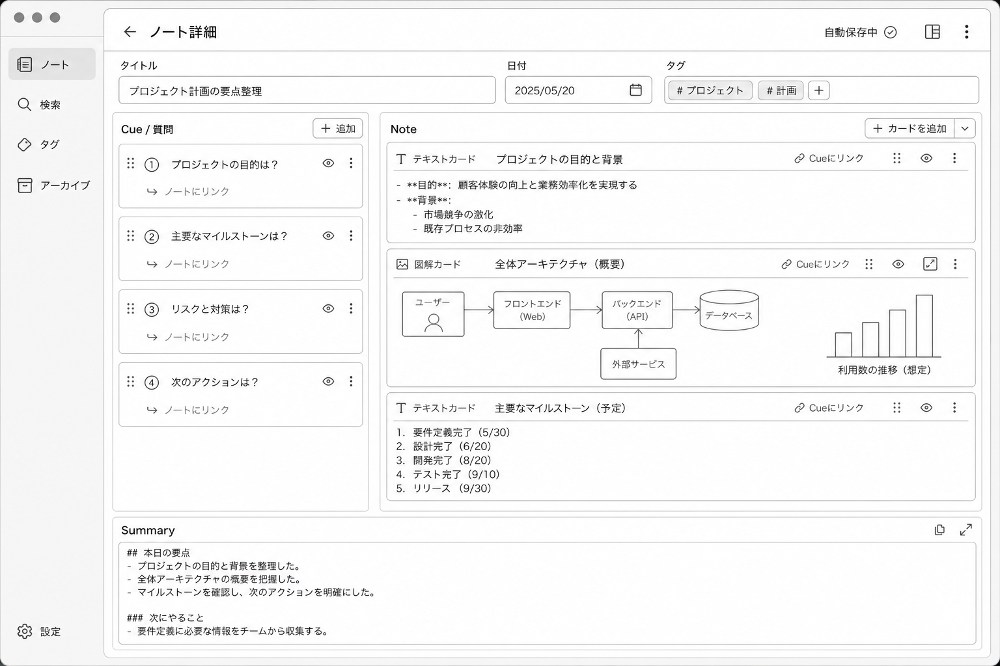
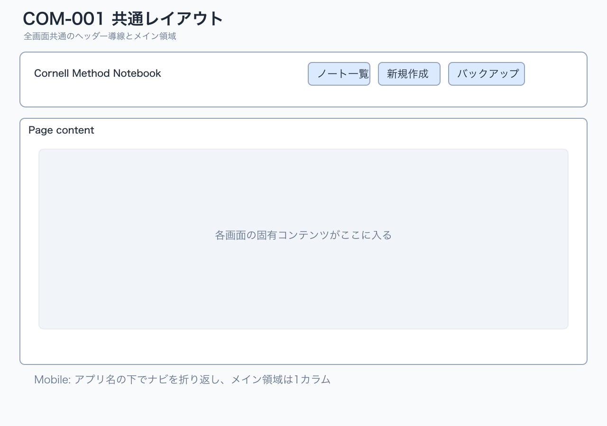
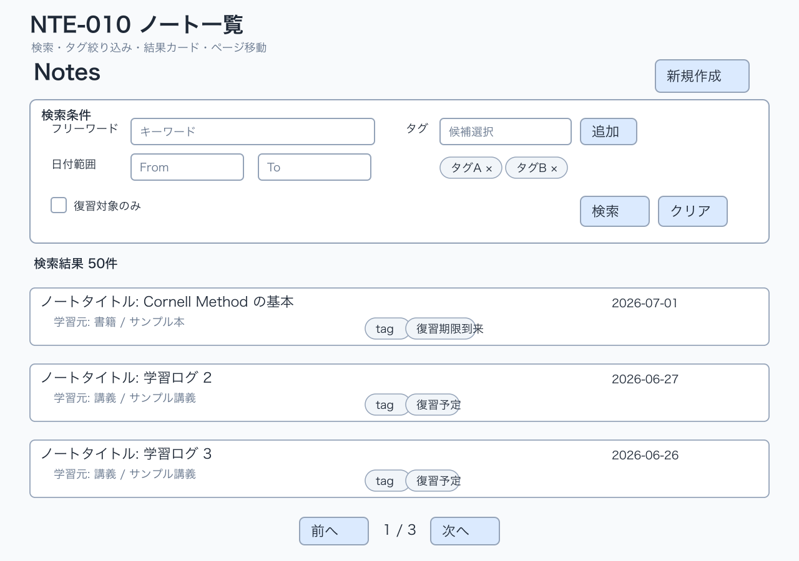
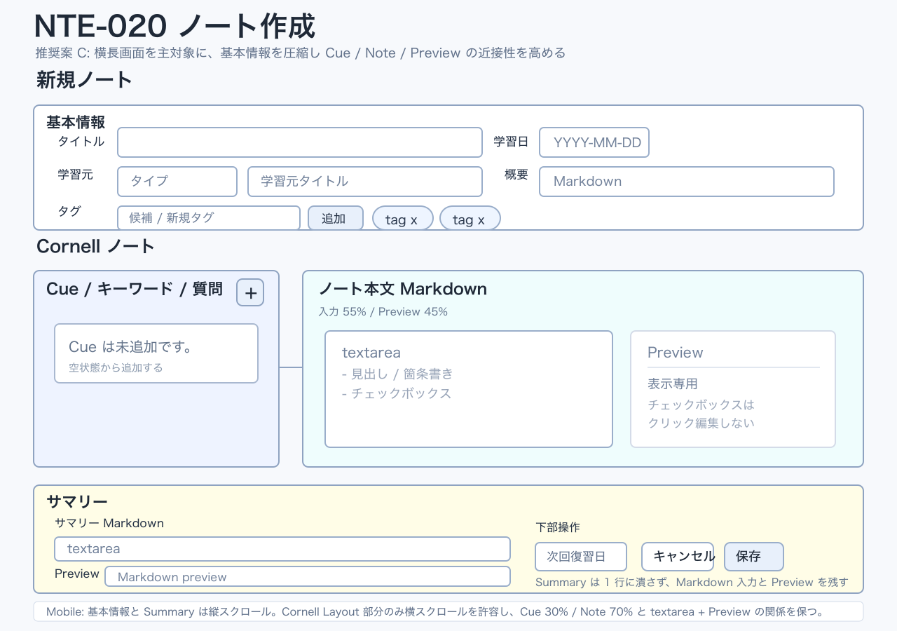
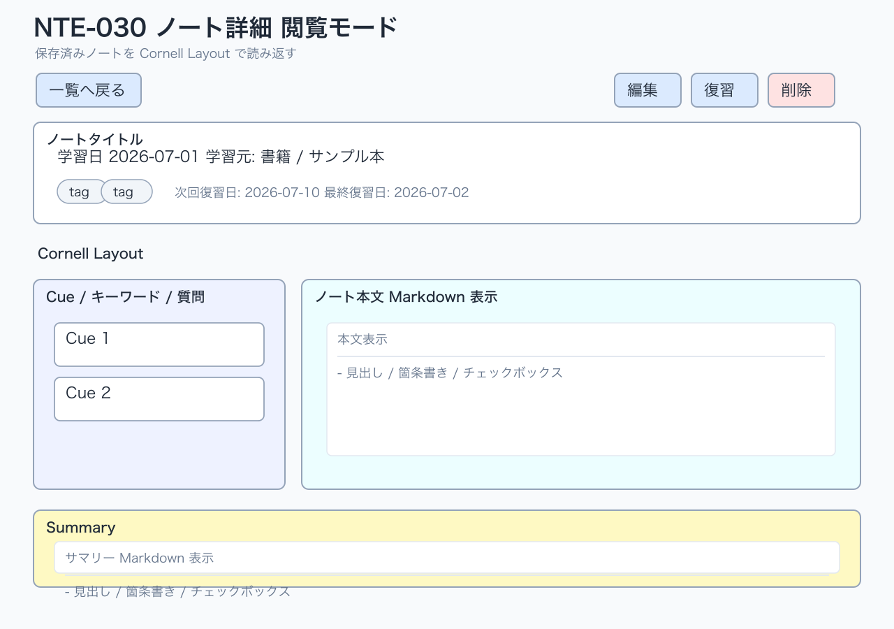
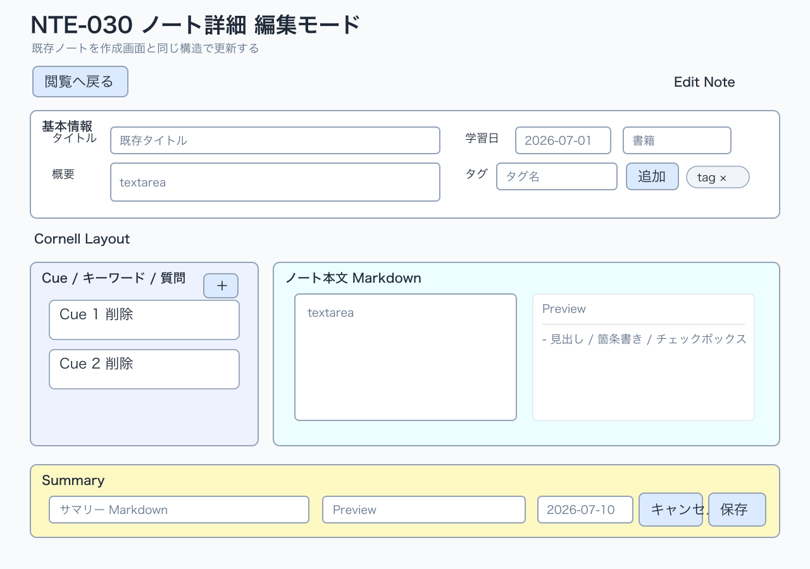
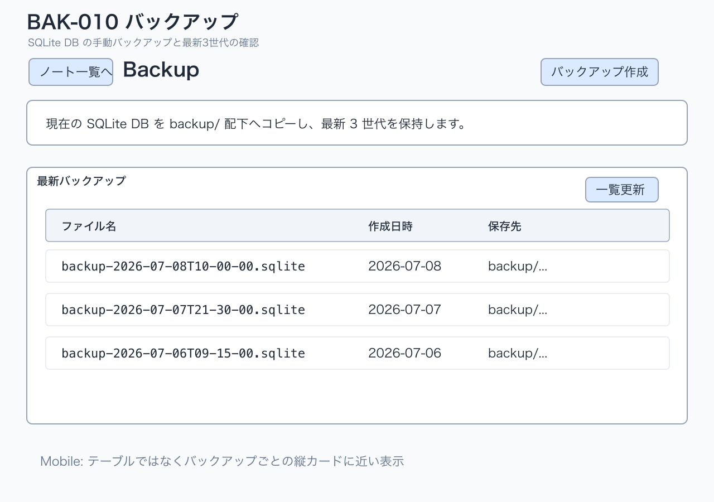

# MVP UI Wireframes

作成日: 2026-07-08

## 位置づけ

この文書は、Cornell Method Notebook MVP の normal state における低忠実度ワイヤフレームです。

目的は、実装前に画面レイアウトと主要操作配置を合意できるようにすることです。完成デザイン、色、装飾、CSS 指示、詳細なコンポーネント仕様は扱いません。

## 参照

- 画面仕様: `doc/screens/MVP_SCREEN_DESIGN.md`
- 画面棚卸し: `doc/screens/MVP_SCREEN_INVENTORY.md`
- UI 成果物不足レビュー: `doc/review/MVP_UI_DESIGN_ARTIFACT_GAP_REVIEW.md`

## 補助モック: Note 欄拡張案



この画像は、Note 欄にテキストカードと図解カードが混在する案を説明する視覚モックです。MVP normal state 全体の正式ワイヤフレームではなく、Note 欄拡張案を理解するための補助モックとして扱います。

## 対象範囲

対象:

- 共通レイアウト `COM-001`
- ノート一覧 `/notes` `NTE-010`
- ノート作成 `/notes/new` `NTE-020`
- ノート詳細 `/notes/[id]` `NTE-030`
  - 閲覧モード
  - 編集モード
  - 復習モード
- バックアップ `/backup` `BAK-010`

この文書では normal state と主要操作配置だけを扱います。loading、empty、error、validation、saving、削除確認、復習更新中、保存失敗、競合時などの状態別 UI モックは別文書で補完予定です。

## 操作優先度の表記

| 種別 | 意味 |
| --- | --- |
| primary | 画面目的を進める主操作 |
| secondary | 補助操作、モード切替、再取得など |
| danger | 削除など取り消しにくい操作 |
| link | 画面遷移や戻る導線 |

## 共通レイアウト COM-001

### 画面の主目的

MVP の主要画面へ迷わず移動できる共通導線を提供します。

### 主操作と配置理由

| 操作 | 優先度 | 配置 | 理由 |
| --- | --- | --- | --- |
| ノート一覧へ | link | ヘッダーナビ左側 | MVP の起点画面であり、常に戻れるようにする |
| 新規作成へ | link | ヘッダーナビ | 記録開始の頻度が高いため、一覧を経由せず入れるようにする |
| バックアップへ | link | ヘッダーナビ右側 | 利用頻度は低いが、全画面からアクセスできる保守導線にする |

### デスクトップのワイヤフレーム



```text
+------------------------------------------------------------------+
| Cornell Method Notebook      [ノート一覧] [新規作成] [バックアップ] |
+------------------------------------------------------------------+
|                                                                  |
|  Page content                                                    |
|                                                                  |
+------------------------------------------------------------------+
```

### モバイルの積み順 / 折り返し方針

- ヘッダー上段にアプリ名を置く。
- ナビはアプリ名の下に横並びで置き、幅が足りない場合は折り返す。
- メイン領域は 1 カラムで表示する。

```text
+------------------------------+
| Cornell Method Notebook       |
| [ノート一覧] [新規作成]       |
| [バックアップ]                |
+------------------------------+
| Page content                  |
+------------------------------+
```

### MVP では置かない操作

- 復習タスク専用ナビ
- 未完タスクバッジ
- ユーザーアイコン
- 認証、ログアウト導線

## ノート一覧 NTE-010 `/notes`

### 画面の主目的

保存済みノートを検索、絞り込みし、閲覧、復習、新規作成へ進む入口にします。

### 主操作と配置理由

| 操作 | 優先度 | 配置 | 理由 |
| --- | --- | --- | --- |
| 新規作成 | primary | 画面ヘッダー右上 | 一覧から最も明確な作成導線にする |
| 検索 | primary | 検索条件フォーム末尾 | 条件入力後の実行位置として自然なため |
| クリア | secondary | 検索ボタンの隣 | 検索条件を戻す補助操作として近接させる |
| 復習対象のみ | secondary | 検索条件内 | 一覧の絞り込み条件であり、結果表示の前に置く |
| ノート選択 | link | 一覧カード全体またはタイトル | 読み返し、復習の入口になるためカード内で最も目立つ情報にする |
| ページ移動 | secondary | 一覧下部 | 結果を確認した後に使う操作なので末尾に置く |

### デスクトップのワイヤフレーム



```text
+------------------------------------------------------------------+
| Notes                                                [新規作成]    |
+------------------------------------------------------------------+
| 検索条件                                                         |
| +--------------------------------------------------------------+ |
| | フリーワード [____________________]                           | |
| | 日付 From [____-__-__]  To [____-__-__]                       | |
| | タグ [候補選択 v] [追加]  [タグA x] [タグB x]                 | |
| | [ ] 復習対象のみ                                              | |
| |                                      [検索] [クリア]           | |
| +--------------------------------------------------------------+ |
+------------------------------------------------------------------+
| 検索結果  50件                                                   |
| +--------------------------------------------------------------+ |
| | ノートタイトル                                      2026-07-01 | |
| | 学習元: 書籍 / サンプル本                                     | |
| | [tag] [tag]  Cue 5件  要約あり  復習期限到来                  | |
| +--------------------------------------------------------------+ |
| +--------------------------------------------------------------+ |
| | ノートタイトル                                      2026-06-28 | |
| | 学習元: 講義 / サンプル講義                                   | |
| | [tag]        Cue 2件  要約未作成  復習予定 2026-07-10         | |
| +--------------------------------------------------------------+ |
|                                                                  |
|                         [前へ]  1 / 3  [次へ]                   |
+------------------------------------------------------------------+
```

### モバイルの積み順 / 折り返し方針

- ヘッダーは「Notes」「新規作成」の順に縦積みにする。
- 検索条件は 1 カラムに積む。
- From / To は縦並びにする。
- タグチップは入力欄の下で折り返す。
- ノートカードは 1 カラムで、タイトル、日付、学習元、タグ、状態の順に表示する。
- ページャは一覧末尾に置く。

```text
+------------------------------+
| Notes                        |
| [新規作成]                   |
+------------------------------+
| フリーワード [_____________] |
| From [____-__-__]            |
| To   [____-__-__]            |
| タグ [候補選択 v] [追加]     |
| [タグA x] [タグB x]          |
| [ ] 復習対象のみ             |
| [検索] [クリア]              |
+------------------------------+
| 検索結果 50件                |
| +--------------------------+ |
| | ノートタイトル           | |
| | 2026-07-01               | |
| | 学習元: 書籍             | |
| | [tag] Cue 5 要約あり     | |
| | 復習期限到来             | |
| +--------------------------+ |
| [前へ] 1 / 3 [次へ]          |
+------------------------------+
```

### MVP では置かない操作

- 一覧からの直接編集
- 一覧からの直接削除
- PDF 出力
- 一括操作
- 右クリックメニュー
- 日付 range picker、クイックセレクト、ソート切替

## ノート作成 NTE-020 `/notes/new`

### 画面の主目的

デスクトップ / 横長画面を主対象に、Cornell 形式で新しいノートを作成し、保存後に詳細閲覧へ進めます。基本情報、Cornell ノート、サマリーの 3 セクションは維持しつつ、基本情報を圧縮し、Cue / Note / Preview の近接性を高めます。

### 主操作と配置理由

| 操作 | 優先度 | 配置 | 理由 |
| --- | --- | --- | --- |
| 保存 | primary | 画面下部右側 | 入力を上から下へ進めた最後に確定できるようにする |
| キャンセル | secondary | 保存ボタンの左 | 保存せず戻る操作として保存と近接させる |
| Cue 追加 | secondary | Cue セクション見出し右側 | Cue 入力領域に対する操作であることを明確にする |
| Cue 削除 | danger | 各 Cue 行の右側 | 削除対象を誤認しないよう対象行に置く |
| タグ追加 | secondary | タグ入力欄の横 | 入力したタグをその場で追加する操作として近接させる |
| タグ削除 | secondary | 各タグチップ内 | 削除対象のタグが分かるようチップ内に置く |

### デスクトップのワイヤフレーム



```text
+------------------------------------------------------------------+
| 新規ノート                                                       |
+------------------------------------------------------------------+
| 基本情報                                                         |
| +--------------------------------------------------------------+ |
| | タイトル [____________________________________] 学習日 [date] | |
| | 学習元タイプ [select v] 学習元タイトル [___________________] | |
| | 概要                                                         | |
| | [________________________________________________________]    | |
| | タグ [候補/新規タグ入力____________] [追加] [tag x] [tag x]  | |
| +--------------------------------------------------------------+ |
+------------------------------------------------------------------+
| Cornell ノート                                                   |
| +------------------------------+ +-----------------------------+ |
| | Cue / キーワード / 質問  [+] | | ノート本文 Markdown         | |
| | +--------------------------+ | | +---------------+ +-------+ | |
| | | Cue は未追加です。       | | | | textarea      | |Preview| | |
| | +--------------------------+ | | |               | |       | | |
| |                              | | +---------------+ +-------+ | |
| |                              | +-----------------------------+ |
| +------------------------------+                                 |
+------------------------------------------------------------------+
| サマリー                                                         |
| +--------------------------------------------------------------+ |
| | サマリー Markdown                                            | |
| | [textarea                                                    ] | |
| | Preview                                                      | |
| | [Markdown preview                                            ] | |
| | 次回復習日 [date]                    [キャンセル] [保存]      | |
| +--------------------------------------------------------------+ |
+------------------------------------------------------------------+
```

### モバイルの横スクロール方針

- 基本情報を先頭に置く。
- NTE-020 はデスクトップ / 横長画面での作成・編集を主対象にする。
- モバイルでは Cornell レイアウトを無理に 1 カラム化せず、Cue / Note / Preview の関係を保つため Cornell Layout 部分の横スクロールを許容する。
- 横スクロールは主に Cornell Layout 部分へ閉じ込め、基本情報と Summary は通常の縦スクロールで読める構造にする。
- モバイル最適化の最低条件は、横スクロールで構造を維持し、操作不能にしないこととする。
- モバイルでの本格的な編集効率最適化は MVP / 近い改善対象から外す。
- 保存 / キャンセルは最下部に置く。

```text
+------------------------------+
| 新規ノート                   |
+------------------------------+
| 基本情報                     |
| タイトル [_________________] |
| 学習日 [____-__-__]          |
| 学習元タイプ [select v]      |
| 学習元タイトル [___________] |
| 概要 [_____________________] |
| タグ [________] [追加]       |
| [tag x] [tag x]              |
+------------------------------+
| Cornell ノート               |
| <横スクロール領域>           |
| +----------------------------+ +----------------------------+ |
| | Cue / キーワード / 質問 [+]| | ノート本文 Markdown        | |
| | +------------------------+ | | +------------+ +----------+ | |
| | | Cue は未追加です。     | | | | textarea   | | Preview  | | |
| | +------------------------+ | | +------------+ +----------+ | |
| +----------------------------+ +----------------------------+ |
| </横スクロール領域>          |
+------------------------------+
| サマリー Markdown            |
| [textarea]                   |
| Preview                      |
| [Markdown preview]           |
| 次回復習日 [____-__-__]      |
| [キャンセル] [保存]          |
+------------------------------+
```

### MVP では置かない操作

- 自動保存
- 下書き保存
- D&D 並び替え
- Cue と本文範囲のリンク
- 本文のカード分割
- 高機能 Markdown エディタ、リッチな Markdown ツールバー
- Cmd / Ctrl ショートカット

## ノート詳細 NTE-030 `/notes/[id]`

### 共通方針

詳細画面は同一ページ内で閲覧、編集、復習モードを切り替えます。初期表示は閲覧モードです。

モード切替操作はページ上部にまとめ、現在のノートを見失わずに操作できるようにします。

閲覧モードと復習モードは、タイトル・メタ情報・ヘッダー領域、概要、Cornell レイアウト、Summary の位置を共通化します。デスクトップの Cornell レイアウトは Cue を左、本文を右に置く 30% / 70% を基本とします。復習モードでは同じ本文領域だけを初期マスクし、本文表示／非表示の操作と復習記録を追加します。Cue と Summary を本文より上の別レイアウトへ移動することはしません。

## ノート詳細 NTE-030 閲覧モード

### 画面の主目的

保存済みノートを Cornell レイアウトで読み返し、編集、復習、削除へ進めます。

### 主操作と配置理由

| 操作 | 優先度 | 配置 | 理由 |
| --- | --- | --- | --- |
| 一覧へ戻る | link | 画面ヘッダー左側 | 一覧から来た利用者が戻りやすくする |
| 編集 | primary | 画面ヘッダー右側 | 閲覧中に内容修正へ進む主操作にする |
| 復習 | secondary | 編集の隣 | 詳細から復習へ入る主要導線だが、閲覧修正より一段補助にする |
| 削除 | danger | ヘッダー右端またはメタ情報下 | 破壊的操作として主操作から距離を取り、誤操作を避ける |

### デスクトップのワイヤフレーム



```text
+------------------------------------------------------------------+
| [一覧へ戻る]                                [編集] [復習] [削除] |
+------------------------------------------------------------------+
| ノートタイトル                                                   |
| 学習日 2026-07-01  学習元: 書籍 / サンプル本                     |
| [tag] [tag]  次回復習日: 2026-07-10  最終復習日: 2026-07-02      |
| 概要: ノート全体の説明                                           |
+------------------------------------------------------------------+
| Cornell Layout                                                   |
| +------------------------------+ +-----------------------------+ |
| | Cue / キーワード / 質問      | | ノート本文 Markdown 表示    | |
| | +--------------------------+ | |                             | |
| | | Cue 1                    | | | 本文                        | |
| | +--------------------------+ | |                             | |
| | +--------------------------+ | |                             | |
| | | Cue 2                    | | |                             | |
| | +--------------------------+ | |                             | |
| +------------------------------+ +-----------------------------+ |
+------------------------------------------------------------------+
| Summary                                                          |
| +--------------------------------------------------------------+ |
| | サマリー Markdown 表示                                        | |
| +--------------------------------------------------------------+ |
+------------------------------------------------------------------+
```

### モバイルの積み順 / 折り返し方針

- 戻る導線、タイトル、メタ情報、操作ボタンの順に表示する。
- 操作ボタンは折り返し可能な横並びにする。
- 概要の下に Cornell レイアウト（Cue、本文）を置き、その下にサマリーを表示する。
- Cornell の Cue / 本文は、デスクトップの左右関係を保ちつつ、狭い幅では 1 カラム表示へ調整してよい。

```text
+------------------------------+
| [一覧へ戻る]                 |
| ノートタイトル               |
| 2026-07-01 / 書籍            |
| [tag] [tag]                  |
| 次回復習日: 2026-07-10       |
| 最終復習日: 2026-07-02       |
| [編集] [復習] [削除]         |
+------------------------------+
| 概要                         |
+------------------------------+
| Cue / キーワード / 質問      |
| +--------------------------+ |
| | Cue 1                    | |
| +--------------------------+ |
+------------------------------+
| ノート本文 Markdown 表示     |
+------------------------------+
| Summary                      |
+------------------------------+
```

### MVP では置かない操作

- Undo Snackbar
- ソフトデリート復元
- ドラフト状態表示
- 本文カード単位の非表示

## ノート詳細 NTE-030 編集モード

### 画面の主目的

保存済みノートを作成画面と同じ構造で更新し、保存後に閲覧モードへ戻します。

### 主操作と配置理由

| 操作 | 優先度 | 配置 | 理由 |
| --- | --- | --- | --- |
| 保存 | primary | 画面下部右側 | 編集内容を確認しながら最後に確定できるようにする |
| キャンセル | secondary | 保存の左 | 変更を保存しない操作として保存と近接させる |
| Cue 追加 | secondary | Cue セクション見出し右側 | 作成画面と同じ操作位置にする |
| Cue 削除 | danger | 各 Cue 行の右側 | 削除対象を明確にする |
| 閲覧へ戻る | link | ヘッダー左側またはキャンセル | モード離脱の導線を明示する |

### デスクトップのワイヤフレーム



```text
+------------------------------------------------------------------+
| [閲覧へ戻る]                                          Edit Note   |
+------------------------------------------------------------------+
| 基本情報                                                         |
| +--------------------------------------------------------------+ |
| | タイトル [既存タイトル_______________________________]        | |
| | 学習日 [2026-07-01]  学習元タイプ [select v]                 | |
| | 学習元タイトル [既存学習元____________________________]       | |
| | 概要 [textarea]                                               | |
| | タグ [________________] [追加]  [tag x] [tag x]               | |
| +--------------------------------------------------------------+ |
+------------------------------------------------------------------+
| Cornell Layout                                                   |
| +------------------------------+ +-----------------------------+ |
| | Cue / キーワード / 質問  [+] | | ノート本文 Markdown         | |
| | +--------------------------+ | | [textarea]                  | |
| | | Cue 1              [削除] | | |                             | |
| | +--------------------------+ | | Preview                     | |
| | +--------------------------+ | | [Markdown preview]          | |
| | | Cue 2              [削除] | | |                             | |
| | +--------------------------+ | +-----------------------------+ |
| +------------------------------+                                 |
+------------------------------------------------------------------+
| Summary                                                          |
| +--------------------------------------------------------------+ |
| | サマリー Markdown [textarea]                                  | |
| | Preview [Markdown preview]                                    | |
| | 次回復習日 [2026-07-10]                                       | |
| |                                      [キャンセル] [保存]       | |
| +--------------------------------------------------------------+ |
+------------------------------------------------------------------+
```

### モバイルの積み順 / 折り返し方針

- 作成画面と同じく、基本情報、Cue、本文、サマリー、次回復習日、保存操作の順に積む。
- 閲覧へ戻る導線は最上部に置き、保存 / キャンセルは最下部に置く。
- 入力欄と preview は各セクションで縦並びにする。

### MVP では置かない操作

- 自動保存
- 下書き保存
- 楽観ロック、409 競合 UI
- D&D 並び替え
- NoteCard 分割
- 未保存変更確認ダイアログの必須化

## ノート詳細 NTE-030 復習モード

### 画面の主目的

Cue とサマリーを手がかりに本文を思い出し、復習済み状態を記録します。

### 主操作と配置理由

| 操作 | 優先度 | 配置 | 理由 |
| --- | --- | --- | --- |
| 閲覧へ戻る | link | 画面ヘッダー左側 | 復習を中断して通常閲覧へ戻れるようにする |
| 本文を表示 | primary | 本文非表示エリア内 | 思い出した後に答え合わせする操作なので、非表示本文の位置に置く |
| 本文を隠す | secondary | 本文表示エリア上部 | 再度想起したい場合に本文付近で切り替えられるようにする |
| 復習済みにする | primary | 復習操作エリア下部右側 | 復習の完了操作として最後に置く |
| 次回復習日変更 | secondary | 復習済み操作の近く | 復習完了時に必要に応じて調整する入力にする |

### デスクトップのワイヤフレーム

```text
+------------------------------------------------------------------+
| [閲覧へ戻る]                                      復習モード       |
+------------------------------------------------------------------+
| ノートタイトル                                                   |
| 学習日 2026-07-01  学習元: 書籍 / サンプル本                     |
| [tag] [tag]  次回復習日: 2026-07-10  最終復習日: 2026-07-02      |
| 概要: ノート全体の説明                                           |
+------------------------------------------------------------------+
| Cornell Layout                                                   |
| +------------------------------+ +-----------------------------+ |
| | Cue / キーワード / 質問      | | 本文                         | |
| | +--------------------------+ | | +-------------------------+ | |
| | | Cue 1                    | | | | 本文は非表示です。       | | |
| | +--------------------------+ | | | |                         | | |
| | +--------------------------+ | | | | [本文を表示]            | | |
| | | Cue 2                    | | | +-------------------------+ | |
| | +--------------------------+ | |                             | |
| +------------------------------+ +-----------------------------+ |
+------------------------------------------------------------------+
| Summary                                                          |
| +--------------------------------------------------------------+ |
| | サマリー Markdown 表示                                        | |
| +--------------------------------------------------------------+ |
| 復習記録                                                         |
| 次回復習日 [____-__-__]                         [復習済みにする] |
+------------------------------------------------------------------+
```

本文表示後は、同じ本文領域内で Markdown 表示と `[本文を隠す]` を表示します。本文のマスク切替以外は閲覧モードと同じ構造を維持し、Cue と Summary の位置は変えません。

### モバイルの積み順 / 折り返し方針

- タイトルとメタ情報の下に概要を置き、その下に共通の Cornell レイアウトを置く。
- Cornell の Cue と本文は閲覧モードと同じ順序・位置関係で表示し、本文エリアは初期非表示のまま、その位置に「本文を表示」操作を置く。
- Cornell レイアウトの下に Summary を置き、復習記録は Summary の後ろに追加する。

```text
+------------------------------+
| [閲覧へ戻る] 復習             |
| ノートタイトル               |
| 2026-07-01 / 書籍            |
| [tag] [tag]                  |
| 次回復習日: 2026-07-10       |
| 最終復習日: 2026-07-02       |
| 概要                         |
+------------------------------+
| Cornell Layout               |
| Cue / キーワード / 質問      |
| +--------------------------+ |
| | Cue 1                    | |
| +--------------------------+ |
| 本文                         |
| 本文は非表示です。           |
| [本文を表示]                 |
+------------------------------+
| Summary                      |
| サマリー Markdown 表示       |
+------------------------------+
| 復習記録                     |
| 次回復習日 [____-__-__]      |
| [復習済みにする]             |
+------------------------------+
```

### MVP では置かない操作

- 採点、正誤判定
- AI クイズ生成
- 自動での次回復習日計算
- 本文表示状態の永続化
- `/tasks/review` 専用画面
- 1 日後 / 1 週間後タブ
- 未完タスクバッジ

## バックアップ BAK-010 `/backup`

### 画面の主目的

SQLite DB ファイルの手動バックアップを作成し、最新 3 世代のバックアップを確認できるようにします。

### 主操作と配置理由

| 操作 | 優先度 | 配置 | 理由 |
| --- | --- | --- | --- |
| バックアップ作成 | primary | 画面ヘッダー右側 | この画面の主目的であり、最初に見つけられる位置に置く |
| 一覧更新 | secondary | バックアップ一覧見出し右側 | 一覧データに対する補助操作として一覧近くに置く |
| ノート一覧へ | link | 画面ヘッダー左側 | 保守作業後に通常利用へ戻る導線にする |

### デスクトップのワイヤフレーム



```text
+------------------------------------------------------------------+
| [ノート一覧へ] Backup                              [バックアップ作成] |
+------------------------------------------------------------------+
| 現在の SQLite DB を backup/ 配下へコピーし、最新 3 世代を保持します。 |
+------------------------------------------------------------------+
| 最新バックアップ                                      [一覧更新]    |
| +--------------------------------------------------------------+ |
| | ファイル名                         作成日時        保存先       | |
| | backup-2026-07-08T10-00-00.sqlite  2026-07-08      backup/...  | |
| | backup-2026-07-07T21-30-00.sqlite  2026-07-07      backup/...  | |
| | backup-2026-07-06T09-15-00.sqlite  2026-07-06      backup/...  | |
| +--------------------------------------------------------------+ |
+------------------------------------------------------------------+
```

### モバイルの積み順 / 折り返し方針

- 「ノート一覧へ」「Backup」「バックアップ作成」を縦に近い配置で置く。
- 一覧はテーブル横スクロールではなく、バックアップごとのカード表示に近い縦積みにする。
- 一覧更新は一覧見出し直下に置く。

```text
+------------------------------+
| [ノート一覧へ]               |
| Backup                       |
| [バックアップ作成]           |
+------------------------------+
| 現在の SQLite DB を保存します |
+------------------------------+
| 最新バックアップ             |
| [一覧更新]                   |
| +--------------------------+ |
| | backup-2026-...sqlite    | |
| | 作成日時: 2026-07-08     | |
| | 保存先: backup/...       | |
| +--------------------------+ |
| +--------------------------+ |
| | backup-2026-...sqlite    | |
| | 作成日時: 2026-07-07     | |
| | 保存先: backup/...       | |
| +--------------------------+ |
+------------------------------+
```

### MVP では置かない操作

- バックアップログ DB 管理
- バックアップからの自動復元
- スケジュール実行 UI
- `POST /api/backups/retry`
- ログ詳細画面

## この文書で解消する不足

`doc/review/MVP_UI_DESIGN_ARTIFACT_GAP_REVIEW.md` の不足項目のうち、この文書では次に対応します。

- 画面レイアウト案
- 主要操作の配置
- PC 幅と狭い画面幅での優先表示と折り返し方針

次の不足は、この文書では扱わず次段階に残します。

- loading / empty / error / validation / saving / success の状態別 UI モック
- 入力中、保存中、保存失敗、競合時の見え方
- 削除確認、復習更新中、復習完了通知の詳細
- 採用しない UI バリエーションと比較レビュー
