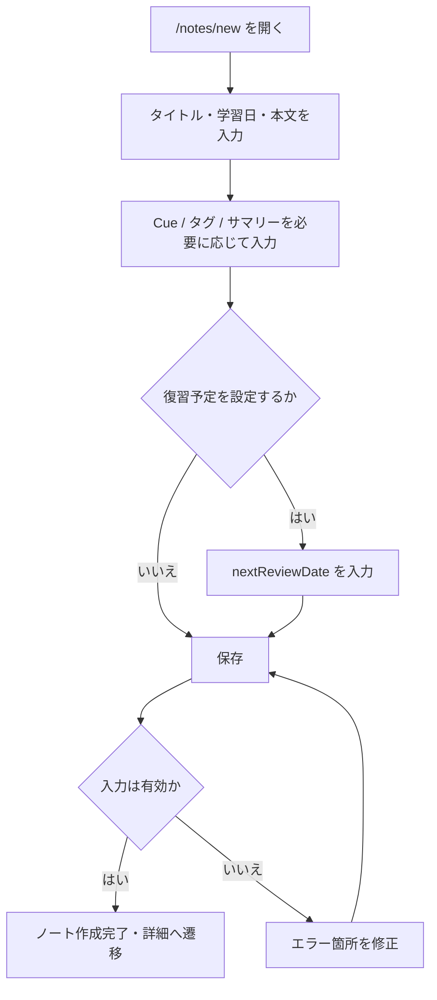
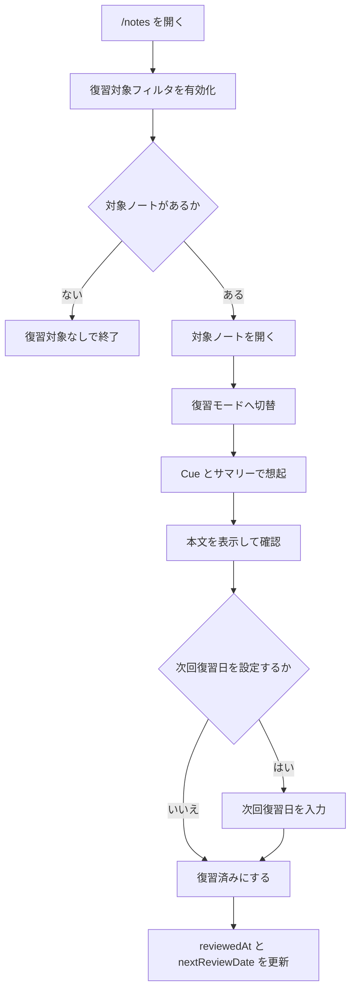
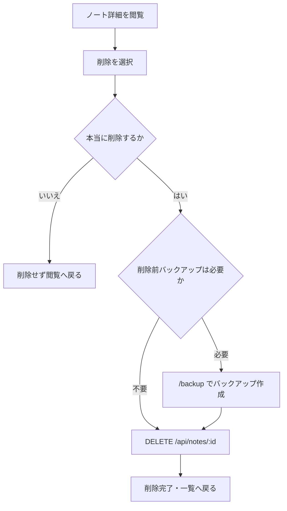

# MVP 業務フロー・ワークフロー設計

確認日: 2026-06-21

## 位置づけ

このドキュメントは、Cornell Method Notebook MVP を実際に運用するための業務フロー・操作ワークフロー設計です。

既存の MVP 設計資料がデータ、API、画面、技術方針を定義しているのに対し、本書は「利用者が何のために、どの順序で、どの判断基準に従って操作するか」を整理します。

参照元:

- `doc/data/MVP_DATA_DESIGN.md`
- `doc/api/MVP_API_DESIGN.md`
- `doc/screens/MVP_SCREEN_DESIGN.md`
- `doc/technical/MVP_TECHNICAL_DESIGN.md`
- `doc/implementation/MVP_IMPLEMENTATION_TASKS.md`
- `doc/diagrams/MVP_UML_DESIGN.md`
- `doc/diagrams/MVP_BUSINESS_FLOW_DIAGRAMS.md`
- `doc/diagrams/MVP_SEQUENCE_DIAGRAMS.md`

主要フローの業務フロー図は `doc/diagrams/MVP_BUSINESS_FLOW_DIAGRAMS.md`、UI / API / DB の責務境界を示すシーケンス図は `doc/diagrams/MVP_SEQUENCE_DIAGRAMS.md` を参照してください。図別設計書の入口は `doc/diagrams/MVP_UML_DESIGN.md` です。本書は業務上の操作順序と判断分岐を正とし、図は実装者が責務境界を確認する補助資料として扱います。

## MVP の利用者・目的・業務範囲

### 利用者

MVP の利用者は、ローカル環境で学習記録を管理する個人ユーザーです。認証、ユーザー切替、共有、承認者、管理者は置きません。

### 業務目的

MVP の業務目的は、学習内容を Cornell Method に沿って記録し、あとから検索・復習できる状態に保つことです。

具体的には、以下の学習サイクルを安定して回せることを目的にします。

1. 学習した内容をノートとして記録する。
2. キーワード / 質問、本文、サマリーを分けて整理する。
3. タグ、日付、検索語で過去ノートを探す。
4. 復習予定日が来たノートを確認する。
5. Cue とサマリーを手がかりに想起し、復習済みにする。
6. ローカル DB をバックアップして、誤操作や破損に備える。

### 業務範囲

MVP で扱う業務範囲:

- ノート作成
- ノート閲覧
- ノート編集
- ノート検索 / タグ絞り込み
- 復習対象確認
- 復習済み更新
- バックアップ作成 / 確認
- ノート削除

MVP で扱わない業務範囲:

- 複数ユーザーによる共同編集
- 承認、レビュー依頼、コメント
- 自動保存、下書き保存、Undo
- 専用の復習タスク画面
- 自動間隔反復
- PDF 出力
- タグ管理 UI
- バックアップからの自動復元
- Vercel / Supabase などへの本番デプロイ

## 運用ルール

業務フローを属人化させないため、MVP では次のルールを標準運用とします。

| 分類         | ルール                                                                                                                                                     |
| ------------ | ---------------------------------------------------------------------------------------------------------------------------------------------------------- |
| ノート作成   | 学習した内容は、タイトル、学習日、本文の最低限を入力して保存する。タグやサマリーは未入力でもよいが、あとで検索・復習しやすくなるため可能な範囲で入力する。 |
| タイトル     | 何を学んだノートか後から判別できる名前にする。曖昧なタイトルだけで保存しない。                                                                             |
| 学習日       | 実際に学習した日を設定する。未来日は入力しない。                                                                                                           |
| Cue          | 本文を思い出すためのキーワード、質問、論点を入れる。本文の見出しそのものではなく、想起の手がかりになる語を優先する。                                       |
| サマリー     | 後から短時間で読み返すための要約を書く。未作成の場合は一覧・詳細で要約未作成として扱う。                                                                   |
| タグ         | 分類や検索に使う語だけを付ける。1 ノート最大 12 個、重複不可。                                                                                             |
| 復習予定日   | 復習したいノートにだけ設定する。MVP では自動計算しないため、利用者が手動で決める。                                                                         |
| 復習済み     | 本文を見る前に Cue とサマリーで想起し、確認後に復習済みにする。採点や正誤管理はしない。                                                                    |
| 削除         | 削除前に本当に不要か確認する。MVP は物理削除で Undo できない。迷う場合は削除せず、タグやタイトルを見直す。                                                 |
| バックアップ | 重要な編集や削除の前、または定期的な作業開始時にバックアップを作成する。最新 3 世代だけ保持する。                                                          |

## 画面と API の対応

| 業務                     | 利用画面                              | 主な API                                                                                                             |
| ------------------------ | ------------------------------------- | -------------------------------------------------------------------------------------------------------------------- |
| ノート一覧確認           | `/notes`                              | `GET /api/notes`                                                                                                     |
| ノート作成               | `/notes/new`                          | `POST /api/notes`, `GET /api/tags`                                                                                   |
| ノート閲覧 / 編集 / 復習 | `/notes/[id]`                         | `GET /api/notes/:id`, `PATCH /api/notes/:id`, `POST /api/notes/:id/review`, `DELETE /api/notes/:id`, `GET /api/tags` |
| タグ候補取得             | `/notes`, `/notes/new`, `/notes/[id]` | `GET /api/tags`                                                                                                      |
| バックアップ             | `/backup`                             | `GET /api/backups`, `POST /api/backups`                                                                              |

## 代表フロー図

### ノート作成から復習予定化まで

### 復習対象確認から復習済み更新まで

### 削除前の確認

## 1. ノート作成フロー

### 業務目的

学習直後の情報を Cornell Method 形式で保存し、後から検索・復習できる状態にします。

### 開始条件

- 利用者が学習を終えた、または学習中に記録したい内容がある。
- アプリが起動しており `/notes/new` にアクセスできる。

### 終了条件

- ノートが作成され、詳細画面 `/notes/[id]` の閲覧モードで確認できる。
- 入力不備がある場合は、保存せずエラーを表示した状態で終了する。

### 利用画面

- `/notes/new`
- 保存成功後: `/notes/[id]`

### 主な操作

1. 新規作成画面を開く。
2. タイトル、学習日を入力する。
3. 必要に応じて学習元タイプ、学習元タイトル、概要を入力する。
4. Cue、本文、サマリーを入力する。
5. 必要に応じてタグと次回復習日を設定する。
6. 保存する。
7. 詳細画面で保存結果を確認する。

### 入力データ

- `title`
- `noteDate`
- `sourceType`
- `sourceTitle`
- `overview`
- `body`
- `summary`
- `nextReviewDate`
- `cues[]`
- `tags[]`

### 更新されるデータ

- `Notebook`
- `Cue`
- `Tag`
- `NotebookTag`

### 参照 API

- `GET /api/tags`
- `POST /api/notes`

### 正常系

- 入力値が validation を通過する。
- 存在しないタグ名は保存時に自動作成される。
- Notebook、Cue、Tag、NotebookTag が 1 リクエストで保存される。
- 保存後、作成したノートの詳細画面へ遷移する。

### 例外系 / 判断分岐

| 分岐                     | 判断ルール                               | 対応                                                 |
| ------------------------ | ---------------------------------------- | ---------------------------------------------------- |
| タイトル未入力           | `title` は 1〜120 文字必須               | 保存せずエラー表示                                   |
| 学習日が未来             | `noteDate` は今日以前                    | 保存せずエラー表示                                   |
| Cue が空                 | Cue は任意。ただし空行は保存対象にしない | 空行を除外、または入力エラーとして扱う実装に合わせる |
| タグが 12 個超過         | 最大 12 個                               | 保存せずエラー表示                                   |
| タグ重複                 | 同一ノート内で重複不可                   | 重複を除外、またはエラー表示                         |
| 次回復習日が学習日より前 | `nextReviewDate` は `noteDate` 以降      | 保存せずエラー表示                                   |
| サマリー未入力           | MVP では許可                             | 要約未作成として表示                                 |
| API 失敗                 | 400 / 500 等                             | エラー形式 `{ code, message, errors? }` を表示       |

### 属人判断を避けるルール

- 復習したいノートだけ `nextReviewDate` を設定する。MVP では自動計算しない。
- タグは「あとで探すための分類語」として付ける。感想や長文メモをタグにしない。
- Cue は本文の検索語ではなく、想起を促す質問・キーワードを優先する。

### MVP では扱わない Phase 2 項目

- 自動保存、下書き保存
- Cue の D&D 並び替え
- Cue と本文範囲の厳密リンク
- 本文カード分割
- リッチな Markdown エディタ
- ノート作成時の自動復習スケジュール生成

## 2. ノート編集フロー

### 業務目的

保存済みノートの誤字、追記、タグ、Cue、サマリー、復習予定日を更新し、学習記録の再利用性を高めます。

### 開始条件

- 編集対象のノートが存在する。
- 利用者が `/notes/[id]` の閲覧モードで対象ノートを確認している。

### 終了条件

- 更新内容が保存され、閲覧モードで反映される。
- キャンセルした場合は変更を保存せず閲覧モードへ戻る。

### 利用画面

- `/notes/[id]`

### 主な操作

1. ノート詳細を開く。
2. 編集モードへ切り替える。
3. 必要な項目を修正する。
4. Cue や Tag を追加・削除する。
5. 保存する。
6. 閲覧モードで更新結果を確認する。

### 入力データ

ノート作成時と同じ入力データ一式です。

### 更新されるデータ

- `Notebook`
- `Cue`
- `Tag`
- `NotebookTag`

MVP では、Cue と Tag 関連は PATCH リクエスト内容で全置換します。

### 参照 API

- `GET /api/notes/:id`
- `GET /api/tags`
- `PATCH /api/notes/:id`

### 正常系

- 詳細取得に成功する。
- 編集内容が validation を通過する。
- Notebook が更新される。
- Cue はリクエスト内容に置き換わる。
- Tag 関連もリクエスト内容に置き換わる。
- 保存後、閲覧モードに戻る。

### 例外系 / 判断分岐

| 分岐                           | 判断ルール                   | 対応                                 |
| ------------------------------ | ---------------------------- | ------------------------------------ |
| 対象ノートなし                 | `GET /api/notes/:id` が 404  | 一覧へ戻れるエラーを表示             |
| 編集キャンセル                 | 利用者が保存しない判断をした | 変更を破棄し閲覧モードへ戻る         |
| 入力不備                       | validation エラー            | 保存せずエラー表示                   |
| Cue / Tag の一部だけ更新したい | MVP は差分更新なし           | フォーム全体の状態を保存する         |
| 保存中に API 失敗              | 400 / 404 / 500 等           | エラー表示し、入力内容は画面上に保持 |

### 属人判断を避けるルール

- 編集前に、修正対象が「内容の正確性」「検索性」「復習しやすさ」のどれに関わるかを確認する。
- タグを消す場合は、そのタグで後から探す必要がないか確認する。
- Cue を消す場合は、本文を思い出す手がかりが不足しないか確認する。

### MVP では扱わない Phase 2 項目

- 楽観ロック
- 自動保存
- 差分保存
- 更新履歴
- 複数端末・複数ユーザー競合
- Cue / Tag の差分更新 API

## 3. ノート検索 / タグ絞り込みフロー

### 業務目的

保存済みノートから、読み返したい内容や復習したい対象を短時間で見つけます。

### 開始条件

- 1 件以上のノートが保存されている。
- 利用者が `/notes` を開く。

### 終了条件

- 条件に合うノート一覧が表示される。
- 対象が見つかった場合は詳細画面へ遷移できる。
- 対象がない場合は、条件を変更するか検索を終了する。

### 利用画面

- `/notes`
- 詳細確認時: `/notes/[id]`

### 主な操作

1. `/notes` を開く。
2. 必要に応じてフリーワードを入力する。
3. 必要に応じて日付 From / To を指定する。
4. 必要に応じてタグを指定する。
5. 必要に応じて復習対象フィルタを有効にする。
6. 一覧から対象ノートを選択する。

### 入力データ

- `query`
- `tag`
- `from`
- `to`
- `reviewDue`
- `page`

### 更新されるデータ

なし。検索は参照のみです。

### 参照 API

- `GET /api/notes`
- `GET /api/tags`

### 正常系

- 条件に一致するノート一覧が返る。
- 一覧は `noteDate desc, updatedAt desc` の固定順で表示される。
- タグは OR 条件で絞り込む。
- フリーワードは `title`, `overview`, `body`, `summary`, `cue.text` を対象にする。
- 復習対象フィルタは `nextReviewDate` が今日以前のノートを対象にする。

### 例外系 / 判断分岐

| 分岐             | 判断ルール               | 対応                                     |
| ---------------- | ------------------------ | ---------------------------------------- |
| 条件未指定       | 全件一覧として扱う       | 通常の一覧を表示                         |
| 検索結果 0 件    | 条件に一致するノートなし | 条件変更を促す表示                       |
| From > To        | 日付範囲が不正           | 検索せずエラー表示                       |
| タグ候補取得失敗 | `GET /api/tags` 失敗     | タグ候補なしで検索継続、またはエラー表示 |
| API 応答失敗     | `GET /api/notes` 失敗    | 一覧を更新せずエラー表示                 |

### 属人判断を避けるルール

- 目的が明確な場合は、まずタグと日付で絞り込む。
- 思い出せる語が少ない場合は、フリーワードを短くして検索する。
- 復習対象の確認では、通常検索条件と混同せず `reviewDue=true` を使う。

### MVP では扱わない Phase 2 項目

- タグ管理 UI
- タグ右クリックメニュー
- 高度な検索構文
- 保存済み検索条件
- PDF 出力
- 一括操作
- 並び順切替

## 4. 復習対象確認フロー

### 業務目的

次回復習日が到来したノートを見つけ、復習作業に入る対象を決めます。

### 開始条件

- 復習予定日 `nextReviewDate` が設定されたノートがある。
- 利用者が `/notes` を開く。

### 終了条件

- 復習対象が一覧で確認できる。
- 復習対象がない場合は、復習作業を終了する。
- 対象がある場合は、ノート詳細の復習モードへ進む。

### 利用画面

- `/notes`
- `/notes/[id]`

### 主な操作

1. `/notes` を開く。
2. 復習対象フィルタを有効にする。
3. 表示されたノートのタイトル、日付、タグ、要約状態、復習予定日を確認する。
4. 復習するノートを選択する。
5. 詳細画面で復習モードへ切り替える。

### 入力データ

- `reviewDue=true`
- 必要に応じて `query`, `tag`, `from`, `to`

### 更新されるデータ

なし。復習対象確認は参照のみです。

### 参照 API

- `GET /api/notes?reviewDue=true`

### 正常系

- `nextReviewDate` が今日以前のノートが一覧表示される。
- 利用者は対象ノートを選択し、復習モードへ入る。

### 例外系 / 判断分岐

| 分岐       | 判断ルール                     | 対応                                             |
| ---------- | ------------------------------ | ------------------------------------------------ |
| 対象なし   | `reviewDue=true` の結果が 0 件 | 復習対象なしとして終了                           |
| 対象が多い | 一度に処理しきれない           | 日付やタグで追加絞り込み                         |
| 要約未作成 | `summary` が空                 | Cue と本文確認で復習するか、編集でサマリーを補う |
| API 失敗   | 一覧取得失敗                   | エラー表示し、復習作業を中断                     |

### 属人判断を避けるルール

- 復習対象は `nextReviewDate <= today` で判断する。
- 気分や記憶の曖昧さではなく、設定済みの復習予定日を基準に対象を選ぶ。
- 対象が多すぎる場合はタグまたは日付で範囲を区切る。

### MVP では扱わない Phase 2 項目

- `/tasks/review` 専用画面
- 1 日後 / 1 週間後タブ
- 未完タスク数バッジ
- 自動タスク生成
- 完了後のタスク自動除去 UI

## 5. 復習済み更新フロー

### 業務目的

復習を実施した事実を記録し、必要に応じて次回復習日を再設定します。

### 開始条件

- 利用者が `/notes/[id]` の復習モードを開いている。
- Cue とサマリーを使って想起する準備ができている。

### 終了条件

- `reviewedAt` が現在時刻で更新される。
- `nextReviewDate` が指定値、または null に更新される。
- 画面上で復習済み状態を確認できる。

### 利用画面

- `/notes/[id]` の復習モード

### 主な操作

1. 復習モードへ切り替える。
2. Cue とサマリーを見て本文を思い出す。
3. 本文を表示して確認する。
4. 必要に応じて次回復習日を指定する。
5. 復習済みにする。

### 入力データ

- `nextReviewDate` 任意

### 更新されるデータ

- `Notebook.reviewedAt`
- `Notebook.nextReviewDate`

### 参照 API

- `POST /api/notes/:id/review`

### 正常系

- `reviewedAt = now` で更新される。
- `nextReviewDate` を指定した場合は、その日付が保存される。
- `nextReviewDate` を指定しない場合は、次回復習日が空になる。

### 例外系 / 判断分岐

| 分岐             | 判断ルール                                    | 対応                              |
| ---------------- | --------------------------------------------- | --------------------------------- |
| 本文確認前       | 運用上は Cue とサマリーで想起後に本文確認する | 画面上の操作制約は MVP 実装に依存 |
| 次回復習日未指定 | 復習予定を継続しない判断                      | `nextReviewDate = null`           |
| 次回復習日が不正 | 学習日より前など                              | 更新せずエラー表示                |
| 対象ノートなし   | API が 404                                    | 一覧へ戻れるエラーを表示          |
| API 失敗         | 500 等                                        | 復習済みにせずエラー表示          |

### 属人判断を避けるルール

- 復習済みにする前に、必ず Cue とサマリーを先に見る。
- 次回も復習したい場合だけ次回復習日を設定する。
- MVP は正誤判定を記録しないため、理解度の評価はノート本文やサマリーの追記で補う。

### MVP では扱わない Phase 2 項目

- 1 日後 / 1 週間後の自動ステータス遷移
- `NotebookReviewProgress`
- `reviewStatus`
- `firstReviewCompletedAt`, `secondReviewCompletedAt`
- 復習結果のスコアリング
- 復習履歴の複数回記録

## 6. バックアップ作成 / 確認フロー

### 業務目的

SQLite DB ファイルをコピーし、誤削除、破損、実装作業前後のデータ損失リスクを下げます。

### 開始条件

- 利用者が `/backup` を開く。
- SQLite DB ファイルが存在する。

### 終了条件

- 最新バックアップ一覧を確認できる。
- バックアップ作成を実行した場合、`backup/` 配下に新しい DB コピーが作成される。
- 最新 3 世代だけが保持される。

### 利用画面

- `/backup`

### 主な操作

1. バックアップ画面を開く。
2. 最新バックアップ一覧と保存先パスを確認する。
3. 必要に応じてバックアップ作成を実行する。
4. 作成後、一覧を再取得して新しいバックアップを確認する。

### 入力データ

通常の利用者入力はありません。

### 更新されるデータ

- `backup/` 配下の SQLite DB コピーファイル

MVP では `BackupLog` テーブルを使いません。

### 参照 API

- `GET /api/backups`
- `POST /api/backups`

### 正常系

- `GET /api/backups` で最新バックアップ一覧を表示する。
- `POST /api/backups` で DB ファイルをコピーする。
- 4 世代目以降は古いバックアップから削除される。

### 例外系 / 判断分岐

| 分岐                        | 判断ルール              | 対応                                     |
| --------------------------- | ----------------------- | ---------------------------------------- |
| DB ファイルなし             | コピー元が存在しない    | バックアップ失敗としてエラー表示         |
| backup ディレクトリ作成失敗 | ファイルシステム権限等  | エラー表示                               |
| コピー失敗                  | I/O エラー              | エラー表示し、既存バックアップ一覧は保持 |
| 一覧取得失敗                | `GET /api/backups` 失敗 | エラー表示                               |
| 復元したい                  | MVP は自動復元なし      | 手動復元手順は README 側で扱う           |

### 属人判断を避けるルール

- 削除や大きな編集の前はバックアップ作成を検討する。
- バックアップ成功は、作成後の一覧に新しいファイルが表示されることで確認する。
- 古いバックアップを長期保存したい場合は、MVP の 3 世代保持とは別に手動退避する。

### MVP では扱わない Phase 2 項目

- バックアップログ DB 管理
- バックアップからの自動復元
- スケジュール実行 UI
- 失敗分の再試行専用 API
- クラウドストレージ連携

## 7. ノート削除フロー

### 業務目的

不要になったノートを削除し、一覧や検索結果のノイズを減らします。

### 開始条件

- 削除対象のノートが存在する。
- 利用者が `/notes/[id]` の閲覧モードで対象ノートを確認している。

### 終了条件

- 削除確認後、ノートが削除される。
- 削除成功後、一覧画面へ戻る。
- キャンセルした場合、ノートは削除されない。

### 利用画面

- `/notes/[id]`
- 削除後: `/notes`
- 必要に応じて削除前: `/backup`

### 主な操作

1. 削除対象の詳細画面を開く。
2. タイトル、学習日、タグ、本文を確認し、対象が正しいことを確認する。
3. 必要に応じて削除前にバックアップを作成する。
4. 削除ボタンを押す。
5. 確認ダイアログで削除を確定する。
6. 削除後、一覧へ戻る。

### 入力データ

- `id`

### 更新されるデータ

- `Notebook`
- 関連する `Cue`
- 関連する `NotebookTag`

MVP の API 設計では物理削除です。

### 参照 API

- `GET /api/notes/:id`
- `DELETE /api/notes/:id`
- 必要に応じて `POST /api/backups`

### 正常系

- 削除確認ダイアログで確定する。
- `DELETE /api/notes/:id` が 204 を返す。
- 対象ノートが一覧に表示されなくなる。

### 例外系 / 判断分岐

| 分岐                     | 判断ルール                   | 対応                              |
| ------------------------ | ---------------------------- | --------------------------------- |
| 削除キャンセル           | 確認ダイアログでキャンセル   | 何も更新しない                    |
| 削除対象が不明確         | タイトルや本文で確信できない | 削除しない                        |
| バックアップ未作成で不安 | 復元不能なため判断が必要     | 先に `/backup` でバックアップ作成 |
| API が 404               | 既に存在しない               | 一覧へ戻る                        |
| API が 500               | 削除失敗                     | エラー表示し、詳細画面に留まる    |

### 属人判断を避けるルール

- 「もう使わない」と判断できるノートだけ削除する。
- 迷う場合は削除せず、タイトルやタグの修正で検索ノイズを下げる。
- MVP では Undo がないため、削除前バックアップを必要に応じて行う。

### MVP では扱わない Phase 2 項目

- ソフトデリート
- Undo Snackbar
- `SoftDeleteBuffer`
- 削除期限切れ後の物理削除バッチ
- 削除済み一覧

## MVP / Phase 2 境界

| 領域         | MVP                                   | Phase 2                                 |
| ------------ | ------------------------------------- | --------------------------------------- |
| ノート本文   | 1 つの Markdown 本文                  | 本文カード分割                          |
| Cue          | リスト管理、更新時全置換              | D&D 並び替え、本文リンク、差分更新      |
| 保存         | 明示的な保存                          | 自動保存、ドラフト、楽観ロック          |
| 削除         | 確認ダイアログ + 物理削除             | ソフトデリート、Undo                    |
| 復習         | `nextReviewDate`, `reviewedAt`        | 専用タスク画面、1日後/1週間後ステータス |
| 検索         | フリーワード、タグ OR、日付、復習対象 | 高度検索、保存条件、一括操作            |
| タグ         | ノート保存時の自動作成、候補取得      | タグ名称変更、削除、右クリックメニュー  |
| バックアップ | 手動作成、最新 3 世代確認             | ログ管理、自動復元、再試行専用 API      |
| エクスポート | 対象外                                | PDF 出力                                |
| デプロイ     | ローカル SQLite                       | Vercel / Supabase 等                    |

## 未決事項

| ID    | 内容                                                           | 影響                                 |
| ----- | -------------------------------------------------------------- | ------------------------------------ |
| W-001 | Cue の空行を UI で自動除外するか、validation エラーにするか    | 作成・編集フォームのエラー表示に影響 |
| W-002 | 復習済み更新前に「本文を表示したこと」を UI で必須にするか     | 復習モードの操作制御に影響           |
| W-003 | 削除前バックアップを UI 上で推奨表示するか                     | 削除確認ダイアログの文言に影響       |
| W-004 | バックアップ作成の標準タイミングを README にどこまで明記するか | 運用手順の厳密さに影響               |

## 検証観点

このワークフロー設計を実装・テストに落とす際は、最低限以下を確認します。

- ノート作成後、詳細画面で入力内容を確認できる。
- ノート編集後、Cue と Tag が全置換仕様どおり保存される。
- `/notes` でフリーワード、日付、タグ、復習対象の絞り込みができる。
- 復習モードで本文非表示から本文表示へ切り替えられる。
- 復習済み更新で `reviewedAt` と `nextReviewDate` が期待どおり更新される。
- バックアップ作成後、最新 3 世代保持が守られる。
- 削除確認後にノートが削除され、一覧から消える。
